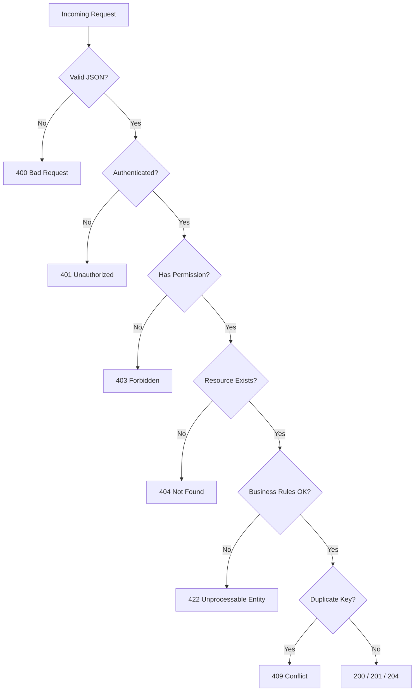
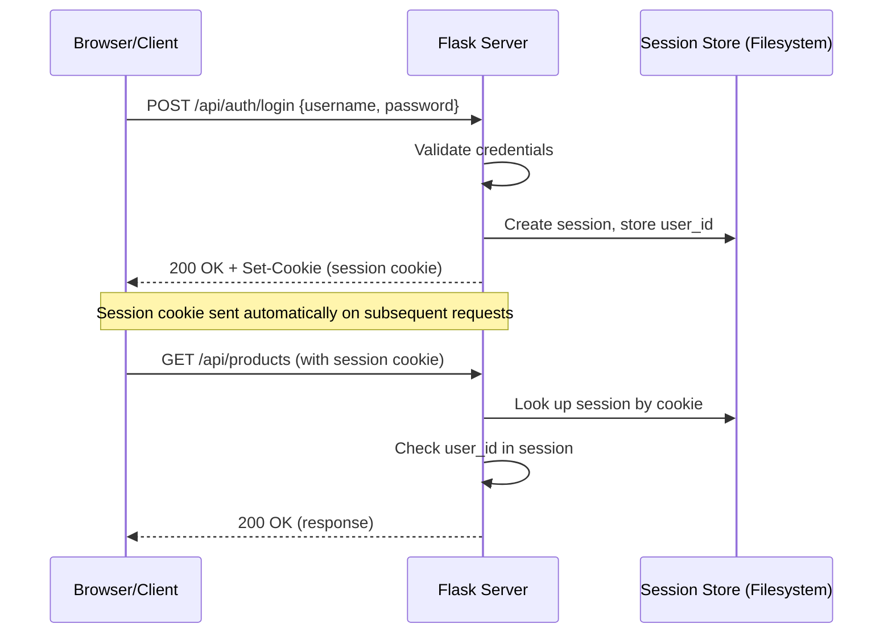
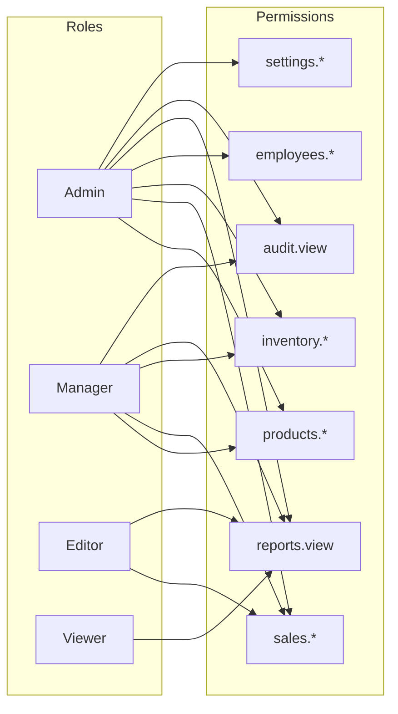
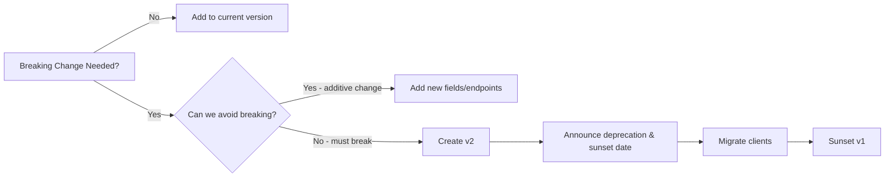
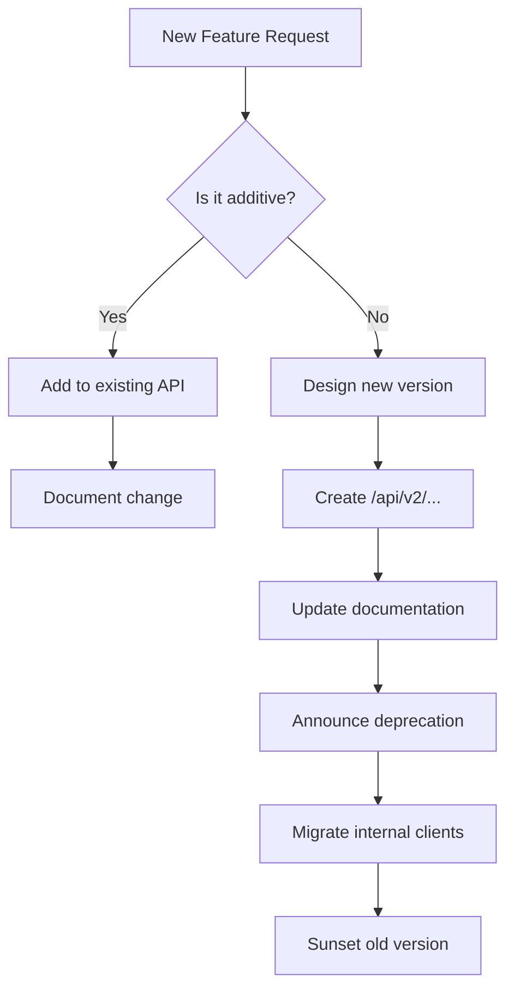

# API Standards

> **Version:** 1.0  
> **Last Updated:** 2026-06-24  
> **Applies To:** All REST API endpoints under `/api/`

---

## Table of Contents

1. [REST API Design Principles](#1-rest-api-design-principles)
2. [URL Structure](#2-url-structure)
3. [Request / Response Format](#3-request--response-format)
4. [HTTP Status Codes](#4-http-status-codes)
5. [Pagination](#5-pagination)
6. [Filtering](#6-filtering)
7. [Sorting](#7-sorting)
8. [Search](#8-search)
9. [Authentication](#9-authentication)
10. [Authorization](#10-authorization)
11. [Error Handling](#11-error-handling)
12. [Rate Limiting](#12-rate-limiting)
13. [CORS](#13-cors)
14. [Content-Type & Headers](#14-content-type--headers)
15. [Date Format](#15-date-format)
16. [Money Format](#16-money-format)
17. [Versioning & Deprecation](#17-versioning--deprecation)
18. [Common Mistake Patterns](#18-common-mistake-patterns)
19. [API Evolution Strategy](#19-api-evolution-strategy)

---

## 1. REST API Design Principles

This ERP system follows a **resource-oriented REST** architecture. Every URL represents a **noun** (resource) and HTTP verbs define the **action**.

```text
GET    /api/products       → List all products
POST   /api/products       → Create a new product
GET    /api/products/42    → Retrieve product #42
PUT    /api/products/42    → Fully replace product #42
DELETE /api/products/42    → Delete product #42
```

### Core Principles

| Principle | Implementation |
|-----------|---------------|
| **Statelessness** | Each request contains all information needed; server does not store client state (session data is stored server-side but is opaque to client) |
| **Resource-oriented** | URLs represent resources, not actions (exception: actions that don't map to CRUD, e.g. `/api/inventory/adjust`) |
| **Uniform interface** | Consistent patterns across all resources |
| **HATEOAS optional** | Not enforced; response includes resource IDs but not full hypermedia links |
| **Idempotency** | GET, PUT, DELETE are idempotent; POST is not |

### Design Decisions

- **Nested resources** are used for clear parent-child relationships: `/api/sales/orders/{id}/items`
- **Action endpoints** are used sparingly for non-CRUD operations: `/api/inventory/adjust`, `/api/repairs/warranty-check`
- **Plural nouns** for collections: `/api/customers`, not `/api/customer`
- **Kebab-case** in URL paths: `/api/inventory/stock-count`, not `/api/inventory/stockCount`

---

## 2. URL Structure

```
/api/{resource}/{id}/{action}
```

### URL Segments

| Segment | Required | Description |
|---------|----------|-------------|
| `/api`  | Yes | API version prefix (v1) |
| `{resource}` | Yes | Plural resource name (e.g. `products`, `customers`) |
| `{id}` | Optional | Resource unique identifier (integer) |
| `{action}` | Optional | Sub-resource or action (e.g. `categories`, `status`, `receive`) |

### Examples

```text
/api/products                     → All products
/api/products/42                  → Single product
/api/products/categories          → Product categories list
/api/products/42                  → Delete product (DELETE)
/api/sales/orders                 → All sales orders
/api/sales/orders/128             → Single sales order
/api/purchases/orders/55/receive  → Receive purchase order items
/api/repairs/orders/7/parts       → Add parts to repair order
/api/inventory/adjust             → Adjust stock levels
/api/inventory/stock-count        → Perform stock count
/api/inventory/movements          → Stock movement history
/api/reports/dashboard            → Dashboard report data
/api/audit/logs                   → Audit log entries
```

### Anti-patterns (AVOID)

```text
/api/getProduct?id=42             ✗ Action in URL
/api/product (singular)           ✗ Singular resource name
/api/deleteProduct/42             ✗ Verb in URL
/api/products/deleteAll           ✗ Bulk action as sub-resource
/api/products.php                 ✗ File extension in URL
/api/v1/products                  ✗ Version in URL (use Header or keep as /api/)
```

---

## 3. Request / Response Format

### Request Body

All POST, PUT requests must send `Content-Type: application/json; charset=utf-8`.

```json
{
  "name": "حاسوب محمول",
  "sku": "LPT-001",
  "price": 150000,
  "category_id": 5
}
```

### Success Response Envelope

```json
{
  "message": "تمت العملية بنجاح",
  "data": { ... }
}
```

For list endpoints:

```json
{
  "message": "تم جلب البيانات بنجاح",
  "data": [ ... ],
  "count": 100,
  "page": 1,
  "pageSize": 20
}
```

### Error Response Envelope

```json
{
  "error": "لم يتم العثور على المنتج"
}
```

### Field Structure

```json
{
  "message": "تم إنشاء العميل بنجاح",
  "data": {
    "id": 47,
    "name": "شركة الأمل للتجارة",
    "phone": "0123456789",
    "email": "info@alamal.com",
    "created_at": "2026-06-24T10:30:00Z"
  }
}
```

### Response Helpers (Python)

```python
def success_response(message="تمت العملية بنجاح", data=None, status=200):
    body = {"message": message}
    if data is not None:
        body["data"] = data
    return jsonify(body), status


def error_response(message="حدث خطأ", status=400):
    return jsonify({"error": message}), status


def json_body_response(data, count=None, page=None, page_size=None, status=200):
    body = {"message": "تم جلب البيانات بنجاح", "data": data}
    if count is not None:
        body["count"] = count
        body["page"] = page
        body["pageSize"] = page_size
    return jsonify(body), status
```

---

## 4. HTTP Status Codes

| Code | Name | When To Use |
|------|------|-------------|
| **200** | OK | Successful GET, PUT, DELETE; response body contains the resource |
| **201** | Created | Successful POST; resource was created |
| **204** | No Content | Successful DELETE when no body is returned |
| **400** | Bad Request | Validation error, malformed JSON, missing required fields |
| **401** | Unauthorized | Not authenticated; session missing or expired |
| **403** | Forbidden | Authenticated but lacks required permission |
| **404** | Not Found | Resource does not exist |
| **409** | Conflict | Duplicate unique field (e.g. SKU already exists) |
| **422** | Unprocessable Entity | Business rule violation (e.g. PaidAmount > GrandTotal) |
| **429** | Too Many Requests | Rate limit exceeded |
| **500** | Internal Server Error | Unexpected server-side failure |

### Decision Flow



---

## 5. Pagination

### Request

| Query Param | Type | Default | Description |
|-------------|------|---------|-------------|
| `Page` | int | 1 | Page number (1-indexed) |
| `PageSize` | int | 20 | Items per page (max 100) |

### Response

```json
{
  "data": [ ... ],
  "count": 250,
  "page": 2,
  "pageSize": 20
}
```

### Implementation

```python
def get_pagination_params():
    page = request.args.get("Page", 1, type=int)
    page_size = request.args.get("PageSize", 20, type=int)
    page_size = min(page_size, 100)  # Enforce max
    offset = (page - 1) * page_size
    return page, page_size, offset


def paginated_response(query, page, page_size, serializer):
    count = len(query)
    items = query[offset:offset + page_size]
    return {
        "data": [serializer(item) for item in items],
        "count": count,
        "page": page,
        "pageSize": page_size,
    }
```

### Edge Cases

| Scenario | Behavior |
|----------|----------|
| Page > total pages | Return empty `data` array, `count` = 0 |
| PageSize = 0 | Treat as default (20) |
| PageSize > 100 | Cap at 100 |
| Negative Page | Treat as 1 |
| Extremely large offset | Return empty array (do not iterate all rows) — use SQL `LIMIT/OFFSET` |

---

## 6. Filtering

### Pattern

Filters are passed as **query parameters** named after the field being filtered.

```
GET /api/products?category_id=5&is_active=1
GET /api/sales/orders?status=completed&date_from=2026-01-01
GET /api/inventory/movements?type=SALE_OUT&warehouse_id=2
```

### Convention

| Filter Style | Example | Behavior |
|-------------|---------|----------|
| Exact match | `?category_id=5` | WHERE category_id = 5 |
| Range | `?date_from=2026-01-01&date_to=2026-06-01` | WHERE date BETWEEN |
| Partial | `?name=حاسوب` | WHERE name LIKE '%حاسوب%' |
| Multiple values | `?status[]=pending&status[]=completed` | WHERE status IN (...) |

### Filterable Fields Per Resource

| Resource | Filterable Fields |
|----------|------------------|
| Products | `category_id`, `brand_id`, `tax_id`, `is_active`, `created_at` (date range) |
| Customers | `phone`, `email`, `is_active`, `created_at` |
| Suppliers | `phone`, `email`, `is_active`, `created_at` |
| Sales Orders | `status`, `customer_id`, `date_from`, `date_to`, `created_by` |
| Purchase Orders | `status`, `supplier_id`, `date_from`, `date_to`, `created_by` |
| Inventory Movements | `type`, `warehouse_id`, `product_id`, `date_from`, `date_to` |
| Audit Logs | `user_id`, `action`, `resource`, `date_from`, `date_to` |
| Employees | `role_id`, `is_active`, `department` |
| Repairs | `status`, `technician_id`, `customer_id`, `date_from`, `date_to` |

### Security Considerations

- Never expose database internal IDs directly if they could be enumerated maliciously (use UUIDs for user-facing records)
- Whitelist allowed filter fields; reject unknown filter params with a 400 error
- Prevent SQL injection by using parameterized queries, never string interpolation

---

## 7. Sorting

### Request

```
GET /api/products?sort=name
GET /api/products?sort=-price           # Descending
GET /api/products?sort=category_id,name # Multiple fields
```

| Query Param | Type | Default | Description |
|-------------|------|---------|-------------|
| `sort` | string | `-created_at` | Field name; prefix with `-` for descending |

### Implementation

```python
SORTABLE_FIELDS = {
    "products": ["name", "price", "sku", "created_at", "category_id"],
    "customers": ["name", "phone", "created_at"],
    # ...
}

def apply_sorting(query, sort_param, resource_type):
    allowed = SORTABLE_FIELDS.get(resource_type, [])
    if not sort_param:
        return query.order_by(text("created_at DESC"))

    clauses = []
    for field in sort_param.split(","):
        field = field.strip()
        desc = field.startswith("-")
        clean_field = field.lstrip("-")

        if clean_field not in allowed:
            raise ValueError(f"حقل الفرز '{clean_field}' غير مسموح به")

        col = getattr(models, clean_field)
        clauses.append(col.desc() if desc else col.asc())

    return query.order_by(*clauses)
```

### Allowed Sort Fields

| Resource | Sortable Fields |
|----------|----------------|
| Products | `name`, `sku`, `price`, `created_at`, `category_id`, `brand_id` |
| Customers | `name`, `phone`, `email`, `created_at` |
| Suppliers | `name`, `phone`, `email`, `created_at` |
| Sales Orders | `created_at`, `grand_total`, `status`, `customer_id` |
| Purchase Orders | `created_at`, `grand_total`, `status`, `supplier_id` |

---

## 8. Search

### Request

```
GET /api/products?search=لابتوب
GET /api/products?q=حاسوب
```

Both `search` and `q` query params are accepted (for flexibility with frontend frameworks).

### Search Behavior Per Resource

| Resource | Searchable Fields |
|----------|-----------------|
| Products | `name`, `sku`, `barcode` |
| Customers | `name`, `phone`, `email` |
| Suppliers | `name`, `phone`, `email` |
| Sales Orders | `id`, `customer_name` (via join) |
| Purchase Orders | `id`, `supplier_name` (via join) |
| Employees | `name`, `phone`, `email` |

### Implementation

```python
def apply_search(query, search_term, searchable_fields, model_class):
    if not search_term:
        return query

    filters = []
    for field in searchable_fields:
        column = getattr(model_class, field)
        filters.append(column.ilike(f"%{search_term}%"))

    return query.filter(or_(*filters))
```

### Security Considerations

- Sanitize search input: strip HTML/JS to prevent XSS
- Limit search term length (e.g. 200 chars)
- Use `LIKE` with parameterized queries, never interpolate
- Consider full-text search (FTS5) for large datasets

---

## 9. Authentication

### Session-Based Authentication

This ERP system uses **server-side sessions** with Flask-Session.



### Login Endpoint

```json
// POST /api/auth/login
// Request:
{
  "username": "admin",
  "password": "secure_password"
}

// Response (200):
{
  "message": "تم تسجيل الدخول بنجاح",
  "data": {
    "user": {
      "id": 1,
      "username": "admin",
      "display_name": "مدير النظام"
    }
  }
}

// Response (401):
{
  "error": "اسم المستخدم أو كلمة المرور غير صحيحة"
}
```

### Session Configuration

```python
app.config.update(
    SESSION_TYPE="filesystem",
    SESSION_PERMANENT=True,
    PERMANENT_SESSION_LIFETIME=timedelta(hours=8),
    SESSION_COOKIE_HTTPONLY=True,
    SESSION_COOKIE_SECURE=False,  # True in production with HTTPS
    SESSION_COOKIE_SAMESITE="Lax",
)
```

### Security Best Practices

| Practice | Implementation |
|----------|---------------|
| **HTTPOnly cookies** | Prevents JavaScript access to session cookie |
| **Secure flag** | Send only over HTTPS (enable in production) |
| **SameSite=Lax** | Mitigates CSRF attacks |
| **Session timeout** | 8 hours, extendable on activity |
| **Password hashing** | Werkzeug `generate_password_hash` (pbkdf2:sha256) |
| **Brute force protection** | Lock account after 5 failed attempts (15 min cooldown) |
| **Session regeneration** | On login to prevent session fixation |

---

## 10. Authorization

### Permission-Based Authorization

Authorization is enforced via the `@require_permission` decorator.

```python
@require_permission("products.create")
def create_product():
    ...
```

### Permission Levels

| Level | Scope | Example |
|-------|-------|---------|
| `admin` | All operations | System configuration |
| `manager` | Read + write for assigned resources | Manage inventory |
| `editor` | Create + update (no delete) | Create sales orders |
| `viewer` | Read-only | View reports |

### Permission Naming Convention

```
{resource}.{action}
```

| Permission | Description |
|------------|-------------|
| `products.view` | View product list and details |
| `products.create` | Create new products |
| `products.edit` | Update existing products |
| `products.delete` | Delete products |
| `sales.view` | View sales orders |
| `sales.create` | Create sales orders |
| `sales.edit` | Edit sales orders |
| `sales.delete` | Delete sales orders |
| `inventory.view` | View stock and movements |
| `inventory.adjust` | Adjust stock levels |
| `inventory.count` | Perform stock counts |
| `employees.view` | View employee list |
| `employees.manage` | Create/edit/delete employees |
| `reports.view` | View reports |
| `audit.view` | View audit logs |
| `settings.manage` | Manage system settings |

### Decorator Implementation

```python
def require_permission(*permissions):
    def decorator(f):
        @wraps(f)
        def decorated_function(*args, **kwargs):
            user = get_current_user()
            if not user:
                return error_response("يجب تسجيل الدخول أولاً", 401)

            user_permissions = get_user_permissions(user["id"])
            for perm in permissions:
                if perm not in user_permissions:
                    return error_response("ليس لديك صلاحية للوصول إلى هذا المورد", 403)

            return f(*args, **kwargs)
        return decorated_function
    return decorator
```

### Role-Permission Matrix



---

## 11. Error Handling

### Error Response Format

All errors follow a strict JSON format with **Arabic messages** for production.

```json
{
  "error": "رسالة الخطأ باللغة العربية"
}
```

### Error Categories

| Category | Status | Example Message |
|----------|--------|----------------|
| Validation | 400 | "حقل الاسم مطلوب" |
| Authentication | 401 | "يجب تسجيل الدخول أولاً" |
| Authorization | 403 | "ليس لديك صلاحية للوصول إلى هذا المورد" |
| Not Found | 404 | "لم يتم العثور على المنتج" |
| Conflict | 409 | "رمز SKU موجود مسبقاً" |
| Business Rule | 422 | "المبلغ المدفوع لا يمكن أن يتجاوز الإجمالي" |
| Server Error | 500 | "حدث خطأ داخلي في الخادم" |

### Global Error Handler

```python
@app.errorhandler(404)
def not_found(e):
    return error_response("المورد المطلوب غير موجود", 404)

@app.errorhandler(500)
def server_error(e):
    app.logger.error(f"Internal error: {e}")
    return error_response("حدث خطأ داخلي في الخادم", 500)
```

### Route-Level Error Handling Pattern

```python
@bp.route("/products", methods=["POST"])
@require_permission("products.create")
def create_product():
    try:
        data = get_json_body()
        validate_product_data(data)
        product_id = product_service.create_product(data)
        return success_response("تم إنشاء المنتج بنجاح", {"id": product_id}, 201)

    except ValueError as e:
        return error_response(str(e), 400)
    except json.JSONDecodeError:
        return error_response("صيغة JSON غير صحيحة", 400)
    except sqlite3.IntegrityError as e:
        if "UNIQUE constraint" in str(e):
            return error_response("رمز SKU موجود مسبقاً", 409)
        return error_response("خطأ في قاعدة البيانات", 500)
    except Exception as e:
        app.logger.error(f"Unexpected error creating product: {e}", exc_info=True)
        return error_response("حدث خطأ غير متوقع", 500)
```

---

## 12. Rate Limiting

> **Note:** Rate limiting is optional and configurable. Implement when deploying to production with public-facing endpoints.

### Recommended Implementation

```python
# Using Flask-Limiter
from flask_limiter import Limiter
from flask_limiter.util import get_remote_address

limiter = Limiter(
    app=app,
    key_func=get_remote_address,
    default_limits=["200 per day", "50 per hour"],
    storage_uri="memory://",
)
```

### Rate Limit Tiers

| Tier | Limit | Applies To |
|------|-------|------------|
| Strict | 10/minute | `/api/auth/login` (prevent brute force) |
| Normal | 60/minute | Standard API endpoints |
| Relaxed | 300/minute | Read-only endpoints, reports |

### Rate Limit Response

```json
// Status: 429 Too Many Requests
{
  "error": "لقد تجاوزت الحد المسموح من الطلبات. الرجاء المحاولة بعد 60 ثانية"
}

// Headers:
RateLimit-Limit: 60
RateLimit-Remaining: 0
RateLimit-Reset: 1624567890
Retry-After: 60
```

---

## 13. CORS

### Configuration

Since this is a same-origin application (Flask serves the frontend from `templates/` and `static/`), CORS is minimally configured:

```python
from flask_cors import CORS

CORS(
    app,
    supports_credentials=True,
    origins=[  # Explicitly list allowed origins
        "http://localhost:5000",
        "http://127.0.0.1:5000",
    ],
    methods=["GET", "POST", "PUT", "DELETE", "OPTIONS"],
    allow_headers=["Content-Type", "X-Requested-With"],
)
```

### CORS Headers

| Header | Value |
|--------|-------|
| `Access-Control-Allow-Origin` | Request origin (if allowed) |
| `Access-Control-Allow-Credentials` | `true` |
| `Access-Control-Allow-Methods` | `GET, POST, PUT, DELETE, OPTIONS` |
| `Access-Control-Allow-Headers` | `Content-Type, X-Requested-With` |
| `Access-Control-Max-Age` | `3600` |

### Security Note

Never use `Access-Control-Allow-Origin: *` with credentials. Always explicitly list allowed origins.

---

## 14. Content-Type & Headers

### Request Headers

| Header | Value | Required | Notes |
|--------|-------|----------|-------|
| `Content-Type` | `application/json; charset=utf-8` | For POST/PUT | Ensures proper JSON parsing |
| `X-Requested-With` | `XMLHttpRequest` | Optional | Used by frontend AJAX calls |

### Response Headers

| Header | Value |
|--------|-------|
| `Content-Type` | `application/json; charset=utf-8` |
| `X-Content-Type-Options` | `nosniff` |
| `X-Frame-Options` | `DENY` |
| `X-XSS-Protection` | `1; mode=block` |
| `Strict-Transport-Security` | `max-age=31536000; includeSubDomains` (production) |

### Custom Response Headers

| Header | Description |
|--------|-------------|
| `X-Total-Count` | Total records (for pagination) |
| `X-Page` | Current page number |
| `X-Page-Size` | Page size |

---

## 15. Date Format

### ISO 8601 in UTC

All dates and timestamps must be formatted as **ISO 8601** strings in **UTC**.

```json
{
  "created_at": "2026-06-24T14:30:00Z",
  "updated_at": "2026-06-24T15:00:00Z",
  "date": "2026-06-24"
}
```

### Implementation

```python
from datetime import datetime, timezone


def format_datetime(dt):
    """Format datetime to ISO 8601 UTC."""
    if dt is None:
        return None
    if dt.tzinfo is None:
        dt = dt.replace(tzinfo=timezone.utc)
    return dt.strftime("%Y-%m-%dT%H:%M:%SZ")


def format_date(d):
    """Format date to ISO 8601."""
    if d is None:
        return None
    return d.strftime("%Y-%m-%d")


def parse_datetime(s):
    """Parse ISO 8601 string to datetime."""
    if not s:
        return None
    s = s.replace("Z", "+00:00")
    return datetime.fromisoformat(s)
```

### JSON Serializer

```python
class CustomJSONEncoder(json.JSONEncoder):
    def default(self, obj):
        if isinstance(obj, datetime):
            return format_datetime(obj)
        if isinstance(obj, date):
            return format_date(obj)
        if isinstance(obj, Decimal):
            return float(obj)
        return super().default(obj)
```

### Database Storage

SQLite stores dates as ISO 8601 text strings. Use SQLite date/time functions for queries:

```sql
SELECT * FROM products WHERE created_at >= datetime('now', '-30 days');
```

---

## 16. Money Format

### Integer in Smallest Currency Unit

All monetary values are stored as **integers** representing the **smallest currency unit** (qirsh/piasters).

| Display Value | Stored (integer) | Currency |
|--------------|-----------------|----------|
| 1,500.75 SAR | 150075 | Halalas (100 halala = 1 SAR) |
| 50.00 SAR | 5000 | Halalas |
| 0.25 SAR | 25 | Halalas |

### Implementation

```python
def money_to_int(amount):
    """Convert float/Decimal to integer (halalas/qirsh)."""
    return int(round(float(amount) * 100))


def money_from_int(amount):
    """Convert integer to float (for display)."""
    return round(amount / 100, 2)


def format_money(amount):
    """Format integer amount to display string."""
    if amount is None:
        return "0.00"
    return f"{amount / 100:.2f}"
```

### JSON Serialization

```python
def serialize_money(amount):
    """Serialize money for API response."""
    return money_from_int(amount)
```

### Arithmetic

All calculations must be done in integer arithmetic to avoid floating-point errors:

```python
def calculate_total(items):
    """Calculate total in halalas using integer arithmetic."""
    total = 0
    for item in items:
        total += item["quantity"] * item["unit_price"]
    return total
```

### Database Schema

```sql
CREATE TABLE products (
    id INTEGER PRIMARY KEY AUTOINCREMENT,
    name TEXT NOT NULL,
    price INTEGER NOT NULL DEFAULT 0,  -- stored in halalas
    cost_price INTEGER NOT NULL DEFAULT 0,
    -- ...
);
```

---

## 17. Versioning & Deprecation

### Versioning Strategy

- **Current version:** v1 (implicit via `/api/` prefix)
- No explicit version in URL (e.g. `/api/v1/`) to keep URLs clean
- When a breaking change is required, deploy a new version at `/api/v2/`
- Old version remains available for a deprecation period

### Deprecation Headers

```python
@app.after_request
def add_deprecation_headers(response):
    if request.path.startswith("/api/") and "X-API-Version" not in response.headers:
        response.headers["X-API-Version"] = "1"
        response.headers["X-API-Deprecated"] = "false"
        response.headers["X-API-Sunset"] = ""
    return response
```

### Deprecated Endpoint

```python
# When deprecating an endpoint, add:
response.headers["X-API-Deprecated"] = "true"
response.headers["X-API-Sunset"] = "2026-12-31"
response.headers["X-API-Migration"] = "/api/v2/products"
```

### Client Notification

```json
// Response headers for deprecated endpoints:
X-API-Deprecated: true
X-API-Sunset: 2026-12-31
X-API-Migration: /api/v2/products
```

### Versioning Decision



---

## 18. Common Mistake Patterns

### Pattern 1: Leaking Internal Errors

```python
# ✗ BAD: Exposing internal details
return jsonify({"error": str(e)}), 500
# Response:
# {"error": "UNIQUE constraint failed: products.sku"}

# ✓ GOOD: User-safe error message
app.logger.error(f"Database error: {e}", exc_info=True)
return jsonify({"error": "حدث خطأ داخلي في الخادم"}), 500
```

### Pattern 2: String Interpolation in SQL

```python
# ✗ BAD: SQL Injection vulnerable
query = f"SELECT * FROM products WHERE name = '{name}'"

# ✓ GOOD: Parameterized query
query = "SELECT * FROM products WHERE name = ?"
cursor.execute(query, (name,))
```

### Pattern 3: Inconsistent Response Format

```python
# ✗ BAD: Inconsistent envelopes
return jsonify({"success": True, "product": {...}}), 200
return jsonify({"error_msg": "Not found"}), 404

# ✓ GOOD: Consistent envelope
return jsonify({"message": "...", "data": {...}}), 200
return jsonify({"error": "..."}), 404
```

### Pattern 4: Ignoring Pagination for Large Datasets

```python
# ✗ BAD: Returning all records
return jsonify({"data": Product.query.all()}), 200

# ✓ GOOD: Paginated response
page, page_size, offset = get_pagination_params()
items = Product.query.limit(page_size).offset(offset).all()
```

### Pattern 5: Floating-Point Money

```python
# ✗ BAD: Floating point
price = 1500.75  # May cause 1500.7499999 errors

# ✓ GOOD: Integer (halalas)
price = 150075  # 1500.75 SAR in halalas
```

### Pattern 6: Not Validating Input Types

```python
# ✗ BAD: Trusting input types
product_id = request.view_args["id"]
# If id is non-numeric, SQLite will silently convert

# ✓ GOOD: Validate input
product_id = request.view_args.get("id")
try:
    product_id = int(product_id)
except (ValueError, TypeError):
    return error_response("معرف المنتج يجب أن يكون رقماً", 400)
```

### Pattern 7: Not Handling Concurrent Stock Operations

```python
# ✗ BAD: Race condition
stock = get_stock(product_id, warehouse_id)
if stock >= quantity:
    reduce_stock(product_id, warehouse_id, quantity)

# ✓ GOOD: Atomic operation
cursor.execute("""
    UPDATE stock
    SET quantity = quantity - ?
    WHERE product_id = ? AND warehouse_id = ? AND quantity >= ?
""", (quantity, product_id, warehouse_id, quantity))
```

### Pattern 8: Large Payloads Without Compression

For list endpoints returning hundreds of records, enable gzip compression:

```python
from flask_compress import Compress
Compress(app)
```

---

## 19. API Evolution Strategy

### Additive Changes (Non-Breaking)

- Add new optional fields to request/response
- Add new endpoints
- Add new query parameters (filters, sorting)
- Response extensions (new fields in `data`) — clients must ignore unknown fields

### Breaking Changes (Version Bump)

- Remove or rename fields
- Change field types
- Change endpoint URLs
- Change authentication mechanism
- Change error response format

### Evolution Checklist



### Client Guidance

- Always ignore unknown fields in responses (forward compatibility)
- Use the `X-API-Version` response header to verify API version
- Subscribe to deprecation notices via `X-API-Deprecated` header
- Never rely on undocumented fields or behavior

---

## Summary Checklist

| # | Requirement | Status |
|---|-------------|--------|
| 1 | All responses use `{"message": ..., "data": ...}` success envelope | ✓ |
| 2 | All errors use `{"error": "..."}` envelope | ✓ |
| 3 | Arabic error messages for all user-facing errors | ✓ |
| 4 | Pagination with `Page`, `PageSize` query params | ✓ |
| 5 | Filtering via query params with whitelist | ✓ |
| 6 | Sorting via `sort` query param with whitelist | ✓ |
| 7 | Search via `search`/`q` query param | ✓ |
| 8 | Authentication via server-side sessions | ✓ |
| 9 | Authorization via `@require_permission` decorator | ✓ |
| 10 | Money stored as integers (halalas) | ✓ |
| 11 | Dates in ISO 8601 UTC | ✓ |
| 12 | All POST/PUT endpoints validate JSON body | ✓ |
| 13 | CORS configured for same-origin with credentials | ✓ |
| 14 | Rate limiting recommended for production | ✓ |
| 15 | Deprecation headers on phased-out endpoints | ✓ |
