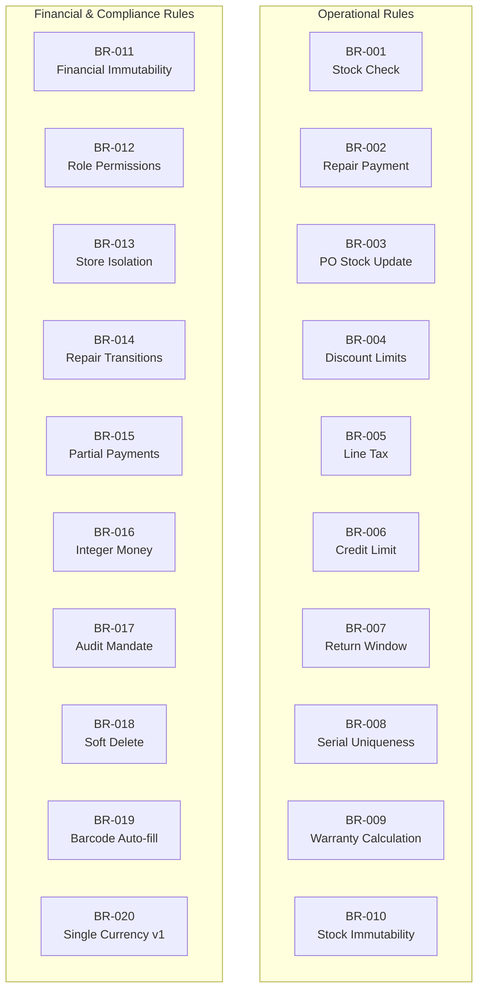
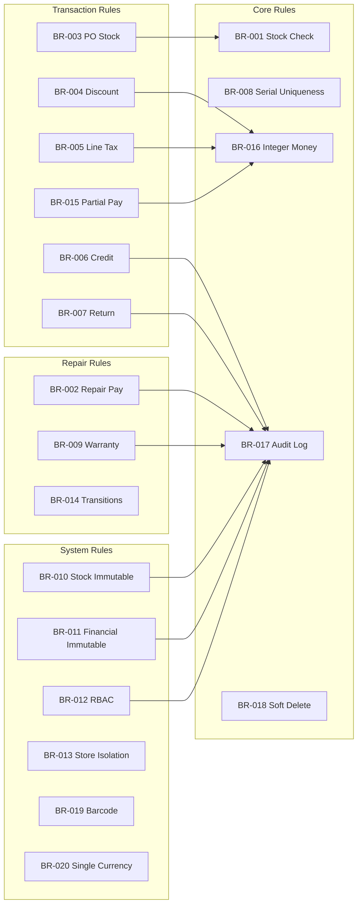

# Business Rules — Computer Shop ERP & POS System

> **Version:** 1.0.0-beta  
> **Document Status:** Final  
> **Rule Prefix:** BR-001  
> **Last Updated:** June 2026

---

## Table of Contents

1. [Introduction](#introduction)
2. [BR-001 to BR-010: Operational Rules](#br-001-to-br-010-operational-rules)
3. [BR-011 to BR-020: Financial & Compliance Rules](#br-011-to-br-020-financial--compliance-rules)
4. [Rule Dependency Graph](#rule-dependency-graph)
5. [Rule Enforcement Matrix](#rule-enforcement-matrix)
6. [Business Rule Testing](#business-rule-testing)

---

## Introduction

This document defines the **business rules** governing the Computer Shop ERP & POS System. Business rules encode domain-specific logic, constraints, and policies enforced at the database, application, and UI layers.

### Rule Format

| Field | Description |
|-------|-------------|
| **ID** | Unique identifier: `BR-NNN` |
| **Title** | Concise rule name |
| **Description** | Detailed explanation of the rule |
| **Category** | Operational / Financial / Compliance / Security |
| **Priority** | Critical / High / Medium / Low |
| **Enforcement Level** | Database / Application / UI |
| **Trigger** | Event that evaluates the rule |
| **Exception** | Conditions for bypassing the rule (and by whom) |

### Rule Categories

| Category | Description | Rules |
|----------|-------------|-------|
| **Operational** | Day-to-day transactions and workflows | BR-001 to BR-010 |
| **Financial & Compliance** | Financial integrity, auditing, regulatory compliance | BR-011 to BR-020 |

### Mermaid Overview



---

## BR-001 to BR-010: Operational Rules

---

### BR-001: Stock Availability Check on Sale

| Field | Value |
|-------|-------|
| **ID** | **BR-001** |
| **Title** | A sale cannot exceed available stock |
| **Description** | When adding a product to the POS cart, the system MUST validate that requested quantity ≤ `AvailableQuantity` (PhysicalQuantity − CommittedQuantity) for that product and warehouse. If exceeded, block with message: "Insufficient stock. Available: {quantity}". The check is performed at cart-add **and** at sale confirmation (to handle concurrent cart changes) |
| **Category** | Operational |
| **Priority** | Critical |
| **Enforcement** | Application (service layer) + UI (client-side pre-check) |
| **Trigger** | Product added to cart, quantity incremented, sale confirmed |
| **Exception** | None — cannot be bypassed |
| **Implementation** | `SELECT ... FOR UPDATE` on inventory row during POS transaction to prevent race conditions |
| **Error (Arabic)** | "المخزون غير كاف. المتوفر: {quantity}" |

---

### BR-002: Repair Order Balance at Delivery

| Field | Value |
|-------|-------|
| **ID** | **BR-002** |
| **Title** | A repair order cannot be closed with outstanding balance |
| **Description** | The system MUST prevent a repair ticket from transitioning to `Delivered` if `payment_status` is `Unpaid` or `Partial`. Full payment must be collected before delivery |
| **Category** | Operational |
| **Priority** | Critical |
| **Enforcement** | Application (service layer) |
| **Trigger** | Status transition `Completed → Delivered` |
| **Exception** | Manager override with reason code, logged in AuditLog |
| **Error** | "Cannot deliver repair with outstanding balance. Please collect full payment first." |

---

### BR-003: Purchase Order Receiving and Stock Update

| Field | Value |
|-------|-------|
| **ID** | **BR-003** |
| **Title** | Purchase order receiving updates both Quantity and AvailableQuantity |
| **Description** | When goods are received against a PO, the system MUST increase both `PhysicalQuantity` and `AvailableQuantity` for each product in the destination warehouse. `IncomingQuantity` MUST be decreased by the received amount. Operation MUST be within a single database transaction |
| **Category** | Operational |
| **Priority** | Critical |
| **Enforcement** | Application (service layer) within DB transaction |
| **Trigger** | Goods receiving event on a PO line item |
| **Exception** | None |
| **Notes** | Serial numbers and batch/expiry recorded at receiving time if applicable |

---

### BR-004: Discount Limits

| Field | Value |
|-------|-------|
| **ID** | **BR-004** |
| **Title** | Discount cannot exceed 100% of item price |
| **Description** | Any discount applied to a line item MUST NOT result in a unit price below zero. Max percentage discount is 100%. Max fixed discount is the line total. Cumulative multiple discounts also must not exceed 100% |
| **Category** | Operational |
| **Priority** | Critical |
| **Enforcement** | Application (service layer) + UI (input validation) |
| **Trigger** | Discount applied or modified on a line item or invoice |
| **Exception** | None — cannot be bypassed |
| **Edge Case** | Loyalty points applied as discount: total discount (monetary + points) must still obey this rule |

---

### BR-005: Tax Calculation per Line Item

| Field | Value |
|-------|-------|
| **ID** | **BR-005** |
| **Title** | Tax is calculated per line item, not on the total |
| **Description** | Sales tax MUST be calculated independently per line item based on the product's assigned tax rate. All line tax amounts are summed for the total tax. Tax MUST NOT be calculated on the invoice subtotal as a single operation |
| **Category** | Operational |
| **Priority** | High |
| **Enforcement** | Application (service layer) |
| **Trigger** | Cart total calculation (every cart change) |
| **Formula** | `line_tax = (unit_price × quantity − line_discount) × (tax_rate / 100)` |
| **Display** | POS and invoices display tax breakdown by rate |

---

### BR-006: Customer Credit Limit

| Field | Value |
|-------|-------|
| **ID** | **BR-006** |
| **Title** | A customer with credit exceeding limit cannot create new sales unless paid |
| **Description** | When customer is selected in POS with payment method `Credit Account`, system MUST validate `current_balance + invoice_total ≤ credit_limit`. If exceeded, block with warning. A customer with `credit_limit = 0` cannot use credit. A customer with `credit_limit = NULL` has unlimited credit |
| **Category** | Operational |
| **Priority** | High |
| **Enforcement** | Application (service layer) + UI |
| **Trigger** | Payment method selected as "Credit Account" |
| **Exception** | Manager override with PIN, logged in AuditLog |

---

### BR-007: Return Window

| Field | Value |
|-------|-------|
| **ID** | **BR-007** |
| **Title** | Returns must reference original sales order within 30 days |
| **Description** | Returns MUST reference an existing sales order by invoice number. The original sale date must be within 30 days of the return date. Configurable via `RETURN_WINDOW_DAYS` env var |
| **Category** | Operational |
| **Priority** | High |
| **Enforcement** | Application (service layer) |
| **Trigger** | Return initiated on a sales order |
| **Exception** | Manager override for: manufacturer defects, warranty replacements, exceptional cases. Override logged |
| **Edge Cases** | Credit sale returns can reduce balance or issue cash refund. Bundle returns: must return all components or proportional refund |

---

### BR-008: Serial Number Uniqueness

| Field | Value |
|-------|-------|
| **ID** | **BR-008** |
| **Title** | Serial numbers are unique across the entire system |
| **Description** | Serial numbers MUST be globally unique across all products, warehouses, and stores. Enforced at database level with UNIQUE constraint |
| **Category** | Operational |
| **Priority** | Critical |
| **Enforcement** | Database (UNIQUE constraint) + Application (validation) |
| **Trigger** | Serial number entry during stock-in, PO receiving, manual entry |
| **Exception** | None — enforced at DB level, cannot be bypassed |
| **Notes** | Case-insensitive uniqueness. Leading/trailing whitespace trimmed before storage |

---

### BR-009: Warranty Calculation from Sale Date

| Field | Value |
|-------|-------|
| **ID** | **BR-009** |
| **Title** | Warranty is calculated from sale date, not manufacture date |
| **Description** | Warranty period MUST be calculated from the sale invoice date, not manufacture or purchase date. End date: `sale_date + warranty_period_days`. Default 365 days (configurable via `WARRANTY_DAYS`, overridable per product) |
| **Category** | Operational |
| **Priority** | High |
| **Enforcement** | Application (service layer) |
| **Trigger** | Warranty check on repair ticket, customer profile, or report |
| **Exception** | Products with manufacturer warranty can have different terms set per-product with manager approval |

---

### BR-010: Immutable Stock Movements

| Field | Value |
|-------|-------|
| **ID** | **BR-010** |
| **Title** | Stock movements are immutable — never deleted, only reversed |
| **Description** | Once a stock movement record is created, it MUST NOT be edited or deleted. Corrections MUST use a **reversal transaction** — new movement with opposite quantity referencing the original movement ID |
| **Category** | Operational |
| **Priority** | Critical |
| **Enforcement** | Database (triggers reject UPDATE/DELETE) + Application (no edit/delete endpoints) |
| **Trigger** | Any attempt to edit or delete a stock movement |
| **Exception** | DBA with written approval — logged and audited |
| **Reversal Requirements** | Reason code, supervisor approval, reference to original movement ID |

---

## BR-011 to BR-020: Financial & Compliance Rules

---

### BR-011: Immutable Financial Records

| Field | Value |
|-------|-------|
| **ID** | **BR-011** |
| **Title** | Financial records cannot be deleted, only voided with audit trail |
| **Description** | Financial records MUST NOT be deleted. Erroneous records must be voided — set `status = Voided`, record `voided_at`, `voided_by`, `void_reason`, and create a reversal entry. The original record is preserved |
| **Category** | Financial & Compliance |
| **Priority** | Critical |
| **Enforcement** | Database (DELETE trigger rejection) + Application (no delete endpoints) |
| **Trigger** | Any attempt to delete a financial record |
| **Exception** | None — absolute rule |

---

### BR-012: Role-Based Permissions

| Field | Value |
|-------|-------|
| **ID** | **BR-012** |
| **Title** | Employee permissions are role-based with granular permission flags |
| **Description** | Every user is assigned exactly one role. Each role has a set of permission flags controlling access to specific operations. Permission check enforced on every route via decorator |
| **Category** | Security & Compliance |
| **Priority** | Critical |
| **Enforcement** | Application (decorator on every route) + UI (conditional rendering) |
| **Trigger** | Every authenticated request |
| **Exception** | Super Admin has all permissions (role is unmodifiable) |
| **Examples** | `pos:access`, `pos:discount`, `products:create`, `inventory:adjust`, `repairs:assign`, `reports:financial`, `employees:manage`, `settings:system` |

---

### BR-013: Multi-Store Inventory Independence

| Field | Value |
|-------|-------|
| **ID** | **BR-013** |
| **Title** | Each store has independent inventory but shared product catalog |
| **Description** | All stores share a single product catalog (products, categories, brands, taxes). Each store maintains independent inventory — stock levels, warehouses, movements are per-store. Prices may differ per store |
| **Category** | Operational |
| **Priority** | High |
| **Enforcement** | Application (data access layer filters by `store_id`) + Database (indexed `store_id`) |
| **Trigger** | All inventory and pricing operations |
| **Data Isolation** | Transactional tables: `store_id` column. Reference tables: no `store_id` (shared) |

---

### BR-014: Ordered Repair Status Transitions

| Field | Value |
|-------|-------|
| **ID** | **BR-014** |
| **Title** | Repair status transitions are strictly ordered |
| **Description** | Repair ticket status MUST follow defined workflow in exact order. Allowed transitions: `Pending → Diagnosed → AwaitingApproval → InProgress → Completed → Delivered`. Exception: `AwaitingApproval → Pending` (customer rejects estimate, re-diagnosis) |
| **Category** | Operational |
| **Priority** | High |
| **Enforcement** | Application (validated against allowed transitions map) |
| **Trigger** | Status update on a repair ticket |
| **Exception** | Only the documented re-diagnosis transition is allowed backwards |
| **Implementation** | ```python
ALLOWED_TRANSITIONS = {
    'Pending': ['Diagnosed'],
    'Diagnosed': ['AwaitingApproval'],
    'AwaitingApproval': ['InProgress', 'Pending'],
    'InProgress': ['Completed'],
    'Completed': ['Delivered'],
}
``` |

---

### BR-015: Partial Payments with Balance Tracking

| Field | Value |
|-------|-------|
| **ID** | **BR-015** |
| **Title** | Partial payments are allowed with balance tracking |
| **Description** | Partial payment on sales orders is allowed. System records payment, sets `payment_status = Partial`, tracks `balance_due`. Multiple partial payments allowed until balance = 0, then status → `Paid` |
| **Category** | Financial & Compliance |
| **Priority** | High |
| **Enforcement** | Application (service layer) |
| **Trigger** | Payment collection on a Confirmed sales order |
| **Edge Cases** | Overpayment: flag as credit or require refund. Partial payment on credit account reduces balance. Partial payment on split payment: each method's amount counts toward total |

---

### BR-016: Monetary Values as Integers

| Field | Value |
|-------|-------|
| **ID** | **BR-016** |
| **Title** | All monetary values stored as integers (lowest currency unit) |
| **Description** | All monetary values stored as integers in smallest currency unit (EGP: piasters; 1 EGP = 100 piasters). EGP 1,234.56 stored as `123456`. Display formatting converts to decimal with currency symbol |
| **Category** | Financial & Compliance |
| **Priority** | Critical |
| **Enforcement** | Database (INTEGER columns) + Application (helper functions) |
| **Trigger** | All financial operations |
| **Rationale** | Eliminates floating-point rounding errors in financial calculations |
| **Helpers** | `to_piasters(amount_egp)`, `to_egp(amount_piasters)`, `format_egp(amount_piasters)` |

---

### BR-017: Mandatory Audit Logging

| Field | Value |
|-------|-------|
| **ID** | **BR-017** |
| **Title** | Every data modification must be logged in AuditLog |
| **Description** | Every CREATE, UPDATE, DELETE, VOID operation on major entities MUST be recorded in `audit_log`. Entry captures: timestamp (UTC), user ID, username, action, entity type, entity ID, old values (JSON), new values (JSON), IP, User-Agent, URL |
| **Category** | Compliance |
| **Priority** | Critical |
| **Enforcement** | Application (explicit AuditLog.create() calls in service layer) |
| **Trigger** | All data modification operations |
| **Exclusions** | Page views (GET), login failures (logged separately), search queries, internal system processes |
| **Implementation** | Preferred approach: explicit logging in service layer methods rather than automatic SQLAlchemy event listeners |

---

### BR-018: Soft Delete for Major Entities

| Field | Value |
|-------|-------|
| **ID** | **BR-018** |
| **Title** | System uses soft delete for all major entities |
| **Description** | Major entities (products, customers, suppliers, employees, sales, POs, repairs) support soft delete: set `is_deleted = True` and `deleted_at = NOW()`. Soft-deleted records excluded from default queries. Hard deletion is prohibited |
| **Category** | Operational |
| **Priority** | Critical |
| **Enforcement** | Database (SELECT queries include `WHERE is_deleted = FALSE`) + Application (SQLAlchemy `default_filters`) |
| **Trigger** | User-initiated delete action |
| **Exception** | DB cleanup scripts may hard-delete records older than retention period (after archival) |

---

### BR-019: Barcode Scanning Auto-Fill in POS

| Field | Value |
|-------|-------|
| **ID** | **BR-019** |
| **Title** | Barcode scanning auto-fills product in POS |
| **Description** | When a barcode scanner sends input terminated by ENTER while the POS search field is focused, the system MUST: (a) search for the product by barcode, (b) if found and already in cart, increment quantity by 1; (c) if found and not in cart, add 1 unit; (d) if not found, display "Product not found" with the scanned barcode value |
| **Category** | Operational |
| **Priority** | Critical |
| **Enforcement** | Application (UI JavaScript + backend AJAX endpoint) |
| **Trigger** | Barcode scanner input (string + ENTER) in POS search field |
| **Exception** | None |

---

### BR-020: Single Currency in v1

| Field | Value |
|-------|-------|
| **ID** | **BR-020** |
| **Title** | Multi-currency not supported in v1 (EGP only) |
| **Description** | Version 1.0 supports EGP (Egyptian Pound) as the sole currency. All monetary values, price lists, reports, and invoices use EGP. Multi-currency support is planned for Phase 3 (Q4 2026). The `currency` column exists in relevant tables (defaulting to `EGP`) to facilitate future migration |
| **Category** | Financial & Compliance |
| **Priority** | Medium |
| **Enforcement** | Application (hard-coded default `DEFAULT_CURRENCY = 'EGP'`) |
| **Trigger** | N/A — no multi-currency paths exist in v1 |
| **Exception** | N/A |
| **Migration Path** | `currency` column added to `sales`, `purchase_orders`, `price_lists` tables but always set to 'EGP'. Future: add exchange_rate table, currency selector to POS, multi-currency reports |

---

## Rule Dependency Graph



---

## Rule Enforcement Matrix

| Rule ID | Layer 1 (DB) | Layer 2 (App) | Layer 3 (UI) | Bypassable |
|---------|-------------|---------------|--------------|------------|
| BR-001 | `CHECK` constraint on qty | Service validation | JavaScript pre-check | No |
| BR-002 | — | Status transition validator | — | Manager PIN |
| BR-003 | Trigger on stock_movements | Service transaction | — | No |
| BR-004 | — | Discount validator | Input max attribute | No |
| BR-005 | — | Tax calculation service | Display breakdown | No |
| BR-006 | — | Credit limit validator | Warning modal | Manager PIN |
| BR-007 | — | Date comparison service | Date picker limit | Manager |
| BR-008 | `UNIQUE` constraint | Duplicate check | — | No |
| BR-009 | — | Date calculation service | Display warranty info | Per-product override |
| BR-010 | `REJECT UPDATE/DELETE` trigger | No edit/delete endpoints | — | DBA |
| BR-011 | `REJECT DELETE` trigger | No delete endpoints | — | No |
| BR-012 | — | `@permission_required` decorator | Conditional render | Super Admin only |
| BR-013 | Indexed `store_id` | `store_id` filter on queries | Store selector | No |
| BR-014 | — | Transition map validator | Disabled buttons | No |
| BR-015 | — | Balance calculation service | Payment form | No |
| BR-016 | `INTEGER` type | Convert/format helpers | Format display | No |
| BR-017 | — | `AuditLog.create()` in services | — | No |
| BR-018 | `is_deleted` default filter | SQLAlchemy `default_filters` | Archive UI | Cleanup scripts |
| BR-019 | — | Barcode lookup endpoint | JS keyboard handler | No |
| BR-020 | Default 'EGP' value | Config constant | Currency display | Phase 3 |

---

## Business Rule Testing

### Test Strategy

Each business rule MUST have corresponding automated tests. The test strategy covers:

| Test Type | Description | Tools |
|-----------|-------------|-------|
| **Unit Tests** | Test rule logic in isolation (service methods) | pytest, parameterized |
| **Integration Tests** | Test rule enforcement through API endpoints | pytest, Flask test client |
| **Database Tests** | Test constraint enforcement at DB level | pytest with DB fixture |
| **Boundary Tests** | Test edge cases (zero values, max values, nulls) | pytest parameterized |
| **Permission Tests** | Test access control enforcement | pytest with role fixtures |
| **Race Condition Tests** | Test concurrent stock decrement scenarios | pytest with threads |

### BR-001 Test Cases

```python
# Example test cases (pytest)
# TC-BR001-01: Add product with sufficient stock → success
# TC-BR001-02: Add product with insufficient stock → blocked
# TC-BR001-03: Increment quantity beyond available → blocked
# TC-BR001-04: Concurrent sale of same product → only one succeeds
# TC-BR001-05: Product with AvailableQuantity = 0 → blocked
# TC-BR001-06: Product with no stock record → blocked
```

### BR-006 Test Cases

```python
# TC-BR006-01: Customer with sufficient credit → allowed
# TC-BR006-02: Customer exceeding credit limit → blocked
# TC-BR006-03: Customer with credit_limit = 0 → credit blocked (cash allowed)
# TC-BR006-04: Customer with credit_limit = NULL → unlimited credit
# TC-BR006-05: Manager override → allowed with audit log
# TC-BR006-06: Balance decreases after payment → new sale possible
```

### Test Coverage Target

| Rule Priority | Coverage Target |
|---------------|-----------------|
| Critical | 100% — all rule paths tested |
| High | 100% — all rule paths tested |
| Medium | ≥ 90% — main paths and edge cases |
| Low | ≥ 80% — main paths |

### Regression Testing

- All BR tests MUST pass before any release
- BR tests run in CI/CD on every pull request
- A new rule or rule change MUST include updated tests in the same PR
- Any bug fix related to a business rule MUST add a new test case covering the bug scenario

---

*This document is maintained by the Product Management team. For questions about business rules, contact product@computershop-erp.com.*
