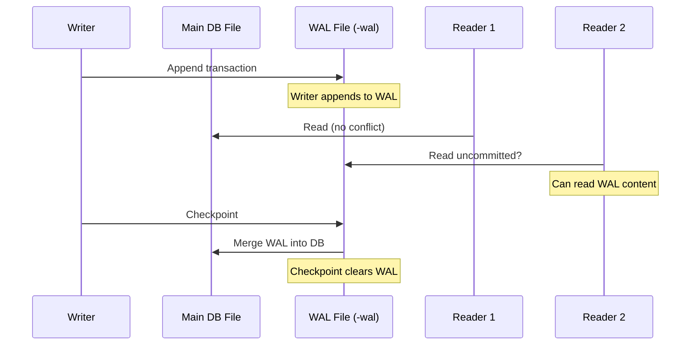
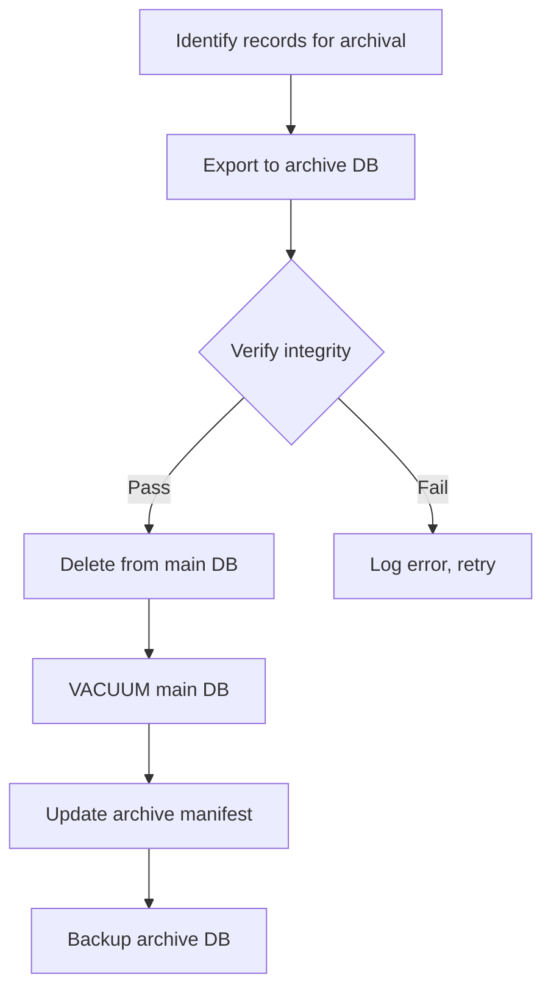
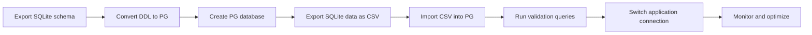

# Database Optimization — Computer Shop ERP & POS System

> **Version:** 1.0  
> **Engine:** SQLite 3.x  
> **Last Updated:** 2026-06-24

---

## Table of Contents

1. [SQLite WAL Mode Configuration](#1-sqlite-wal-mode-configuration)
2. [PRAGMA Settings](#2-pragma-settings)
3. [Index Strategy](#3-index-strategy)
4. [Composite Index Recommendations](#4-composite-index-recommendations)
5. [Query Optimization Patterns](#5-query-optimization-patterns)
6. [EXPLAIN QUERY PLAN Guide](#6-explain-query-plan-guide)
7. [N+1 Query Detection & Prevention](#7-n1-query-detection--prevention)
8. [Bulk Insert/Update Optimization](#8-bulk-insertupdate-optimization)
9. [JSON Field Querying Patterns](#9-json-field-querying-patterns)
10. [Performance Monitoring](#10-performance-monitoring)
11. [Connection Management](#11-connection-management)
12. [WAL File Management](#12-wal-file-management)
13. [VACUUM Strategy](#13-vacuum-strategy)
14. [Archival Strategy](#14-archival-strategy)
15. [PostgreSQL Migration Path](#15-postgresql-migration-path)
16. [Read Replica Strategy](#16-read-replica-strategy)
17. [Connection Pooling with SQLite](#17-connection-pooling-with-sqlite)

---

## 1. SQLite WAL Mode Configuration

Write-Ahead Logging (WAL) is the most impactful performance optimization for SQLite in a concurrent ERP/POS environment. It allows multiple readers to operate simultaneously with one writer.

### Enabling WAL Mode

```sql
PRAGMA journal_mode = WAL;
```

After execution, `PRAGMA journal_mode` returns `wal` — confirm this during application startup.

### How WAL Works



### WAL Benefits for ERP/POS

| Scenario | Without WAL | With WAL |
|---|---|---|
| Concurrent reads during write | BLOCKED (SQLITE_BUSY) | Permitted |
| Write performance | ~1x | ~2-3x faster |
| Read performance during writes | Degraded | Unaffected |
| Crash recovery | Rollback journal | WAL replay |

### WAL Drawbacks

- Slightly larger working set (`.db-wal` and `.db-shm` files).
- WAL file grows indefinitely without checkpoints.
- Not suitable for network filesystems (NFS, SMB) — WAL requires POSIX advisory locks.
- Read-only replicas on WAL files require additional handling.

---

## 2. PRAGMA Settings

Apply these PRAGMAs at application startup, immediately after opening the database connection:

```sql
-- WAL mode for concurrent read/write
PRAGMA journal_mode = WAL;

-- Balanced durability vs. performance
PRAGMA synchronous = NORMAL;

-- Cache size: 8MB (negative means kibibytes: -8000 = ~7.8MB)
PRAGMA cache_size = -8000;

-- Busy timeout: 3 seconds before SQLITE_BUSY error
PRAGMA busy_timeout = 3000;

-- Store temp tables/indexes in memory (not on disk)
PRAGMA temp_store = MEMORY;

-- Enforce foreign key constraints
PRAGMA foreign_keys = ON;
```

### PRAGMA Reference Table

| PRAGMA | Recommended Value | Purpose | Trade-off |
|---|---|---|---|
| `journal_mode` | WAL | Concurrent reads + writes | Extra files (-wal, -shm) |
| `synchronous` | NORMAL | Durability with 2x speed | Loses last ~25ms of data on crash |
| `synchronous` | FULL | Full fsync safety (default) | 2-3x slower writes |
| `cache_size` | -8000 | 8MB page cache | More memory = faster reads |
| `busy_timeout` | 3000 | Wait 3s before giving up | Delayed failure on contention |
| `temp_store` | MEMORY | Temp tables in RAM | Loses temp data on crash |
| `foreign_keys` | ON | Referential integrity | Slight overhead on writes |
| `page_size` | 4096 | Default; 8192 for large DBs | Must be set before first table |
| `auto_vacuum` | INCREMENTAL | Reclaim space on demand | No auto-shrink until VACUUM |
| `mmap_size` | 26843545600 | 25GB memory-mapped I/O | OS virtual memory pressure |

### Connection-Level PRAGMA Application

```python
import sqlite3

def get_connection(db_path: str) -> sqlite3.Connection:
    conn = sqlite3.connect(db_path)
    conn.execute("PRAGMA journal_mode = WAL")
    conn.execute("PRAGMA synchronous = NORMAL")
    conn.execute("PRAGMA cache_size = -8000")
    conn.execute("PRAGMA busy_timeout = 3000")
    conn.execute("PRAGMA temp_store = MEMORY")
    conn.execute("PRAGMA foreign_keys = ON")
    conn.execute("PRAGMA mmap_size = 26843545600")
    return conn
```

---

## 3. Index Strategy

### Every Index in the Schema

| Index Name | Table | Column(s) | Type | Purpose |
|---|---|---|---|---|
| IX_Store_Code | Store | Code | UNIQUE | Lookup by code |
| IX_Store_IsDeleted | Store | IsDeleted | Non-unique | Filter active stores |
| IX_Employee_StoreId | Employee | StoreId | Non-unique | Employees by store |
| IX_Employee_Email | Employee | Email | UNIQUE | Login lookup |
| IX_Employee_IsActive | Employee | IsActive | Non-unique | Filter active employees |
| IX_Employee_IsDeleted | Employee | IsDeleted | Non-unique | Filter deleted employees |
| IX_Role_IsActive | Role | IsActive | Non-unique | Filter active roles |
| IX_EmployeeRole_EmployeeId | EmployeeRole | EmployeeId | Non-unique | Roles by employee |
| IX_EmployeeRole_RoleId | EmployeeRole | RoleId | Non-unique | Employees by role |
| IX_Permission_Module | Permission | Module | Non-unique | Permissions by module |
| IX_RolePermission_RoleId | RolePermission | RoleId | Non-unique | Permissions by role |
| IX_RolePermission_PermissionId | RolePermission | PermissionId | Non-unique | Roles by permission |
| IX_Category_ParentCategoryId | Category | ParentCategoryId | Non-unique | Tree traversal |
| IX_Category_IsDeleted | Category | IsDeleted | Non-unique | Filter active categories |
| IX_Brand_IsDeleted | Brand | IsDeleted | Non-unique | Filter active brands |
| IX_Tax_IsActive | Tax | IsActive | Non-unique | Filter active taxes |
| IX_Product_CategoryId | Product | CategoryId | Non-unique | Products by category |
| IX_Product_BrandId | Product | BrandId | Non-unique | Products by brand |
| IX_Product_SupplierId | Product | SupplierId | Non-unique | Products by supplier |
| IX_Product_TaxId | Product | TaxId | Non-unique | Products by tax rate |
| IX_Product_SKU | Product | SKU | UNIQUE | SKU lookup |
| IX_Product_Barcode | Product | Barcode | UNIQUE (partial) | Barcode lookup (WHERE Barcode IS NOT NULL) |
| IX_Product_IsActive | Product | IsActive | Non-unique | Filter active products |
| IX_Product_IsDeleted | Product | IsDeleted | Non-unique | Filter deleted products |
| IX_Product_CreatedAt | Product | CreatedAt | Non-unique | Date-range queries |
| IX_Warehouse_StoreId | Warehouse | StoreId | Non-unique | Warehouses by store |
| IX_Warehouse_IsDeleted | Warehouse | IsDeleted | Non-unique | Filter active warehouses |
| IX_Inventory_WarehouseId | Inventory | WarehouseId | Non-unique | Stock by warehouse |
| IX_Inventory_ProductId | Inventory | ProductId | Non-unique | Stock by product |
| IX_Inventory_AvailableQuantity | Inventory | AvailableQuantity | Non-unique | Low-stock alerts |
| IX_Inventory_UpdatedAt | Inventory | UpdatedAt | Non-unique | Recency-based queries |
| IX_StockMovement_WarehouseId | StockMovement | WarehouseId | Non-unique | Movements by warehouse |
| IX_StockMovement_ProductId | StockMovement | ProductId | Non-unique | Movements by product |
| IX_StockMovement_MovementType | StockMovement | MovementType | Non-unique | Filter by type |
| IX_StockMovement_Reference | StockMovement | ReferenceType, ReferenceId | Composite | Find by source document |
| IX_StockMovement_CreatedAt | StockMovement | CreatedAt | Non-unique | Date-range queries |
| IX_StockMovement_SerialNumberId | StockMovement | SerialNumberId | Non-unique | Movements by serial |
| IX_SerialNumber_ProductId | SerialNumber | ProductId | Non-unique | Serials by product |
| IX_SerialNumber_InventoryId | SerialNumber | InventoryId | Non-unique | Serials by location |
| IX_SerialNumber_Status | SerialNumber | Status | Non-unique | Filter by status |
| IX_SerialNumber_WarrantyEnd | SerialNumber | WarrantyEnd | Non-unique | Expiring warranties |
| IX_StockCount_WarehouseId | StockCount | WarehouseId | Non-unique | Counts by warehouse |
| IX_StockCount_Status | StockCount | Status | Non-unique | Filter by status |
| IX_StockCount_CountDate | StockCount | CountDate | Non-unique | Date-range queries |
| IX_SalesOrder_StoreId | SalesOrder | StoreId | Non-unique | Orders by store |
| IX_SalesOrder_CustomerId | SalesOrder | CustomerId | Non-unique | Orders by customer |
| IX_SalesOrder_EmployeeId | SalesOrder | EmployeeId | Non-unique | Orders by employee |
| IX_SalesOrder_OrderDate | SalesOrder | OrderDate | Non-unique | Date-range queries |
| IX_SalesOrder_Status | SalesOrder | Status | Non-unique | Filter by status |
| IX_SalesOrder_IsDeleted | SalesOrder | IsDeleted | Non-unique | Filter deleted orders |
| IX_SalesOrder_CreatedAt | SalesOrder | CreatedAt | Non-unique | Date-range queries |
| IX_SalesOrderItem_OrderId | SalesOrderItem | SalesOrderId | Non-unique | Items by order |
| IX_SalesOrderItem_ProductId | SalesOrderItem | ProductId | Non-unique | Sales by product |
| IX_SalesOrderItem_SerialNumberId | SalesOrderItem | SerialNumberId | Non-unique | Items by serial |
| IX_PurchaseOrder_StoreId | PurchaseOrder | StoreId | Non-unique | POs by store |
| IX_PurchaseOrder_SupplierId | PurchaseOrder | SupplierId | Non-unique | POs by supplier |
| IX_PurchaseOrder_EmployeeId | PurchaseOrder | EmployeeId | Non-unique | POs by employee |
| IX_PurchaseOrder_OrderDate | PurchaseOrder | OrderDate | Non-unique | Date-range queries |
| IX_PurchaseOrder_Status | PurchaseOrder | Status | Non-unique | Filter by status |
| IX_PurchaseOrderItem_POId | PurchaseOrderItem | PurchaseOrderId | Non-unique | Items by PO |
| IX_PurchaseOrderItem_ProductId | PurchaseOrderItem | ProductId | Non-unique | Purchases by product |
| IX_Customer_Phone | Customer | Phone | Non-unique | Phone lookup |
| IX_Customer_FullName | Customer | FullName | Non-unique | Name search |
| IX_Customer_IsDeleted | Customer | IsDeleted | Non-unique | Filter deleted customers |
| IX_Supplier_CompanyName | Supplier | CompanyName | Non-unique | Supplier search |
| IX_Supplier_Phone | Supplier | Phone | Non-unique | Phone lookup |
| IX_Supplier_IsDeleted | Supplier | IsDeleted | Non-unique | Filter deleted suppliers |
| IX_RepairOrder_StoreId | RepairOrder | StoreId | Non-unique | Repairs by store |
| IX_RepairOrder_CustomerId | RepairOrder | CustomerId | Non-unique | Repairs by customer |
| IX_RepairOrder_EmployeeId | RepairOrder | EmployeeId | Non-unique | Repairs by technician |
| IX_RepairOrder_Status | RepairOrder | Status | Non-unique | Filter by status |
| IX_RepairOrder_ReceivedDate | RepairOrder | ReceivedDate | Non-unique | Date-range queries |
| IX_RepairOrder_SalesOrderId | RepairOrder | SalesOrderId | Non-unique | Linking to sales |
| IX_RepairOrder_WarrantyId | RepairOrder | WarrantyId | Non-unique | Linking to warranty |
| IX_RepairPart_RepairOrderId | RepairPart | RepairOrderId | Non-unique | Parts by repair |
| IX_RepairPart_ProductId | RepairPart | ProductId | Non-unique | Parts usage by product |
| IX_Warranty_CustomerId | Warranty | CustomerId | Non-unique | Warranties by customer |
| IX_Warranty_ProductId | Warranty | ProductId | Non-unique | Warranties by product |
| IX_Warranty_SerialNumberId | Warranty | SerialNumberId | Non-unique | Warranties by serial |
| IX_Warranty_Status | Warranty | Status | Non-unique | Filter by status |
| IX_Warranty_EndDate | Warranty | EndDate | Non-unique | Expiring warranties |
| IX_FinancialRecord_StoreId | FinancialRecord | StoreId | Non-unique | Records by store |
| IX_FinancialRecord_RecordDate | FinancialRecord | RecordDate | Non-unique | Date-range queries |
| IX_FinancialRecord_RecordType | FinancialRecord | RecordType | Non-unique | Filter by type |
| IX_FinancialRecord_Category | FinancialRecord | Category | Non-unique | Filter by category |
| IX_AuditLog_TableName_RecordId | AuditLog | TableName, RecordId | Composite | Record history lookup |
| IX_AuditLog_EmployeeId | AuditLog | EmployeeId | Non-unique | Actions by employee |
| IX_AuditLog_Action | AuditLog | Action | Non-unique | Filter by action |
| IX_AuditLog_CreatedAt | AuditLog | CreatedAt | Non-unique | Date-range queries |

### Partial Unique Indexes (Nullable Columns)

```sql
-- Barcode: allow multiple NULLs but enforce uniqueness on non-null values
CREATE UNIQUE INDEX IX_Product_Barcode
    ON Product(Barcode)
    WHERE Barcode IS NOT NULL;

-- Email: allow multiple NULLs but enforce uniqueness on non-null values
CREATE UNIQUE INDEX IX_Customer_Email
    ON Customer(Email)
    WHERE Email IS NOT NULL;
```

### Index Maintenance Rules

- **Covering indexes**: For frequently accessed query patterns, include all columns needed in the index to avoid table lookups.
- **Index on JSON expressions**: SQLite supports indexes on `json_extract()` expressions.
- **Drop unused indexes**: Monitor with `EXPLAIN QUERY PLAN` — unused indexes waste write performance.
- **Avoid over-indexing**: Each additional index slows down INSERT/UPDATE/DELETE by ~O(log n).

---

## 4. Composite Index Recommendations

These composite indexes target the most common query patterns in an ERP/POS system:

### Sales Dashboard Queries

```sql
-- Most common: daily sales by store, status, and date
CREATE INDEX IX_SalesOrder_Store_Date_Status
    ON SalesOrder(StoreId, OrderDate, Status)
    WHERE IsDeleted = 0;

-- Query this supports:
SELECT OrderDate, COUNT(*) AS OrderCount, SUM(GrandTotal) AS Total
FROM SalesOrder
WHERE StoreId = ?
  AND OrderDate >= ?
  AND OrderDate < ?
  AND Status IN ('COMPLETED', 'CONFIRMED')
  AND IsDeleted = 0
GROUP BY OrderDate;
```

### Inventory Lookup by Warehouse and Product

```sql
-- Covers the composite unique and low-stock queries
CREATE INDEX IX_Inventory_Warehouse_Product
    ON Inventory(WarehouseId, ProductId, AvailableQuantity);

-- Query this supports:
SELECT p.Name, p.SKU, i.Quantity, i.AvailableQuantity
FROM Inventory i
JOIN Product p ON i.ProductId = p.ProductId
WHERE i.WarehouseId = ?
  AND i.AvailableQuantity <= ?
ORDER BY i.AvailableQuantity ASC;
```

### Product Sales History

```sql
-- Aggregating sales by product over a date range
CREATE INDEX IX_SalesOrderItem_Product_Date
    ON SalesOrderItem(ProductId, SalesOrderId);

-- Combined with SalesOrder date index:
SELECT soi.ProductId, SUM(soi.Quantity) AS Qty, SUM(soi.LineTotal) AS Total
FROM SalesOrderItem soi
JOIN SalesOrder so ON soi.SalesOrderId = so.SalesOrderId
WHERE so.OrderDate >= ?
  AND so.OrderDate < ?
  AND so.Status = 'COMPLETED'
  AND so.IsDeleted = 0
GROUP BY soi.ProductId;
```

### Customer Order History

```sql
CREATE INDEX IX_SalesOrder_Customer_Date
    ON SalesOrder(CustomerId, OrderDate, Status)
    WHERE IsDeleted = 0;
```

### Stock Movement by Reference Document

```sql
-- Used when viewing a purchase order's stock movements
CREATE INDEX IX_StockMovement_Ref_Product
    ON StockMovement(ReferenceType, ReferenceId, ProductId);
```

### Repair Order Status by Technician

```sql
CREATE INDEX IX_RepairOrder_Employee_Status
    ON RepairOrder(EmployeeId, Status, ReceivedDate);
```

### Composite Index Selection Checklist

| Criteria | Decision |
|---|---|
| Does the WHERE clause filter multiple columns? | Create composite index on those columns |
| Is the leading column highly selective? | Yes → good index; No → reverse column order |
| Are all columns used in the query covered? | Consider adding INCLUDE columns |
| Is the table write-heavy? | Fewer indexes; rely on primary key |
| Is the table read-heavy? | More covering indexes acceptable |

---

## 5. Query Optimization Patterns

### BEFORE Optimization: Unindexed Scan

```sql
-- BAD: Full table scan on SalesOrder (potentially millions of rows)
SELECT * FROM SalesOrder WHERE OrderDate >= '2026-01-01' AND Status = 'COMPLETED';
```

```
EXPLAIN QUERY PLAN:
SCAN SalesOrder
```

### AFTER Optimization: Indexed Seek

```sql
-- GOOD: Uses IX_SalesOrder_OrderDate
SELECT * FROM SalesOrder
WHERE OrderDate >= '2026-01-01'
  AND Status = 'COMPLETED'
  AND IsDeleted = 0;
```

```
EXPLAIN QUERY PLAN:
SEARCH SalesOrder USING INDEX IX_SalesOrder_OrderDate (OrderDate>?)
```

---

### BEFORE: N+1 in Inventory Check

```python
# BAD: One query per product
products = execute("SELECT * FROM Product WHERE IsDeleted = 0")
for p in products:
    inv = execute("SELECT * FROM Inventory WHERE ProductId = ? AND WarehouseId = ?",
                  (p['ProductId'], warehouse_id))
```

### AFTER: Batch JOIN

```sql
-- GOOD: Single query with LEFT JOIN
SELECT p.ProductId, p.Name, p.SKU, p.SellingPrice,
       i.Quantity, i.AvailableQuantity
FROM Product p
LEFT JOIN Inventory i ON p.ProductId = i.ProductId AND i.WarehouseId = ?
WHERE p.IsDeleted = 0
  AND p.IsActive = 1;
```

---

### BEFORE: Row-by-Row Insert

```python
# BAD: 1000 individual INSERT statements
for item in order_items:
    execute("INSERT INTO SalesOrderItem (...) VALUES (...)", item)
```

### AFTER: Bulk Insert with executemany

```python
# GOOD: Single transaction, single round-trip
conn.execute("BEGIN TRANSACTION")
conn.executemany("""
    INSERT INTO SalesOrderItem
        (SalesOrderId, ProductId, Quantity, UnitPrice, LineTotal)
    VALUES (?, ?, ?, ?, ?)
""", order_items)
conn.commit()
```

---

### BEFORE: JSON Extraction Without Index

```sql
-- BAD: Full scan for JSON key lookup
SELECT * FROM StockCount
WHERE json_extract(Items, '$[0].productId') = 42;
```

### AFTER: JSON Expression Index

```sql
-- Create index on the JSON expression
CREATE INDEX IX_StockCount_FirstProduct
    ON StockCount(json_extract(Items, '$[0].productId'));

-- Now the query uses the index
SELECT * FROM StockCount
WHERE json_extract(Items, '$[0].productId') = 42;
```

```
EXPLAIN QUERY PLAN:
SEARCH StockCount USING INDEX IX_StockCount_FirstProduct
```

---

### BEFORE: Unnecessary COUNT Subquery

```sql
-- BAD: Counts all rows then filters
SELECT * FROM (
    SELECT *, COUNT(*) OVER() AS TotalCount
    FROM SalesOrder WHERE IsDeleted = 0
)
WHERE OrderDate >= '2026-01-01'
LIMIT 50 OFFSET 0;
```

### AFTER: Separate COUNT + Query

```sql
-- GOOD: Two efficient queries (use for pagination)
SELECT COUNT(*) FROM SalesOrder
WHERE IsDeleted = 0 AND OrderDate >= '2026-01-01';

SELECT * FROM SalesOrder
WHERE IsDeleted = 0 AND OrderDate >= '2026-01-01'
ORDER BY OrderDate DESC
LIMIT 50 OFFSET 0;
```

---

## 6. EXPLAIN QUERY PLAN Guide

### Reading EXPLAIN QUERY PLAN Output

```sql
EXPLAIN QUERY PLAN
SELECT so.OrderNumber, so.OrderDate, so.GrandTotal,
       c.FullName AS Customer
FROM SalesOrder so
LEFT JOIN Customer c ON so.CustomerId = c.CustomerId
WHERE so.StoreId = 1
  AND so.OrderDate >= '2026-01-01'
  AND so.IsDeleted = 0
ORDER BY so.OrderDate DESC
LIMIT 50;
```

```
QUERY PLAN
|--SEARCH SalesOrder AS so USING INDEX IX_SalesOrder_Store_Date_Status (StoreId=? AND OrderDate>?)
|--SEARCH Customer AS c USING INTEGER PRIMARY KEY (rowid=?)
|--USE TEMP B-TREE FOR ORDER BY
```

### Interpreting the Plan

| Keyword | Meaning | Performance |
|---|---|---|
| `SEARCH ... USING INDEX` | Index seek — good | Fast |
| `SCAN` | Full table scan | Slow — add index |
| `USE TEMP B-TREE FOR ORDER BY` | Sorting in temp table | Slow if large — add index on ORDER BY columns |
| `USE TEMP B-TREE FOR GROUP BY` | Grouping in temp table | Slow if large — add composite index |
| `EXECUTE CORRELATED SCALAR SUBQUERY` | Subquery per row | Potential N+1 |
| `SCAN ... USING COVERING INDEX` | Index-only scan | Optimal |
| `SEARCH ... USING INTEGER PRIMARY KEY` | Rowid lookup | Fastest |

### Performance Levels

```
Best:    SEARCH USING COVERING INDEX
Great:   SEARCH USING INDEX
Good:    SEARCH USING INTEGER PRIMARY KEY
Okay:    SCAN (small table < 1000 rows)
Bad:     SCAN (large table)
Critical:USE TEMP B-TREE (large result set)
```

### Common Plan Issues and Fixes

| Observation | Problem | Fix |
|---|---|---|
| `SCAN SalesOrder` | Missing index on WHERE column | Add index on `OrderDate` or `StoreId` |
| `USE TEMP B-TREE FOR ORDER BY` | ORDER BY column not in index | Add composite index with ORDER BY column last |
| `EXECUTE CORRELATED SCALAR SUBQUERY` | N+1 in subquery | Rewrite as JOIN |
| `SCAN ...` on large table with LIMIT | No index for filter | Add index on filtered columns |

### Query Plan Cheat Sheet

```sql
-- Check if an index is being used
EXPLAIN QUERY PLAN SELECT ... ;

-- Look for "SCAN" — indicates missing index
-- Look for "TEMP B-TREE" — indicates missing ORDER BY index

-- Verify index usage after creation:
CREATE INDEX IX_Test ON SalesOrder(OrderDate);
EXPLAIN QUERY PLAN SELECT * FROM SalesOrder WHERE OrderDate > '2026-01-01';
-- Should show: SEARCH SalesOrder USING INDEX IX_Test
```

---

## 7. N+1 Query Detection & Prevention

### What is N+1?

The application executes 1 query to fetch parent records and N additional queries to fetch children for each parent. For 100 orders, this means 1 + 100 = 101 queries.

### Detection with EXPLAIN QUERY PLAN

Look for `EXECUTE CORRELATED SCALAR SUBQUERY` or `EXECUTE CORRELATED SUBQUERY`:

```sql
EXPLAIN QUERY PLAN
SELECT *,
    (SELECT COUNT(*) FROM SalesOrderItem WHERE SalesOrderId = so.SalesOrderId) AS ItemCount
FROM SalesOrder so;
```

```
QUERY PLAN
|--SCAN SalesOrder so
|--EXECUTE CORRELATED SCALAR SUBQUERY 1
   |--SEARCH SalesOrderItem USING INDEX IX_SalesOrderItem_OrderId (SalesOrderId=?)
```

This is N+1 in SQL form — fix with a window function or JOIN:

```sql
SELECT so.*, COALESCE(item_counts.TotalItems, 0) AS ItemCount
FROM SalesOrder so
LEFT JOIN (
    SELECT SalesOrderId, COUNT(*) AS TotalItems
    FROM SalesOrderItem
    GROUP BY SalesOrderId
) item_counts ON so.SalesOrderId = item_counts.SalesOrderId;
```

### Application-Level N+1 Detection

Monitor query count in development:

```python
# Python: wrap connection to count queries
class QueryCounter:
    def __init__(self, conn):
        self.conn = conn
        self.count = 0

    def execute(self, sql, params=None):
        self.count += 1
        if self.count > 100:
            print(f"WARNING: {self.count} queries executed")
        return self.conn.execute(sql, params or [])
```

### Common N+1 Patterns in ERP/POS

| Scenario | Bad Pattern | Good Pattern |
|---|---|---|
| Loading orders with items | Loop over orders, query items each time | `SELECT * FROM SalesOrderItem WHERE SalesOrderId IN (?, ?, ...)` |
| Loading products with inventory | Query product, then query inventory | `LEFT JOIN Inventory ON ...` |
| Loading repairs with parts | Query repair, then query parts | `JOIN RepairPart ON ...` |
| Role permissions check | Query for each permission | Single JOIN with WHERE IN |
| Customer with warranties | Loop over customers | `LEFT JOIN Warranty ON ...` |

---

## 8. Bulk Insert/Update Optimization

### executemany Pattern (Python)

```python
def bulk_insert_sales_items(order_id, items):
    """Insert 100+ sales order items in a single transaction."""
    conn = get_connection("erp.db")
    try:
        conn.execute("BEGIN TRANSACTION")
        conn.executemany("""
            INSERT INTO SalesOrderItem
                (SalesOrderId, ProductId, Quantity, UnitPrice,
                 DiscountPercent, DiscountAmount, TaxPercent,
                 TaxAmount, LineTotal)
            VALUES (?, ?, ?, ?, ?, ?, ?, ?, ?)
        """, [
            (
                order_id,
                item['ProductId'],
                item['Quantity'],
                item['UnitPrice'],
                item.get('DiscountPercent', 0),
                item.get('DiscountAmount', 0),
                item.get('TaxPercent', 0),
                item.get('TaxAmount', 0),
                item['LineTotal']
            )
            for item in items
        ])
        conn.commit()
    except Exception:
        conn.rollback()
        raise
    finally:
        conn.close()
```

### Batch INSERT Performance Comparison

| Method | 100 rows | 1,000 rows | 10,000 rows |
|---|---|---|---|
| Individual INSERTs | 150ms | 1,400ms | 14,000ms |
| executemany (1 transaction) | 5ms | 15ms | 120ms |
| executemany (batch 500) | 5ms | 12ms | 100ms |

### Bulk UPDATE Example

```python
def bulk_update_prices(product_price_updates):
    """Update selling prices for multiple products."""
    conn = get_connection("erp.db")
    try:
        conn.execute("BEGIN TRANSACTION")
        conn.executemany("""
            UPDATE Product
            SET SellingPrice = ?, UpdatedAt = datetime('now')
            WHERE ProductId = ?
        """, product_price_updates)
        conn.commit()
    except Exception:
        conn.rollback()
        raise
    finally:
        conn.close()
```

### Batch INSERT or IGNORE (upsert pattern)

```python
conn.executemany("""
    INSERT INTO Inventory (WarehouseId, ProductId, Quantity, AvailableQuantity)
    VALUES (?, ?, ?, ?)
    ON CONFLICT(WarehouseId, ProductId) DO UPDATE SET
        Quantity = Quantity + excluded.Quantity,
        AvailableQuantity = AvailableQuantity + excluded.AvailableQuantity,
        UpdatedAt = datetime('now')
""", inventory_adjustments)
```

---

## 9. JSON Field Querying Patterns

### StockCount Items

```sql
-- Extract all product IDs from a stock count
SELECT DISTINCT json_extract(value, '$.productId') AS ProductId
FROM StockCount,
     json_each(Items)
WHERE StockCountId = ?;

-- Find stock count lines with discrepancies
SELECT json_extract(value, '$.productId') AS ProductId,
       json_extract(value, '$.expectedQuantity') AS Expected,
       json_extract(value, '$.countedQuantity') AS Counted,
       json_extract(value, '$.difference') AS Difference
FROM StockCount,
     json_each(Items)
WHERE StockCountId = ?
  AND json_extract(value, '$.difference') != 0;
```

### RepairOrder Diagnosis

```sql
-- Find all repairs where a specific component was diagnosed
SELECT ro.RepairNumber, ro.DeviceType, ro.DeviceModel,
       json_extract(diag.value, '$.component') AS Component,
       json_extract(diag.value, '$.issue') AS Issue,
       json_extract(diag.value, '$.severity') AS Severity
FROM RepairOrder ro,
     json_each(ro.Diagnosis) AS diag
WHERE json_extract(diag.value, '$.component') LIKE '%Motherboard%'
  AND ro.Status NOT IN ('CANCELLED', 'DELIVERED');
```

### RepairOrder StatusHistory

```sql
-- Get the last status change for each repair
SELECT ro.RepairNumber, ro.Status,
       json_extract(
           (SELECT value FROM json_each(ro.StatusHistory)
            ORDER BY json_extract(value, '$.changedAt') DESC LIMIT 1),
           '$.changedAt'
       ) AS LastChangedAt
FROM RepairOrder ro;
```

### AuditLog Old/New Values

```sql
-- Find audit entries where selling price changed
SELECT al.CreatedAt, al.Action,
       json_extract(al.OldValues, '$.SellingPrice') AS OldPrice,
       json_extract(al.NewValues, '$.SellingPrice') AS NewPrice,
       e.FullName
FROM AuditLog al
LEFT JOIN Employee e ON al.EmployeeId = e.EmployeeId
WHERE al.TableName = 'Product'
  AND json_extract(al.NewValues, '$.SellingPrice') IS NOT NULL
  AND json_extract(al.OldValues, '$.SellingPrice') !=
      json_extract(al.NewValues, '$.SellingPrice')
ORDER BY al.CreatedAt DESC;
```

### JSON Performance Notes

- `json_extract()` with a path expression is fast but cannot use standard B-tree indexes unless a JSON-specific index is created.
- `json_each()` expands a JSON array into rows — it does a full scan of the JSON string.
- For tables where JSON fields are queried frequently, consider normalising the data into a child table.

---

## 10. Performance Monitoring

### Finding Slow Queries

**Method 1: SQLite's `sqlite_stmt` virtual table (SQLite 3.42+)**

```sql
SELECT * FROM sqlite_stmt;
-- Columns: sql, uses, total_time, min_time, max_time
```

**Method 2: EXPLAIN QUERY PLAN (development)**

```sql
EXPLAIN QUERY PLAN SELECT ... ;
-- Look for SCAN, USE TEMP B-TREE
```

**Method 3: Application-level timing**

```python
import time

def timed_query(conn, sql, params=None):
    start = time.perf_counter()
    result = conn.execute(sql, params or []).fetchall()
    elapsed = (time.perf_counter() - start) * 1000
    if elapsed > 100:  # log queries slower than 100ms
        print(f"SLOW QUERY ({elapsed:.1f}ms): {sql[:100]}...")
    return result
```

**Method 4: SQLite Performance Profile (third-party tools)**

| Tool | Description |
|---|---|
| `sqlite3-analyzer` | Analyzes database file structure |
| `sqldiff` | Compares SQLite databases |
| `sqlite3_explain` | Visualizes query plans |

### Metrics to Monitor

| Metric | Warning Threshold | Critical Threshold |
|---|---|---|
| Query time (p95) | > 100ms | > 500ms |
| Full table scans / sec | > 10 | > 100 |
| WAL file size | > 100MB | > 1GB |
| Database file size | > 1GB | > 10GB |
| Active connections | > 10 | > 50 |
| Transaction duration | > 5s | > 30s |
| Cache miss rate | > 20% | > 50% |

---

## 11. Connection Management

### When to Share vs. Create New Connections

| Scenario | Strategy | Rationale |
|---|---|---|
| Web request handler | Shared connection per request | Request-scoped; close after response |
| Background job queue | Dedicated connection per worker | Jobs run concurrently |
| Long-running import | Dedicated connection | Avoid holding transaction on shared conn |
| Read-only reports | Shared read-only connection | Can share across threads (WAL mode) |
| Real-time dashboards | Connection pool (limited) | Max 4-8 connections |
| Migration scripts | Exclusive connection | Avoid conflicts |

### Connection Lifecycle Best Practices

```python
# DO: Use context manager
def query_orders(store_id):
    conn = get_connection("erp.db")
    try:
        return conn.execute(
            "SELECT * FROM SalesOrder WHERE StoreId = ?", (store_id,)
        ).fetchall()
    finally:
        conn.close()

# DO NOT: Open connection once and reuse forever
# (Connections can become stale, WAL checkpoint issues)
```

### Thread Safety

- SQLite connections are NOT thread-safe by default.
- Use `check_same_thread=False` when sharing across threads (Python):
  ```python
  conn = sqlite3.connect("erp.db", check_same_thread=False)
  ```
- Even with WAL mode, only one writer is allowed at a time.
- Use a threading lock or queue for all write operations.

---

## 12. WAL File Management

### Understanding WAL Files

When WAL mode is enabled, SQLite creates two additional files alongside the main database:

| File | Purpose | Size |
|---|---|---|
| `erp.db` | Main database | Base data |
| `erp.db-wal` | Write-Ahead Log | Pending writes (transient) |
| `erp.db-shm` | Shared Memory | Lock/coordination info (transient) |

The `-wal` file grows with each write transaction. It is checkpointed (merged into the main DB) automatically or manually.

### Checkpoint Strategies

```sql
-- Manual checkpoint (blocks until complete)
PRAGMA wal_checkpoint;

-- Passive checkpoint (non-blocking, may not finish)
PRAGMA wal_checkpoint(PASSIVE);

-- Full checkpoint (blocking, truncates WAL)
PRAGMA wal_checkpoint(FULL);
```

### Automatic Checkpoint Threshold

```sql
-- Set WAL auto-checkpoint to 1000 pages (~4MB for 4KB pages)
PRAGMA wal_autocheckpoint = 1000;
```

### WAL Maintenance Schedule

| Frequency | Action | Command |
|---|---|---|
| Every 5 minutes | Passive checkpoint (background) | `PRAGMA wal_checkpoint(PASSIVE)` |
| Hourly | Full checkpoint (idle time) | `PRAGMA wal_checkpoint(FULL)` |
| Daily | VACUUM (if auto_vacuum=INCREMENTAL) | `PRAGMA incremental_vacuum` |
| Weekly | Full VACUUM (reclaim space) | `VACUUM;` |

### Monitoring WAL Size

```powershell
# Windows
Get-ChildItem -Path erp.db-wal | Format-Table Name, Length
```

Target WAL file size: < 10% of main database file size. If the WAL consistently exceeds this, increase checkpoint frequency.

---

## 13. VACUUM Strategy

### When to VACUUM

VACUUM rebuilds the entire database file, reclaiming space from deleted rows and defragmenting pages.

| Trigger | Action |
|---|---|
| After bulk DELETE (> 20% of rows) | `VACUUM;` |
| Database fragmentation suspected | `PRAGMA page_count; PRAGMA freelist_count;` if freelist > 10% of page_count |
| Monthly maintenance | `VACUUM;` |
| After archival run | `VACUUM;` |

### Incremental Vacuum (Preferred)

```sql
-- Enable incremental vacuum (once, at schema creation)
PRAGMA auto_vacuum = INCREMENTAL;

-- Reclaim pages incrementally without full rebuild
PRAGMA incremental_vacuum(500);  -- Reclaim up to 500 pages
```

### VACUUM Performance Impact

| Database Size | VACUUM Time | Disk Space Needed | Lock Duration |
|---|---|---|---|
| 100MB | 1-2s | 200MB (temporary) | Brief |
| 500MB | 5-10s | 1GB | Moderate |
| 1GB | 15-30s | 2GB | Long |
| 10GB | 3-5min | 20GB | Very long (schedule offline) |

### VACUUM Safety

```sql
-- Always VACUUM with exclusive access
PRAGMA schema_version;  -- verify before
VACUUM;
PRAGMA schema_version;  -- verify after (should match)

-- On failure, the original database is preserved
```

---

## 14. Archival Strategy

### What to Archive

| Table | Archival Trigger | Retention Period |
|---|---|---|
| SalesOrder (COMPLETED) | Paid in full, delivered | 12 months online, 3 years archive |
| SalesOrderItem | Parent archived | Same as parent |
| StockMovement | > 6 months old | Archive after archival of orders |
| AuditLog | > 1 year old | 3 years archive |
| FinancialRecord | > 2 years old | 5 years archive (legal requirement) |
| RepairOrder (DELIVERED) | Delivered + 6 months | 2 years |

### Archival Process



### Step-by-Step Archival Script

```sql
-- Step 1: Identify archival candidates
CREATE TEMP TABLE ArchiveCandidates AS
SELECT SalesOrderId FROM SalesOrder
WHERE Status = 'COMPLETED'
  AND PaymentDate < date('now', '-12 months')
  AND IsDeleted = 0;

-- Step 2: Export to archive database (run from application)
-- ATTACH 'erp_archive.db' AS archive;
-- INSERT INTO archive.SalesOrder SELECT * FROM main.SalesOrder
-- WHERE SalesOrderId IN (SELECT SalesOrderId FROM ArchiveCandidates);
-- INSERT INTO archive.SalesOrderItem SELECT soi.*
-- FROM SalesOrderItem soi
-- JOIN ArchiveCandidates ac ON soi.SalesOrderId = ac.SalesOrderId;

-- Step 3: Verify row counts
-- SELECT COUNT(*) FROM archive.SalesOrder;
-- SELECT COUNT(*) FROM archive.SalesOrderItem;

-- Step 4: Delete from main database (inside transaction)
BEGIN TRANSACTION;
    DELETE FROM SalesOrderItem
    WHERE SalesOrderId IN (SELECT SalesOrderId FROM ArchiveCandidates);
    DELETE FROM SalesOrder
    WHERE SalesOrderId IN (SELECT SalesOrderId FROM ArchiveCandidates);
COMMIT;

-- Step 5: Reclaim space
VACUUM;

-- Step 6: Drop temp table
DROP TABLE ArchiveCandidates;
```

### Archive Verification Checklist

- [ ] Row count matches between source and archive
- [ ] Sum of GrandTotal matches
- [ ] All child records were copied (SalesOrderItem count matches)
- [ ] Foreign key integrity in archive: `PRAGMA foreign_key_check`
- [ ] Backup both databases after archival

---

## 15. PostgreSQL Migration Path

### Why Migrate from SQLite to PostgreSQL

| Factor | SQLite | PostgreSQL |
|---|---|---|
| Concurrent write throughput | ~100 writes/sec | ~10,000+ writes/sec |
| Connection limit | Limited (WAL mode helps) | 100+ concurrent connections |
| Storage scaling | Single file | Distributed, tablespaces |
| Replication | None built-in | Streaming replication |
| User management | No users | Role-based access |
| JSON support | Basic | Full JSONB with indexing |
| Array support | No | Native arrays |
| Full-text search | FTS5 extension | Built-in |

### Schema Changes Required

| SQLite Feature | PostgreSQL Equivalent | Change Required |
|---|---|---|
| `INTEGER PRIMARY KEY` | `SERIAL PRIMARY KEY` or `BIGSERIAL` | Auto-increment syntax |
| `TEXT` dates (ISO-8601) | `TIMESTAMP` or `TIMESTAMPTZ` | Column type change; values convert automatically |
| `INTEGER` for prices | `INTEGER` or `NUMERIC(10,2)` | Same type works, or use `NUMERIC` for decimal |
| `REAL` for percentages | `NUMERIC(5,2)` or `REAL` | Same type works |
| `BOOL` as `INTEGER` | `BOOLEAN` | Type change; 0/1 → true/false |
| `JSON` (text) | `JSONB` | Type change; use `JSONB` for indexing |
| `CURRENT_TIMESTAMP` | `NOW()` or `CURRENT_TIMESTAMP` | Same, works identically |
| Partial unique indexes | `CREATE UNIQUE INDEX ... WHERE` | Same syntax |
| `ON CONFLICT` (UPSERT) | `ON CONFLICT` | Same syntax |
| Recursive CTE | `WITH RECURSIVE` | Same syntax |
| `json_extract()` | `->>` operator | `json_extract(col, '$.path')` → `col->>'path'` |
| `json_each()` | `jsonb_array_elements()` | Table function syntax differs |

### Migration Procedure



### Data Type Mapping Table

```sql
-- SQLite → PostgreSQL exact mapping
CREATE TABLE Product_PG (
    ProductId         BIGSERIAL PRIMARY KEY,
    ProductUid        UUID NOT NULL UNIQUE,
    CategoryId        BIGINT NOT NULL REFERENCES Category(CategoryId),
    BrandId           BIGINT REFERENCES Brand(BrandId),
    SupplierId        BIGINT REFERENCES Supplier(SupplierId),
    TaxId             BIGINT REFERENCES Tax(TaxId),
    SKU               VARCHAR(100) NOT NULL UNIQUE,
    Name              VARCHAR(500) NOT NULL,
    Description       TEXT,
    UnitOfMeasure     VARCHAR(10) NOT NULL DEFAULT 'PCS',
    Barcode           VARCHAR(100) UNIQUE,
    CostPrice         INTEGER NOT NULL DEFAULT 0,
    SellingPrice      INTEGER NOT NULL DEFAULT 0,
    WarrantyDays      INTEGER DEFAULT 0,
    HasSerialNumbers  BOOLEAN NOT NULL DEFAULT FALSE,
    MinStockLevel     INTEGER DEFAULT 0,
    MaxStockLevel     INTEGER DEFAULT 0,
    IsActive          BOOLEAN NOT NULL DEFAULT TRUE,
    IsDeleted         BOOLEAN NOT NULL DEFAULT FALSE,
    CreatedAt         TIMESTAMPTZ NOT NULL DEFAULT NOW(),
    UpdatedAt         TIMESTAMPTZ NOT NULL DEFAULT NOW()
);

-- Partial unique index (same syntax)
CREATE UNIQUE INDEX IX_Product_Barcode
    ON Product(Barcode) WHERE Barcode IS NOT NULL;
```

### PostgreSQL-Specific Optimisations

```sql
-- Use JSONB for better query performance
ALTER TABLE RepairOrder ALTER COLUMN Diagnosis TYPE JSONB USING Diagnosis::JSONB;

-- JSONB index for component lookups
CREATE INDEX IX_RepairOrder_Diagnosis_Component
    ON RepairOrder USING GIN (Diagnosis jsonb_path_ops);

-- Full-text search on product names
ALTER TABLE Product ADD COLUMN SearchVector TSVECTOR
    GENERATED ALWAYS AS (to_tsvector('english', Name || ' ' || COALESCE(Description, ''))) STORED;
CREATE INDEX IX_Product_Search ON Product USING GIN(SearchVector);
```

---

## 16. Read Replica Strategy

### SQLite Read Replica Concept

SQLite does not natively support replication. However, with WAL mode, you can implement a manual read-replica pattern:

```
┌─────────────────┐          ┌─────────────────┐
│   Main (Writer)  │          │  Replica (Reader)│
│   erp.db         │  ──────► │   erp_replica.db │
│   WAL mode       │   Copy   │   WAL mode       │
└─────────────────┘          └─────────────────┘
         │                          │
         │ Writes                   │ Reads only
         ▼                          ▼
   POS Terminals              Reports, Dashboards
```

### Implementation Approaches

**Strategy 1: Periodic File Copy (Simple)**

```powershell
# Windows scheduled task: every 5 minutes
Copy-Item -Path "erp.db" -Destination "erp_replica.db" -Force
Copy-Item -Path "erp.db-wal" -Destination "erp_replica.db-wal" -Force
```

**Limitations:** Replica is only as current as the last copy; risk of copying during an active write.

**Strategy 2: Litestream (Recommended)**

```bash
# Stream SQLite changes to S3/network location
litestream replicate erp.db s3://bucket/erp.db
```

**Strategy 3: Application-Level Dual Write**

```python
def write_and_replicate(query, params):
    # Write to primary
    primary.execute(query, params)
    # Write to replica (async)
    replica_queue.put((query, params))
```

**Limitations:** Not atomic; risk of divergence.

### PostgreSQL Read Replicas (After Migration)

- Built-in streaming replication.
- Hot standby for read-only queries.
- Load balancing: send analytical queries to replica, transactional queries to primary.

---

## 17. Connection Pooling with SQLite

### Why Connection Pooling is Problematic for SQLite

SQLite is designed for single-connection use. Connection pooling introduces contention because:

1. Only one writer can hold a transaction at a time.
2. Multiple connections competing for the write lock cause `SQLITE_BUSY` errors.
3. WAL mode helps readers but does not solve writer contention.

### Acceptable Pooling Strategies

**Strategy 1: Single Writer + Multiple Readers**

```python
from queue import Queue
import sqlite3

class SQLitePool:
    def __init__(self, db_path, max_readers=4):
        self.write_conn = sqlite3.connect(db_path, timeout=5)
        self.read_conns = [
            sqlite3.connect(db_path, timeout=5)
            for _ in range(max_readers)
        ]

    def write(self, sql, params=None):
        self.write_conn.execute("BEGIN IMMEDIATE")
        try:
            result = self.write_conn.execute(sql, params or [])
            self.write_conn.commit()
            return result
        except:
            self.write_conn.rollback()
            raise

    def read(self, sql, params=None):
        # Round-robin read connections
        conn = self.read_conns[self._next_reader()]
        return conn.execute(sql, params or []).fetchall()

    def _next_reader(self):
        import itertools
        return next(self._reader_counter)
```

**Strategy 2: SQLiteProxy (Middleware)**

Use a dedicated SQLite proxy like `sqlite-proxy` or `rqlite` to handle connection multiplexing.

**Strategy 3: Queue-Based Writes**

```python
import threading
from queue import Queue

class WriterQueue:
    def __init__(self, db_path):
        self.conn = sqlite3.connect(db_path)
        self.queue = Queue()
        self._start_worker()

    def _start_worker(self):
        def worker():
            while True:
                sql, params, result_queue = self.queue.get()
                try:
                    self.conn.execute(sql, params)
                    self.conn.commit()
                    result_queue.put(("ok", None))
                except Exception as e:
                    result_queue.put(("error", e))
        thread = threading.Thread(target=worker, daemon=True)
        thread.start()

    def enqueue_write(self, sql, params=None):
        result_queue = Queue()
        self.queue.put((sql, params, result_queue))
        _, error = result_queue.get()
        if error:
            raise error
```

### Connection Pool Size Guidelines

| Workload | Writers | Readers | Notes |
|---|---|---|---|
| Single-user (desktop POS) | 1 | 1 | No pooling needed |
| Multi-terminal (4-8 POS) | 1 | 4 | Single writer + 4 readers |
| Multi-terminal (10-20 POS) | 1 | 8 | Consider PostgreSQL |
| Web app (< 100 concurrent) | 1 | 4-8 | WAL mode critical |
| Web app (> 100 concurrent) | — | — | Migrate to PostgreSQL |

### Fallback for Connection Exhaustion

```python
def execute_with_retry(conn, sql, params=None, max_retries=3):
    for attempt in range(max_retries):
        try:
            return conn.execute(sql, params or []).fetchall()
        except sqlite3.OperationalError as e:
            if "database is locked" in str(e) and attempt < max_retries - 1:
                time.sleep(0.5 * (attempt + 1))
                continue
            raise
```

---

## Summary: Optimization Checklist

### Daily
- [ ] Monitor slow queries (p95 > 100ms)
- [ ] Check WAL file size
- [ ] Verify backup integrity

### Weekly
- [ ] Run `PRAGMA wal_checkpoint(PASSIVE)`
- [ ] Review EXPLAIN QUERY PLAN for new queries
- [ ] Check database file growth rate

### Monthly
- [ ] Run full checkpoint: `PRAGMA wal_checkpoint(FULL)`
- [ ] Run incremental vacuum: `PRAGMA incremental_vacuum`
- [ ] Review and update composite indexes
- [ ] Archive old data (if applicable)
- [ ] Run `PRAGMA integrity_check`

### Quarterly
- [ ] Full VACUUM (schedule offline)
- [ ] Review and optimize JSON query patterns
- [ ] Assess PostgreSQL migration need based on connection count
- [ ] Update archival strategy based on data growth

---

*End of DATABASE_OPTIMIZATION.md*
