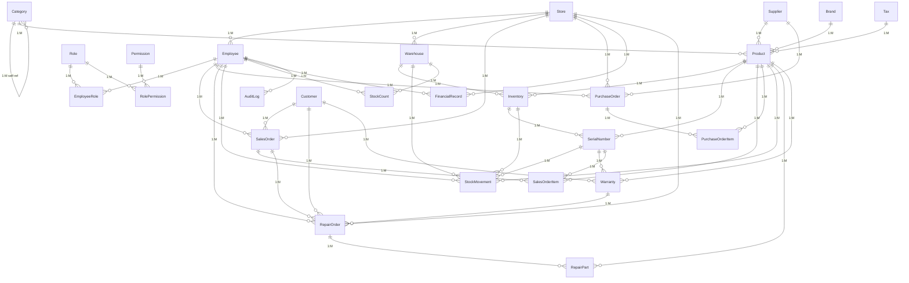
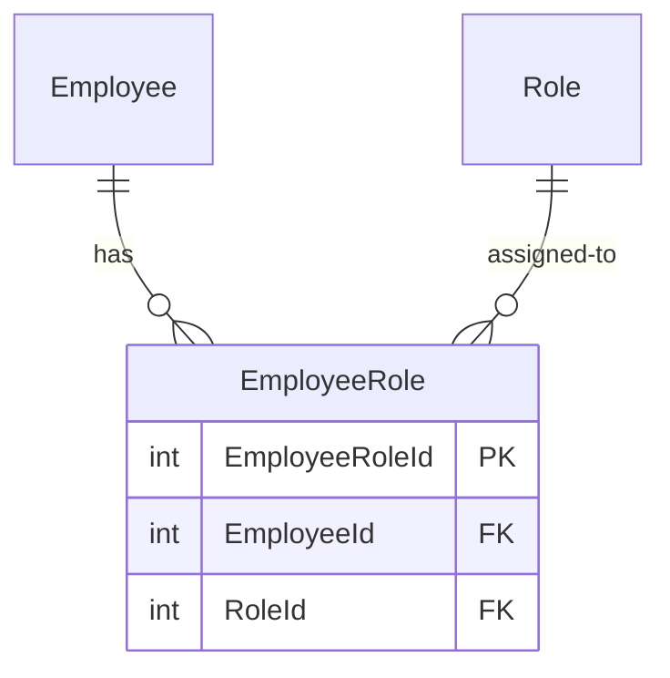
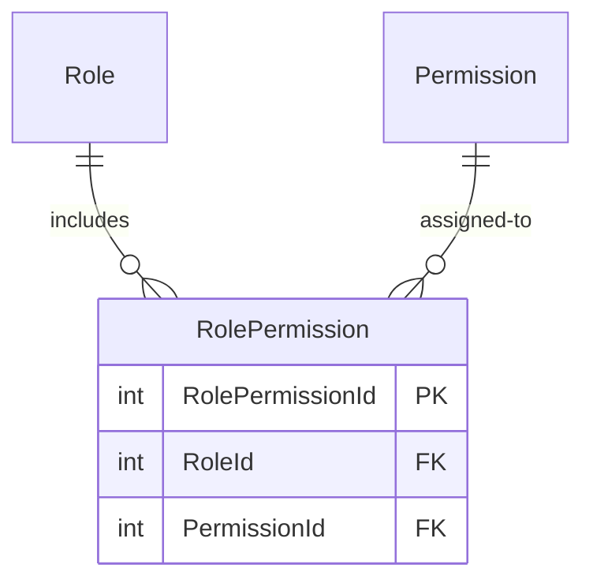
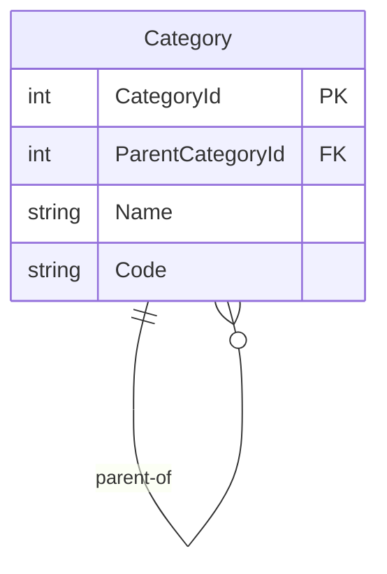

# Database Relationships — Computer Shop ERP & POS System

> **Version:** 1.0  
> **Engine:** SQLite 3.x  
> **Last Updated:** 2026-06-24

---

## Full Entity-Relationship Diagram



---

## Foreign Key Mapping

The table below lists every foreign key constraint in the schema, its source and target, and the relationship type.

| # | Source Table | FK Column | Target Table | Target Column | Relationship Type |
|---|---|---|---|---|---|
| 1 | Employee | StoreId | Store | StoreId | Many-to-One (M:1) |
| 2 | Warehouse | StoreId | Store | StoreId | Many-to-One (M:1) |
| 3 | SalesOrder | StoreId | Store | StoreId | Many-to-One (M:1) |
| 4 | PurchaseOrder | StoreId | Store | StoreId | Many-to-One (M:1) |
| 5 | FinancialRecord | StoreId | Store | StoreId | Many-to-One (M:1) |
| 6 | RepairOrder | StoreId | Store | StoreId | Many-to-One (M:1) |
| 7 | EmployeeRole | EmployeeId | Employee | EmployeeId | Many-to-One (M:1) |
| 8 | EmployeeRole | RoleId | Role | RoleId | Many-to-One (M:1) |
| 9 | RolePermission | RoleId | Role | RoleId | Many-to-One (M:1) |
| 10 | RolePermission | PermissionId | Permission | PermissionId | Many-to-One (M:1) |
| 11 | Category | ParentCategoryId | Category | CategoryId | Many-to-One (M:1, self-ref) |
| 12 | Product | CategoryId | Category | CategoryId | Many-to-One (M:1) |
| 13 | Product | BrandId | Brand | BrandId | Many-to-One (M:1) |
| 14 | Product | SupplierId | Supplier | SupplierId | Many-to-One (M:1) |
| 15 | Product | TaxId | Tax | TaxId | Many-to-One (M:1) |
| 16 | Inventory | WarehouseId | Warehouse | WarehouseId | Many-to-One (M:1) |
| 17 | Inventory | ProductId | Product | ProductId | Many-to-One (M:1) |
| 18 | SerialNumber | ProductId | Product | ProductId | Many-to-One (M:1) |
| 19 | SerialNumber | InventoryId | Inventory | InventoryId | Many-to-One (M:1) |
| 20 | StockMovement | WarehouseId | Warehouse | WarehouseId | Many-to-One (M:1) |
| 21 | StockMovement | ProductId | Product | ProductId | Many-to-One (M:1) |
| 22 | StockMovement | SerialNumberId | SerialNumber | SerialNumberId | Many-to-One (M:1) |
| 23 | StockMovement | CreatedBy | Employee | EmployeeId | Many-to-One (M:1) |
| 24 | StockCount | WarehouseId | Warehouse | WarehouseId | Many-to-One (M:1) |
| 25 | StockCount | CreatedBy | Employee | EmployeeId | Many-to-One (M:1) |
| 26 | SalesOrder | CustomerId | Customer | CustomerId | Many-to-One (M:1) |
| 27 | SalesOrder | EmployeeId | Employee | EmployeeId | Many-to-One (M:1) |
| 28 | SalesOrderItem | SalesOrderId | SalesOrder | SalesOrderId | Many-to-One (M:1) |
| 29 | SalesOrderItem | ProductId | Product | ProductId | Many-to-One (M:1) |
| 30 | SalesOrderItem | SerialNumberId | SerialNumber | SerialNumberId | Many-to-One (M:1) |
| 31 | PurchaseOrder | SupplierId | Supplier | SupplierId | Many-to-One (M:1) |
| 32 | PurchaseOrder | EmployeeId | Employee | EmployeeId | Many-to-One (M:1) |
| 33 | PurchaseOrderItem | PurchaseOrderId | PurchaseOrder | PurchaseOrderId | Many-to-One (M:1) |
| 34 | PurchaseOrderItem | ProductId | Product | ProductId | Many-to-One (M:1) |
| 35 | RepairOrder | CustomerId | Customer | CustomerId | Many-to-One (M:1) |
| 36 | RepairOrder | EmployeeId | Employee | EmployeeId | Many-to-One (M:1) |
| 37 | RepairOrder | SalesOrderId | SalesOrder | SalesOrderId | Many-to-One (M:1) |
| 38 | RepairOrder | WarrantyId | Warranty | WarrantyId | Many-to-One (M:1) |
| 39 | RepairPart | RepairOrderId | RepairOrder | RepairOrderId | Many-to-One (M:1) |
| 40 | RepairPart | ProductId | Product | ProductId | Many-to-One (M:1) |
| 41 | Warranty | ProductId | Product | ProductId | Many-to-One (M:1) |
| 42 | Warranty | SerialNumberId | SerialNumber | SerialNumberId | Many-to-One (M:1) |
| 43 | Warranty | SalesOrderItemId | SalesOrderItem | SalesOrderItemId | Many-to-One (M:1) |
| 44 | Warranty | CustomerId | Customer | CustomerId | Many-to-One (M:1) |
| 45 | FinancialRecord | CreatedBy | Employee | EmployeeId | Many-to-One (M:1) |
| 46 | AuditLog | EmployeeId | Employee | EmployeeId | Many-to-One (M:1) |

---

## Many-to-Many Relationships

### Employee ↔ Role (via EmployeeRole)



**Cardinality:** An Employee can have many Roles. A Role can be assigned to many Employees.

**Junction Table:** EmployeeRole

**Unique Constraint:** (EmployeeId, RoleId) — prevents duplicate assignments.

**Query Pattern — Get all roles for an employee:**

```sql
SELECT r.RoleId, r.RoleName
FROM Employee e
JOIN EmployeeRole er ON e.EmployeeId = er.EmployeeId
JOIN Role r ON er.RoleId = r.RoleId
WHERE e.EmployeeId = ? AND r.IsActive = 1;
```

**Query Pattern — Get all employees in a role:**

```sql
SELECT e.EmployeeId, e.FullName, e.Email
FROM Role r
JOIN EmployeeRole er ON r.RoleId = er.RoleId
JOIN Employee e ON er.EmployeeId = e.EmployeeId
WHERE r.RoleId = ? AND e.IsActive = 1 AND e.IsDeleted = 0;
```

---

### Role ↔ Permission (via RolePermission)



**Cardinality:** A Role can be granted many Permissions. A Permission can be assigned to many Roles.

**Junction Table:** RolePermission

**Unique Constraint:** (RoleId, PermissionId) — prevents redundant grants.

**Query Pattern — Get all permissions for a role:**

```sql
SELECT p.PermissionCode, p.PermissionName, p.Module
FROM Role r
JOIN RolePermission rp ON r.RoleId = rp.RoleId
JOIN Permission p ON rp.PermissionId = p.PermissionId
WHERE r.RoleId = ?;
```

**Query Pattern — Check if a role has a specific permission:**

```sql
SELECT CASE WHEN COUNT(*) > 0 THEN 1 ELSE 0 END AS HasPermission
FROM RolePermission rp
JOIN Permission p ON rp.PermissionId = p.PermissionId
WHERE rp.RoleId = ? AND p.PermissionCode = ?;
```

---

## Self-Referencing Relationship

### Category ↔ Category (Parent-Child Hierarchy)



**Type:** Self-referencing one-to-many (a category has many child categories).

**Foreign Key:** ParentCategoryId → Category.CategoryId, ON DELETE SET NULL

**Query Pattern — Get full category tree (recursive CTE):**

```sql
WITH RECURSIVE CategoryTree AS (
    -- Anchor: root categories
    SELECT CategoryId, ParentCategoryId, Name, Code, 0 AS Level
    FROM Category
    WHERE ParentCategoryId IS NULL AND IsDeleted = 0

    UNION ALL

    -- Recursive: children
    SELECT c.CategoryId, c.ParentCategoryId, c.Name, c.Code, ct.Level + 1
    FROM Category c
    JOIN CategoryTree ct ON c.ParentCategoryId = ct.CategoryId
    WHERE c.IsDeleted = 0
)
SELECT * FROM CategoryTree ORDER BY Level, Name;
```

**Query Pattern — Get all ancestors of a category:**

```sql
WITH RECURSIVE CategoryAncestors AS (
    SELECT CategoryId, ParentCategoryId, Name, 0 AS Depth
    FROM Category WHERE CategoryId = ?

    UNION ALL

    SELECT c.CategoryId, c.ParentCategoryId, c.Name, ca.Depth + 1
    FROM Category c
    JOIN CategoryAncestors ca ON c.CategoryId = ca.ParentCategoryId
)
SELECT * FROM CategoryAncestors ORDER BY Depth DESC;
```

**Business Rules:**
- Circular references (A→B→C→A) must be prevented at the application layer.
- Maximum nesting depth should be limited (recommended: 5 levels).
- ON DELETE SET NULL converts child categories to root categories when a parent is deleted — this may not be desired; application-level re-parenting is safer.

---

## Referential Integrity Actions

The table below documents the ON DELETE and ON UPDATE behaviour for each foreign key.

| FK Constraint Name | Source Table | FK Column | Delete Rule | Update Rule | Rationale |
|---|---|---|---|---|---|
| FK_Employee_Store | Employee | StoreId | RESTRICT | RESTRICT | Prevent orphaned employees; store must exist |
| FK_Warehouse_Store | Warehouse | StoreId | RESTRICT | RESTRICT | Prevent orphaned warehouses |
| FK_SalesOrder_Store | SalesOrder | StoreId | RESTRICT | RESTRICT | Historical orders need valid store |
| FK_PurchaseOrder_Store | PurchaseOrder | StoreId | RESTRICT | RESTRICT | Historical POs need valid store |
| FK_FinancialRecord_Store | FinancialRecord | StoreId | RESTRICT | RESTRICT | Financial records need valid store |
| FK_RepairOrder_Store | RepairOrder | StoreId | RESTRICT | RESTRICT | Repair records need valid store |
| FK_EmployeeRole_Employee | EmployeeRole | EmployeeId | CASCADE | RESTRICT | Clean up junction when employee removed |
| FK_EmployeeRole_Role | EmployeeRole | RoleId | CASCADE | RESTRICT | Clean up junction when role removed |
| FK_RolePermission_Role | RolePermission | RoleId | CASCADE | RESTRICT | Clean up junction when role removed |
| FK_RolePermission_Permission | RolePermission | PermissionId | CASCADE | RESTRICT | Clean up junction when permission removed |
| FK_Category_Parent | Category | ParentCategoryId | SET NULL | RESTRICT | Children become roots on parent delete |
| FK_Product_Category | Product | CategoryId | RESTRICT | RESTRICT | Products need valid category |
| FK_Product_Brand | Product | BrandId | SET NULL | RESTRICT | Product can be un-branded |
| FK_Product_Supplier | Product | SupplierId | SET NULL | RESTRICT | Product can have no primary supplier |
| FK_Product_Tax | Product | TaxId | SET NULL | RESTRICT | Product can be tax-exempt |
| FK_Inventory_Warehouse | Inventory | WarehouseId | RESTRICT | RESTRICT | Inventory needs valid warehouse |
| FK_Inventory_Product | Inventory | ProductId | RESTRICT | RESTRICT | Inventory needs valid product |
| FK_SerialNumber_Product | SerialNumber | ProductId | RESTRICT | RESTRICT | Serial number needs valid product |
| FK_SerialNumber_Inventory | SerialNumber | InventoryId | RESTRICT | RESTRICT | Serial number needs valid inventory location |
| FK_StockMovement_Warehouse | StockMovement | WarehouseId | RESTRICT | RESTRICT | Audit trail needs valid warehouse |
| FK_StockMovement_Product | StockMovement | ProductId | RESTRICT | RESTRICT | Audit trail needs valid product |
| FK_StockMovement_SerialNumber | StockMovement | SerialNumberId | SET NULL | RESTRICT | Movement can exist without serial link |
| FK_StockMovement_CreatedBy | StockMovement | CreatedBy | SET NULL | RESTRICT | Retain movement history even if employee removed |
| FK_StockCount_Warehouse | StockCount | WarehouseId | RESTRICT | RESTRICT | Count needs valid warehouse |
| FK_StockCount_CreatedBy | StockCount | CreatedBy | SET NULL | RESTRICT | Retain count history |
| FK_SalesOrder_Customer | SalesOrder | CustomerId | SET NULL | RESTRICT | Retain order even if customer removed |
| FK_SalesOrder_Employee | SalesOrder | EmployeeId | RESTRICT | RESTRICT | Need to know who processed the order |
| FK_SalesOrderItem_Order | SalesOrderItem | SalesOrderId | CASCADE | RESTRICT | Delete items when order deleted |
| FK_SalesOrderItem_Product | SalesOrderItem | ProductId | RESTRICT | RESTRICT | Item needs valid product |
| FK_SalesOrderItem_SerialNumber | SalesOrderItem | SerialNumberId | SET NULL | RESTRICT | Item can exist without serial link |
| FK_PurchaseOrder_Supplier | PurchaseOrder | SupplierId | RESTRICT | RESTRICT | PO needs valid supplier |
| FK_PurchaseOrder_Employee | PurchaseOrder | EmployeeId | RESTRICT | RESTRICT | Need to know who raised PO |
| FK_PurchaseOrderItem_PO | PurchaseOrderItem | PurchaseOrderId | CASCADE | RESTRICT | Delete items when PO deleted |
| FK_PurchaseOrderItem_Product | PurchaseOrderItem | ProductId | RESTRICT | RESTRICT | Item needs valid product |
| FK_RepairOrder_Customer | RepairOrder | CustomerId | RESTRICT | RESTRICT | Repair needs valid customer |
| FK_RepairOrder_Employee | RepairOrder | EmployeeId | RESTRICT | RESTRICT | Need assigned technician |
| FK_RepairOrder_SalesOrder | RepairOrder | SalesOrderId | SET NULL | RESTRICT | Repair can exist without sale link |
| FK_RepairOrder_Warranty | RepairOrder | WarrantyId | SET NULL | RESTRICT | Repair can exist without warranty link |
| FK_RepairPart_RepairOrder | RepairPart | RepairOrderId | CASCADE | RESTRICT | Delete parts when repair deleted |
| FK_RepairPart_Product | RepairPart | ProductId | SET NULL | RESTRICT | Part can be non-catalogue item |
| FK_Warranty_Product | Warranty | ProductId | RESTRICT | RESTRICT | Warranty needs valid product |
| FK_Warranty_SerialNumber | Warranty | SerialNumberId | RESTRICT | RESTRICT | Warranty needs valid serial |
| FK_Warranty_SalesOrderItem | Warranty | SalesOrderItemId | SET NULL | RESTRICT | Warranty can exist without specific line |
| FK_Warranty_Customer | Warranty | CustomerId | RESTRICT | RESTRICT | Warranty needs valid customer |
| FK_FinancialRecord_CreatedBy | FinancialRecord | CreatedBy | SET NULL | RESTRICT | Retain record if employee removed |
| FK_AuditLog_Employee | AuditLog | EmployeeId | SET NULL | RESTRICT | Retain audit trail if employee removed |

---

## Cascading Effects

### CASCADE Deletes

The following parent deletions will automatically delete related child rows:

| Parent Table | Child Table(s) | Affected Columns | Business Impact |
|---|---|---|---|
| Employee | EmployeeRole | EmployeeId | Removing an employee revokes all role assignments |
| Role | EmployeeRole, RolePermission | RoleId, RoleId | Removing a role revokes all assignments and permissions |
| Permission | RolePermission | PermissionId | Removing a permission removes it from all roles |
| SalesOrder | SalesOrderItem | SalesOrderId | Deleting an order removes all its items |
| PurchaseOrder | PurchaseOrderItem | PurchaseOrderId | Deleting a PO removes all its items |
| RepairOrder | RepairPart | RepairOrderId | Deleting a repair removes all parts used |

**⚠️ Warning:** CASCADE deletes are powerful but dangerous. Never cascade-delete transactional data (SalesOrder, PurchaseOrder) in production — only soft-delete. CASCADE should only apply to junction/child tables where the child has no meaning without the parent.

### SET NULL Effects

| Parent Table | Child Table(s) | Affected Columns | Result |
|---|---|---|---|
| Category | Category | ParentCategoryId | Orphaned children become root categories |
| Brand | Product | BrandId | Products become un-branded |
| Supplier | Product | SupplierId | Products lose primary supplier reference |
| Tax | Product | TaxId | Products become tax-exempt |
| Customer | SalesOrder | CustomerId | Orders become anonymous |
| Employee | StockMovement, StockCount, FinancialRecord, AuditLog | CreatedBy | Records lose creator reference |
| SerialNumber | StockMovement, SalesOrderItem | SerialNumberId | Movements/items lose serial link |

### RESTRICT Effects

Any attempt to delete a parent that has related child rows will fail with a foreign key violation. This is the safest default for transactional data. Application code should implement soft-delete instead.

---

## Business Rules Enforced Through Relationships

| Rule | Enforced By |
|---|---|
| Every employee belongs to exactly one store | NOT NULL on Employee.StoreId + FK |
| Every product belongs to exactly one category | NOT NULL on Product.CategoryId + FK |
| An inventory record always references a warehouse and a product | NOT NULL + FK on both columns |
| An employee cannot be assigned the same role twice | UNIQUE(EmployeeId, RoleId) on EmployeeRole |
| A role cannot have duplicate permissions | UNIQUE(RoleId, PermissionId) on RolePermission |
| Each warehouse-product combination has at most one inventory row | UNIQUE(WarehouseId, ProductId) on Inventory |
| A product can only be stocked in valid warehouses | FK Inventory.WarehouseId → Warehouse |
| Every serial number belongs to exactly one product and one inventory location | NOT NULL + FK on SerialNumber |
| Sales orders always reference a valid store and employee | NOT NULL + FK |
| Purchase orders always reference a valid store, supplier, and employee | NOT NULL + FK |
| Repair orders always reference a valid store, customer, and employee | NOT NULL + FK |
| A warranty is always associated with a product and a customer | NOT NULL + FK |
| Financial records always reference a valid store | NOT NULL + FK |

---

## Orphan Prevention Strategies

Orphaned records occur when a referenced parent is deleted but child records still exist. The schema uses a multi-layered approach:

### Strategy 1: RESTRICT (Primary Defence)
Most transactional foreign keys use RESTRICT, preventing parent deletion while children exist. This is the strongest protection. Example:

```sql
-- This will FAIL if any products reference CategoryId = 5
DELETE FROM Category WHERE CategoryId = 5;
-- ERROR: FOREIGN KEY constraint failed
```

### Strategy 2: Soft Delete (Recommended Workflow)
Instead of deleting, set IsDeleted = 1. This preserves referential integrity while logically removing the record:

```sql
-- Safe: preserves all child relationships
UPDATE Category SET IsDeleted = 1 WHERE CategoryId = 5;
```

### Strategy 3: CASCADE (Junction Tables Only)
Used only for junction tables where child rows have no independent meaning:

```sql
-- Deleting a role automatically cleans up EmployeeRole and RolePermission
DELETE FROM Role WHERE RoleId = 10;
-- EmployeeRole rows with RoleId = 10 are deleted automatically
-- RolePermission rows with RoleId = 10 are deleted automatically
```

### Strategy 4: SET NULL (Optional References)
Used for non-critical references where a NULL value is acceptable:

```sql
-- Deleting a customer sets CustomerId to NULL on their orders
DELETE FROM Customer WHERE CustomerId = 42;
-- SalesOrder.CustomerId becomes NULL for that customer's orders
```

### Application-Level Checks
For critical business rules that cannot be enforced at the database level:

1. **Pre-deletion validation query:**
```sql
SELECT CASE WHEN EXISTS (
    SELECT 1 FROM Product WHERE CategoryId = ? AND IsDeleted = 0
) THEN 1 ELSE 0 END AS HasActiveProducts;
```

2. **Re-assignment pattern:**
```sql
BEGIN TRANSACTION;
    UPDATE Product SET CategoryId = ? WHERE CategoryId = ?;
    UPDATE Category SET IsDeleted = 1 WHERE CategoryId = ?;
COMMIT;
```

---

## Sample Query Patterns by Relationship Type

### One-to-Many: Store → SalesOrder

**Find all orders for a store in a date range:**

```sql
SELECT so.OrderNumber, so.OrderDate, so.GrandTotal, so.Status,
       e.FullName AS Salesperson,
       c.FullName AS Customer
FROM SalesOrder so
JOIN Employee e ON so.EmployeeId = e.EmployeeId
LEFT JOIN Customer c ON so.CustomerId = c.CustomerId
WHERE so.StoreId = ?
  AND so.OrderDate >= ?
  AND so.OrderDate < ?
  AND so.IsDeleted = 0
ORDER BY so.OrderDate DESC;
```

### Many-to-Many: Employee ↔ Role

**Get all permissions for an employee (aggregated across roles):**

```sql
SELECT DISTINCT p.PermissionCode, p.PermissionName, p.Module
FROM Employee e
JOIN EmployeeRole er ON e.EmployeeId = er.EmployeeId
JOIN Role r ON er.RoleId = r.RoleId
JOIN RolePermission rp ON r.RoleId = rp.RoleId
JOIN Permission p ON rp.PermissionId = p.PermissionId
WHERE e.EmployeeId = ?
  AND e.IsActive = 1
  AND r.IsActive = 1
ORDER BY p.Module, p.PermissionCode;
```

### Self-Referencing: Category → Category

**Get leaf categories (categories with no children):**

```sql
SELECT c.CategoryId, c.Name, c.Code
FROM Category c
WHERE c.CategoryId NOT IN (
    SELECT DISTINCT ParentCategoryId
    FROM Category
    WHERE ParentCategoryId IS NOT NULL
)
AND c.IsDeleted = 0;
```

### Composite Unique: Inventory

**Get stock levels across warehouses for a product:**

```sql
SELECT w.Name AS WarehouseName, i.Quantity, i.AvailableQuantity, i.ReservedQuantity
FROM Inventory i
JOIN Warehouse w ON i.WarehouseId = w.WarehouseId
WHERE i.ProductId = ?
  AND w.IsDeleted = 0
ORDER BY w.Name;
```

### One-to-Many with Aggregation: Product → SalesOrderItem

**Get sales summary by product:**

```sql
SELECT p.ProductId, p.Name, p.SKU,
       COUNT(DISTINCT soi.SalesOrderId) AS OrderCount,
       SUM(soi.Quantity) AS TotalQuantitySold,
       SUM(soi.LineTotal) AS TotalRevenue
FROM Product p
JOIN SalesOrderItem soi ON p.ProductId = soi.ProductId
JOIN SalesOrder so ON soi.SalesOrderId = so.SalesOrderId
WHERE so.Status = 'COMPLETED'
  AND so.OrderDate >= ?
  AND so.OrderDate < ?
  AND p.IsDeleted = 0
GROUP BY p.ProductId
ORDER BY TotalRevenue DESC;
```

### JSON Relationship: StockCount → Items (embedded)

**Find stock count discrepancies where a specific product was counted:**

```sql
SELECT sc.CountNumber, sc.CountDate, sc.Status,
       json_extract(value, '$.productId') AS ProductId,
       json_extract(value, '$.expectedQuantity') AS Expected,
       json_extract(value, '$.countedQuantity') AS Counted,
       json_extract(value, '$.difference') AS Diff
FROM StockCount sc,
     json_each(sc.Items)
WHERE json_extract(value, '$.productId') = ?
  AND sc.Status = 'COMPLETED'
ORDER BY sc.CountDate DESC;
```

### Audit Trail: AuditLog

**Get full change history for a specific record:**

```sql
SELECT al.CreatedAt, al.Action, e.FullName AS ChangedBy,
       al.OldValues, al.NewValues
FROM AuditLog al
LEFT JOIN Employee e ON al.EmployeeId = e.EmployeeId
WHERE al.TableName = 'Product'
  AND al.RecordId = ?
ORDER BY al.CreatedAt DESC;
```

---

## Relationship Validation Rules

The following validation rules should be enforced in application code or database triggers:

| Rule | Description | Enforcement Point |
|---|---|---|
| Circular category refs | Category hierarchy must not contain cycles | Application (before UPDATE/INSERT) |
| Valid status transitions | SalesOrder, PurchaseOrder, RepairOrder, StockCount must follow defined lifecycle | Application (before UPDATE) |
| Serialised product completeness | Products with HasSerialNumbers = 1 must have SerialNumberId on all StockMovement and SalesOrderItem | Application (before INSERT) |
| Inventory non-negative | Quantity, AvailableQuantity, ReservedQuantity must never be negative | CHECK constraint + Application |
| Price positivity | SellingPrice, CostPrice, UnitPrice, UnitCost must be ≥ 0 | Application |
| Warranty date ordering | EndDate must be after StartDate | Application (before INSERT/UPDATE) |
| ReceivedQuantity ≤ Quantity | Partial PO receipt must not exceed ordered quantity | Application + CHECK |
| Cascade safety | Junction tables only use CASCADE; transactional tables use RESTRICT | Schema DDL |
| Soft-delete parent check | Cannot soft-delete a parent with active children | Application |
| Unique nullable columns | Barcode, Email use filtered unique indexes for nullable uniqueness | DDL (partial unique index) |

---

## Relationship-Level Security Considerations

### Row-Level Access

While SQLite does not support row-level security, the schema enforces store-level isolation through StoreId on all transactional tables:

```sql
-- Every query scoped by store
SELECT * FROM SalesOrder WHERE StoreId = ?;
```

### Permission Propagation

Employee permissions are derived through the EmployeeRole → RolePermission chain. Never query EmployeeRole or RolePermission directly — always use the JOIN chain to get resolved permissions:

```sql
-- Correct: get resolved permission for an employee
SELECT DISTINCT p.PermissionCode
FROM Employee e
JOIN EmployeeRole er ON e.EmployeeId = er.EmployeeId
JOIN Role r ON er.RoleId = r.RoleId AND r.IsActive = 1
JOIN RolePermission rp ON r.RoleId = rp.RoleId
JOIN Permission p ON rp.PermissionId = p.PermissionId
WHERE e.EmployeeId = ? AND e.IsActive = 1;
```

### Audit Integrity

The AuditLog table's EmployeeId FK uses SET NULL on delete, ensuring the audit trail survives employee record removal. However, the EmployeeId in the log is lost — consider using a trigger-based approach that copies EmployeeId as a plain value (not FK) into the audit log for full retention.

---

*End of DATABASE_RELATIONSHIPS.md*
