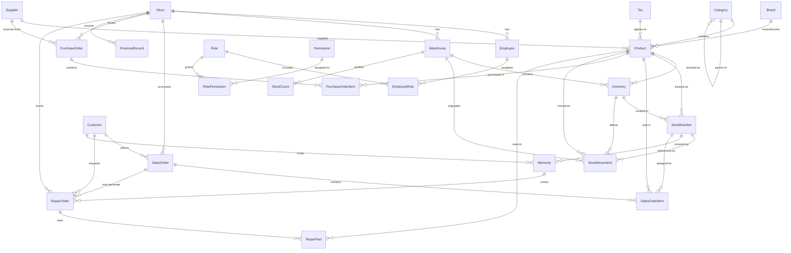

# Database Schema — Computer Shop ERP & POS System

> **Version:** 1.0  
> **Engine:** SQLite 3.x (with PostgreSQL migration path)  
> **Last Updated:** 2026-06-24

---

## Entity-Relationship Diagram



---

## Table: Store

**Purpose:** Represents a physical or logical retail store/branch within the organisation. Every transaction, inventory movement, and employee is scoped to a store.

| Column | Type | Nullable | Default | Description |
|---|---|---|---|---|
| StoreId | INTEGER PK | NOT NULL | AUTOINCREMENT | Surrogate primary key |
| Name | TEXT | NOT NULL | — | Display name of the store |
| Code | TEXT | NOT NULL | — | Short unique code (e.g., CAIRO-01) |
| Address | TEXT | NULL | NULL | Physical street address |
| Phone | TEXT | NULL | NULL | Contact phone number |
| TaxNumber | TEXT | NULL | NULL | Government tax registration ID |
| IsDeleted | INTEGER | NOT NULL | 0 | Soft-delete flag (0 = active, 1 = deleted) |

**Primary Key:** StoreId  
**Unique Constraints:** Code  
**Indexes:**
- `IX_Store_Code` ON Code
- `IX_Store_IsDeleted` ON IsDeleted — filters active stores

**Business Rules:**
- Code must be unique across all stores.
- Soft-delete is used; records referencing a deleted store retain historical integrity.
- A store cannot be deleted if it has related SalesOrder, PurchaseOrder, Employee, Warehouse, or FinancialRecord rows (enforced at application level unless FK cascades are configured).

**Edge Cases:**
- Store Code may need re-use after deletion — the UNIQUE constraint on Code requires either a unique naming convention or a nullable DeletedCode suffix.
- Single-store setups: treat StoreId = 1 as default; all queries should WHERE IsDeleted = 0.

---

## Table: Employee

**Purpose:** Stores login credentials and personal information for all staff members. Employees are assigned to a specific store.

| Column | Type | Nullable | Default | Description |
|---|---|---|---|---|
| EmployeeId | INTEGER PK | NOT NULL | AUTOINCREMENT | Surrogate primary key |
| EmployeeUid | TEXT | NOT NULL | — | Application-level UUID (for external references) |
| StoreId | INTEGER FK | NOT NULL | — | References Store.StoreId |
| EmployeeCode | TEXT | NOT NULL | — | Human-readable employee code (e.g., EMP-042) |
| FullName | TEXT | NOT NULL | — | Employee full display name |
| Phone | TEXT | NULL | NULL | Mobile or landline number |
| Email | TEXT | NOT NULL | — | Login email; must be unique |
| PasswordHash | TEXT | NOT NULL | — | bcrypt/argon2 hash |
| IsActive | INTEGER | NOT NULL | 1 | Login enabled/disabled |
| IsDeleted | INTEGER | NOT NULL | 0 | Soft-delete flag |

**Primary Key:** EmployeeId  
**Foreign Keys:**
- `FK_Employee_Store` (StoreId → Store.StoreId)

**Unique Constraints:** EmployeeUid, Email  
**Indexes:**
- `IX_Employee_StoreId` ON StoreId — filter employees by store
- `IX_Employee_Email` ON Email — login lookup
- `IX_Employee_IsActive` ON IsActive — scope active employees
- `IX_Employee_IsDeleted` ON IsDeleted

**Business Rules:**
- Email is the primary login identifier; must be globally unique.
- PasswordHash should never be selected in list queries — only in authentication flows.
- IsActive = 0 prevents login but retains history.
- An employee cannot be deleted (even soft) if they have open SalesOrder, PurchaseOrder, or RepairOrder assigned to them.

**Edge Cases:**
- Multiple employees with the same phone number are allowed.
- An employee transferred between stores must update StoreId — historical orders still reference the original StoreId via the employee FK.

---

## Table: Role

**Purpose:** Defines named security roles that group permissions for Role-Based Access Control (RBAC).

| Column | Type | Nullable | Default | Description |
|---|---|---|---|---|
| RoleId | INTEGER PK | NOT NULL | AUTOINCREMENT | Surrogate primary key |
| RoleName | TEXT | NOT NULL | — | Display name (e.g., Admin, Cashier, Technician) |
| IsActive | INTEGER | NOT NULL | 1 | Role enabled/disabled |

**Primary Key:** RoleId  
**Unique Constraints:** RoleName  
**Indexes:**
- `IX_Role_IsActive` ON IsActive

**Business Rules:**
- RoleName must be unique.
- System roles (Admin, Manager) should be seeded and never deactivated.
- A role cannot be deleted if employees are still assigned to it (junction table prevents this unless cascading deletes are configured).

---

## Table: EmployeeRole (Junction)

**Purpose:** Many-to-many relationship between Employee and Role. An employee can hold multiple roles; a role can be assigned to many employees.

| Column | Type | Nullable | Default | Description |
|---|---|---|---|---|
| EmployeeRoleId | INTEGER PK | NOT NULL | AUTOINCREMENT | Surrogate primary key |
| EmployeeId | INTEGER FK | NOT NULL | — | References Employee.EmployeeId |
| RoleId | INTEGER FK | NOT NULL | — | References Role.RoleId |

**Primary Key:** EmployeeRoleId  
**Foreign Keys:**
- `FK_EmployeeRole_Employee` (EmployeeId → Employee.EmployeeId) ON DELETE CASCADE
- `FK_EmployeeRole_Role` (RoleId → Role.RoleId) ON DELETE CASCADE

**Unique Constraints:** (EmployeeId, RoleId)  
**Indexes:**
- `IX_EmployeeRole_EmployeeId` ON EmployeeId
- `IX_EmployeeRole_RoleId` ON RoleId

**Business Rules:**
- Duplicate (EmployeeId, RoleId) combinations are prevented by the composite UNIQUE.
- Deleting an employee or role automatically removes junction rows (CASCADE).

**Edge Cases:**
- An employee with no roles should have zero rows in this table — the application should treat this as "no access" rather than "full access."

---

## Table: Permission

**Purpose:** Granular permission codes representing a single action or view within the system.

| Column | Type | Nullable | Default | Description |
|---|---|---|---|---|
| PermissionId | INTEGER PK | NOT NULL | AUTOINCREMENT | Surrogate primary key |
| PermissionCode | TEXT | NOT NULL | — | Machine-readable code (e.g., `sales.order.create`) |
| PermissionName | TEXT | NOT NULL | — | Human-readable name (e.g., "Create Sales Order") |
| Module | TEXT | NOT NULL | — | Module grouping (e.g., Sales, Inventory, HR) |

**Primary Key:** PermissionId  
**Unique Constraints:** PermissionCode  
**Indexes:**
- `IX_Permission_Module` ON Module — filter permissions by module

**Business Rules:**
- PermissionCode follows dot-notation: `{module}.{entity}.{action}`.
- Permissions are seeded at deployment and are rarely modified.

---

## Table: RolePermission (Junction)

**Purpose:** Many-to-many relationship between Role and Permission.

| Column | Type | Nullable | Default | Description |
|---|---|---|---|---|
| RolePermissionId | INTEGER PK | NOT NULL | AUTOINCREMENT | Surrogate primary key |
| RoleId | INTEGER FK | NOT NULL | — | References Role.RoleId |
| PermissionId | INTEGER FK | NOT NULL | — | References Permission.PermissionId |

**Primary Key:** RolePermissionId  
**Foreign Keys:**
- `FK_RolePermission_Role` (RoleId → Role.RoleId) ON DELETE CASCADE
- `FK_RolePermission_Permission` (PermissionId → Permission.PermissionId) ON DELETE CASCADE

**Unique Constraints:** (RoleId, PermissionId)  
**Indexes:**
- `IX_RolePermission_RoleId` ON RoleId
- `IX_RolePermission_PermissionId` ON PermissionId

**Business Rules:**
- Composite unique prevents redundant grant rows.
- CASCADE ensures that deleting a role or permission cleans up mappings.

---

## Table: Category

**Purpose:** Hierarchical product categorisation (e.g., Laptops → Gaming Laptops → ASUS ROG). Self-referencing for unlimited nesting depth.

| Column | Type | Nullable | Default | Description |
|---|---|---|---|---|
| CategoryId | INTEGER PK | NOT NULL | AUTOINCREMENT | Surrogate primary key |
| ParentCategoryId | INTEGER FK | NULL | NULL | Self-referencing FK to parent category |
| Name | TEXT | NOT NULL | — | Display name (e.g., "Laptops") |
| Code | TEXT | NOT NULL | — | Short code (e.g., "LAP") |
| Description | TEXT | NULL | NULL | Optional description |
| IsDeleted | INTEGER | NOT NULL | 0 | Soft-delete flag |

**Primary Key:** CategoryId  
**Foreign Keys:**
- `FK_Category_Parent` (ParentCategoryId → Category.CategoryId) ON DELETE SET NULL

**Unique Constraints:** Code  
**Indexes:**
- `IX_Category_ParentCategoryId` ON ParentCategoryId — tree traversal
- `IX_Category_IsDeleted` ON IsDeleted

**Business Rules:**
- Root categories have ParentCategoryId = NULL.
- A category cannot be deleted (soft) if it has child categories or products — application must reassign or mark all children as deleted first.
- Circular references must be prevented at the application layer.

**JSON / Recursion Note:** SQLite uses recursive CTEs for tree traversal. See query patterns below.

**Edge Cases:**
- Deleting a parent sets ParentCategoryId to NULL (SET NULL), converting children to root categories. This may be undesirable — application code should explicitly handle re-parenting.

---

## Table: Brand

**Purpose:** Product brand/manufacturer information.

| Column | Type | Nullable | Default | Description |
|---|---|---|---|---|
| BrandId | INTEGER PK | NOT NULL | AUTOINCREMENT | Surrogate primary key |
| Name | TEXT | NOT NULL | — | Brand name (e.g., "ASUS", "Samsung") |
| Description | TEXT | NULL | NULL | Optional description |
| IsDeleted | INTEGER | NOT NULL | 0 | Soft-delete flag |

**Primary Key:** BrandId  
**Unique Constraints:** Name  
**Indexes:**
- `IX_Brand_IsDeleted` ON IsDeleted

**Business Rules:**
- Brand names must be unique.
- A brand cannot be soft-deleted if active products reference it.

---

## Table: Tax

**Purpose:** Tax rates applicable to products (e.g., VAT 14%, Zero-rated).

| Column | Type | Nullable | Default | Description |
|---|---|---|---|---|
| TaxId | INTEGER PK | NOT NULL | AUTOINCREMENT | Surrogate primary key |
| Code | TEXT | NOT NULL | — | Short code (e.g., VAT-14) |
| Name | TEXT | NOT NULL | — | Display name (e.g., "VAT 14%") |
| Rate | DECIMAL(5,2) | NOT NULL | — | Percentage value (e.g., 14.00) |
| IsActive | INTEGER | NOT NULL | 1 | Tax rate usable in new transactions |

**Primary Key:** TaxId  
**Unique Constraints:** Code  
**Indexes:**
- `IX_Tax_IsActive` ON IsActive

**Business Rules:**
- Rate is stored as a percentage (not a decimal multiplier). A rate of 14 means 14%.
- Deactivating a tax (IsActive = 0) does not affect historical transactions — the TaxId remains referenced.

---

## Table: Product

**Purpose:** Central product catalogue. Each product belongs to a category and brand, is supplied by one supplier, and has a tax rate applied.

| Column | Type | Nullable | Default | Description |
|---|---|---|---|---|
| ProductId | INTEGER PK | NOT NULL | AUTOINCREMENT | Surrogate primary key |
| ProductUid | TEXT | NOT NULL | — | UUID for external/API use |
| CategoryId | INTEGER FK | NOT NULL | — | References Category.CategoryId |
| BrandId | INTEGER FK | NULL | NULL | References Brand.BrandId |
| SupplierId | INTEGER FK | NULL | NULL | References Supplier.SupplierId |
| TaxId | INTEGER FK | NULL | NULL | References Tax.TaxId |
| SKU | TEXT | NOT NULL | — | Stock Keeping Unit (unique) |
| Name | TEXT | NOT NULL | — | Product display name |
| Description | TEXT | NULL | NULL | Full product description |
| UnitOfMeasure | TEXT | NOT NULL | 'PCS' | Unit (PCS, KG, M, L) |
| Barcode | TEXT | NULL | NULL | UPC/EAN barcode (unique if provided) |
| CostPrice | INTEGER | NOT NULL | 0 | Unit cost in lowest currency unit (cents) |
| SellingPrice | INTEGER | NOT NULL | 0 | Unit selling price in cents |
| WarrantyDays | INTEGER | NULL | 0 | Default warranty period in days |
| HasSerialNumbers | INTEGER | NOT NULL | 0 | 1 = serialized tracking; 0 = bulk |
| MinStockLevel | INTEGER | NULL | 0 | Low-stock threshold |
| MaxStockLevel | INTEGER | NULL | 0 | Overstock threshold |
| IsActive | INTEGER | NOT NULL | 1 | Product available for sale |
| IsDeleted | INTEGER | NOT NULL | 0 | Soft-delete flag |
| CreatedAt | TEXT | NOT NULL | CURRENT_TIMESTAMP | ISO-8601 timestamp |
| UpdatedAt | TEXT | NOT NULL | CURRENT_TIMESTAMP | ISO-8601 timestamp |

**Primary Key:** ProductId  
**Foreign Keys:**
- `FK_Product_Category` (CategoryId → Category.CategoryId)
- `FK_Product_Brand` (BrandId → Brand.BrandId)
- `FK_Product_Supplier` (SupplierId → Supplier.SupplierId)
- `FK_Product_Tax` (TaxId → Tax.TaxId)

**Unique Constraints:** ProductUid, SKU, Barcode  
**Indexes:**
- `IX_Product_CategoryId` ON CategoryId
- `IX_Product_BrandId` ON BrandId
- `IX_Product_SupplierId` ON SupplierId
- `IX_Product_TaxId` ON TaxId
- `IX_Product_SKU` ON SKU
- `IX_Product_Barcode` ON Barcode — (nullable unique index: `CREATE UNIQUE INDEX IX_Product_Barcode ON Product(Barcode) WHERE Barcode IS NOT NULL`)
- `IX_Product_IsActive` ON IsActive
- `IX_Product_IsDeleted` ON IsDeleted
- `IX_Product_CreatedAt` ON CreatedAt — date-range filtering

**Business Rules:**
- Prices are stored in cents (INTEGER) to avoid floating-point rounding errors. Display conversion is the application's responsibility.
- If HasSerialNumbers = 1, every inbound and outbound movement requires serial number assignment.
- SKU and Barcode are mandatory in most implementations — Barcode is nullable for products without barcodes.
- SellingPrice must be ≥ CostPrice (enforced at application layer).
- UpdatedAt is managed via application code or trigger.

**Edge Cases:**
- Barcode collision risk: a nullable barcode with `WHERE Barcode IS NOT NULL` partial unique index allows multiple NULLs.
- Zero-cost products (gifts, promotional items) are allowed with CostPrice = 0.

---

## Table: Warehouse

**Purpose:** Physical stock locations within a store. A store may have multiple warehouses (e.g., Main Showroom, Back Storage, Service Centre).

| Column | Type | Nullable | Default | Description |
|---|---|---|---|---|
| WarehouseId | INTEGER PK | NOT NULL | AUTOINCREMENT | Surrogate primary key |
| StoreId | INTEGER FK | NOT NULL | — | References Store.StoreId |
| Name | TEXT | NOT NULL | — | Warehouse display name |
| Code | TEXT | NOT NULL | — | Short warehouse code |
| Address | TEXT | NULL | NULL | Physical location description |
| IsDeleted | INTEGER | NOT NULL | 0 | Soft-delete flag |

**Primary Key:** WarehouseId  
**Foreign Keys:**
- `FK_Warehouse_Store` (StoreId → Store.StoreId)

**Unique Constraints:** (StoreId, Code)  
**Indexes:**
- `IX_Warehouse_StoreId` ON StoreId
- `IX_Warehouse_IsDeleted` ON IsDeleted

**Business Rules:**
- Code must be unique within a store (composite unique).
- A warehouse cannot be deleted if it has non-zero inventory or open stock counts.

---

## Table: Inventory

**Purpose:** Tracks product stock levels per warehouse. This is the single source of truth for available quantities.

| Column | Type | Nullable | Default | Description |
|---|---|---|---|---|
| InventoryId | INTEGER PK | NOT NULL | AUTOINCREMENT | Surrogate primary key |
| WarehouseId | INTEGER FK | NOT NULL | — | References Warehouse.WarehouseId |
| ProductId | INTEGER FK | NOT NULL | — | References Product.ProductId |
| Quantity | INTEGER | NOT NULL | 0 | Physical stock on hand |
| AvailableQuantity | INTEGER | NOT NULL | 0 | Quantity available for sale (Quantity - ReservedQuantity) |
| ReservedQuantity | INTEGER | NOT NULL | 0 | Quantity reserved by open orders |
| UpdatedAt | TEXT | NOT NULL | CURRENT_TIMESTAMP | Last update timestamp |

**Primary Key:** InventoryId  
**Foreign Keys:**
- `FK_Inventory_Warehouse` (WarehouseId → Warehouse.WarehouseId)
- `FK_Inventory_Product` (ProductId → Product.ProductId)

**Unique Constraints:** (WarehouseId, ProductId)  
**Indexes:**
- `IX_Inventory_WarehouseId` ON WarehouseId
- `IX_Inventory_ProductId` ON ProductId
- `IX_Inventory_AvailableQuantity` ON AvailableQuantity — find low-stock items
- `IX_Inventory_UpdatedAt` ON UpdatedAt

**Business Rules:**
- AvailableQuantity = Quantity - ReservedQuantity (maintained by application logic or triggers).
- Negative inventory must be prevented: CHECK (Quantity >= 0).
- ReservedQuantity must never exceed Quantity.
- Every stock movement must update the relevant Inventory row atomically.

**Edge Cases:**
- New products have no Inventory row until the first stock movement or an initial stock count.
- Concurrent reservations: SQLite serialises writes, but application-level optimistic locking (using UpdatedAt) prevents overselling.

---

## Table: StockMovement

**Purpose:** Immutable audit trail of every stock quantity change — purchases, sales adjustments, transfers, and corrections.

| Column | Type | Nullable | Default | Description |
|---|---|---|---|---|
| MovementId | INTEGER PK | NOT NULL | AUTOINCREMENT | Surrogate primary key |
| MovementNumber | TEXT | NOT NULL | — | Human-readable movement reference |
| WarehouseId | INTEGER FK | NOT NULL | — | References Warehouse.WarehouseId |
| ProductId | INTEGER FK | NOT NULL | — | References Product.ProductId |
| SerialNumberId | INTEGER FK | NULL | NULL | References SerialNumber.SerialNumberId |
| MovementType | TEXT | NOT NULL | — | One of: IN, OUT, TRANSFER_IN, TRANSFER_OUT, ADJUSTMENT, RETURN |
| Quantity | INTEGER | NOT NULL | — | Positive for IN/TRANSFER_IN, negative for OUT/TRANSFER_OUT |
| UnitCost | INTEGER | NULL | 0 | Cost per unit at time of movement (cents) |
| ReferenceType | TEXT | NULL | NULL | Source document type (e.g., PurchaseOrder, SalesOrder, StockCount) |
| ReferenceId | INTEGER | NULL | NULL | PK of the source document |
| ReferenceLineId | INTEGER | NULL | NULL | PK of the source document line item |
| Notes | TEXT | NULL | NULL | User-entered notes |
| CreatedBy | INTEGER FK | NULL | NULL | References Employee.EmployeeId |
| CreatedAt | TEXT | NOT NULL | CURRENT_TIMESTAMP | Immutable creation timestamp |

**Primary Key:** MovementId  
**Foreign Keys:**
- `FK_StockMovement_Warehouse` (WarehouseId → Warehouse.WarehouseId)
- `FK_StockMovement_Product` (ProductId → Product.ProductId)
- `FK_StockMovement_SerialNumber` (SerialNumberId → SerialNumber.SerialNumberId)
- `FK_StockMovement_CreatedBy` (CreatedBy → Employee.EmployeeId)

**Unique Constraints:** MovementNumber  
**Indexes:**
- `IX_StockMovement_WarehouseId` ON WarehouseId
- `IX_StockMovement_ProductId` ON ProductId
- `IX_StockMovement_MovementType` ON MovementType
- `IX_StockMovement_ReferenceType_ReferenceId` ON (ReferenceType, ReferenceId) — find movements by source document
- `IX_StockMovement_CreatedAt` ON CreatedAt — date-range queries
- `IX_StockMovement_SerialNumberId` ON SerialNumberId

**Business Rules:**
- Rows are immutable (no UPDATE, no DELETE). Corrections use new ADJUSTMENT entries.
- Quantity sign convention: IN = positive, OUT = negative. Application code must respect this.
- When MovementType = 'TRANSFER_IN', the corresponding 'TRANSFER_OUT' is logged at the source warehouse with a matching reference number.
- ReferenceType + ReferenceId + ReferenceLineId allows full traceability to source documents.

**Edge Cases:**
- Back-dated movements: CreatedAt should reflect actual event time, not system time — use a parameterised timestamp.
- Bulk corrections for data-entry errors: always add offsetting ADJUSTMENT rows, never modify existing rows.

---

## Table: SerialNumber

**Purpose:** Tracks individual serialized units for products with HasSerialNumbers = 1. Supports warranty tracking and full unit-level traceability.

| Column | Type | Nullable | Default | Description |
|---|---|---|---|---|
| SerialNumberId | INTEGER PK | NOT NULL | AUTOINCREMENT | Surrogate primary key |
| ProductId | INTEGER FK | NOT NULL | — | References Product.ProductId |
| InventoryId | INTEGER FK | NOT NULL | — | References Inventory.InventoryId |
| SerialNumber | TEXT | NOT NULL | — | The actual serial number from manufacturer |
| Status | TEXT | NOT NULL | 'IN_STOCK' | One of: IN_STOCK, SOLD, RETURNED, DEFECTIVE, WARRANTY_REPLACEMENT, DISPOSED |
| WarrantyStart | TEXT | NULL | NULL | Warranty effective start date (ISO-8601) |
| WarrantyEnd | TEXT | NULL | NULL | Warranty expiry date (ISO-8601) |
| WarrantyStatus | TEXT | NULL | NULL | One of: ACTIVE, EXPIRED, VOID |

**Primary Key:** SerialNumberId  
**Foreign Keys:**
- `FK_SerialNumber_Product` (ProductId → Product.ProductId)
- `FK_SerialNumber_Inventory` (InventoryId → Inventory.InventoryId)

**Unique Constraints:** SerialNumber  
**Indexes:**
- `IX_SerialNumber_ProductId` ON ProductId
- `IX_SerialNumber_InventoryId` ON InventoryId
- `IX_SerialNumber_Status` ON Status — filter available serials
- `IX_SerialNumber_WarrantyEnd` ON WarrantyEnd — find expiring warranties

**Business Rules:**
- Status must be one of the defined CHECK constraint values.
- WarrantyStart and WarrantyEnd are populated when the unit is sold (Status → SOLD).
- A serial number can only be in one InventoryId at a time.
- Duplicate physical serial numbers from different manufacturers are distinct rows (each with its own ProductId context).

**Edge Cases:**
- Some manufacturers reuse serial numbers across product lines — the (SerialNumber, ProductId) combination should be unique in practice, but only SerialNumber is constrained here for simplicity. Consider a composite unique on (SerialNumber, ProductId) if needed.
- WarrantyStatus must be recalculated daily via a scheduled job comparing WarrantyEnd against CURRENT_DATE.

---

## Table: StockCount

**Purpose:** Periodic physical inventory count. Stores a snapshot of counted quantities as JSON for flexibility.

| Column | Type | Nullable | Default | Description |
|---|---|---|---|---|
| StockCountId | INTEGER PK | NOT NULL | AUTOINCREMENT | Surrogate primary key |
| CountNumber | TEXT | NOT NULL | — | Human-readable count reference (e.g., CNT-2026-06-001) |
| WarehouseId | INTEGER FK | NOT NULL | — | References Warehouse.WarehouseId |
| CountDate | TEXT | NOT NULL | CURRENT_TIMESTAMP | ISO-8601 date of count |
| Status | TEXT | NOT NULL | 'DRAFT' | One of: DRAFT, IN_PROGRESS, COMPLETED, CANCELLED |
| Items | TEXT | NULL | '[]' | JSON array of counted items |
| Notes | TEXT | NULL | NULL | General notes |
| CreatedBy | INTEGER FK | NULL | NULL | References Employee.EmployeeId |

**Primary Key:** StockCountId  
**Foreign Keys:**
- `FK_StockCount_Warehouse` (WarehouseId → Warehouse.WarehouseId)
- `FK_StockCount_CreatedBy` (CreatedBy → Employee.EmployeeId)

**Unique Constraints:** CountNumber  
**Indexes:**
- `IX_StockCount_WarehouseId` ON WarehouseId
- `IX_StockCount_Status` ON Status
- `IX_StockCount_CountDate` ON CountDate

**JSON Field Structure (Items):**

```json
[
  {
    "productId": 42,
    "productName": "ASUS ROG Strix G16",
    "sku": "ASUS-ROG-G16",
    "barcode": "4711081593570",
    "expectedQuantity": 10,
    "countedQuantity": 9,
    "difference": -1,
    "notes": "One unit misplaced in back room"
  }
]
```

**Business Rules:**
- Status transitions: DRAFT → IN_PROGRESS → COMPLETED (no skipping).
- COMPLETED counts generate ADJUSTMENT stock movements for any discrepancies.
- The Items JSON is the source of truth for counted lines; normalising into a StockCountLine table is recommended for high-volume environments.

---

## Table: SalesOrder

**Purpose:** Customer sales transaction header. Captures the overall order-level financials and metadata.

| Column | Type | Nullable | Default | Description |
|---|---|---|---|---|
| SalesOrderId | INTEGER PK | NOT NULL | AUTOINCREMENT | Surrogate primary key |
| OrderNumber | TEXT | NOT NULL | — | Human-readable order reference |
| StoreId | INTEGER FK | NOT NULL | — | References Store.StoreId |
| CustomerId | INTEGER FK | NULL | NULL | References Customer.CustomerId |
| EmployeeId | INTEGER FK | NOT NULL | — | References Employee.EmployeeId (salesperson) |
| OrderDate | TEXT | NOT NULL | CURRENT_TIMESTAMP | ISO-8601 timestamp |
| SubTotal | INTEGER | NOT NULL | 0 | Sum of line totals before tax/discount |
| TaxAmount | INTEGER | NOT NULL | 0 | Total tax for the order |
| DiscountAmount | INTEGER | NOT NULL | 0 | Order-level discount (sum of line discounts) |
| GrandTotal | INTEGER | NOT NULL | 0 | SubTotal + TaxAmount - DiscountAmount |
| PaidAmount | INTEGER | NOT NULL | 0 | Amount tendered |
| BalanceDue | INTEGER | NOT NULL | 0 | GrandTotal - PaidAmount |
| PaymentMethod | TEXT | NULL | NULL | CASH, CREDIT_CARD, BANK_TRANSFER, INSTALLMENT |
| PaymentDate | TEXT | NULL | NULL | Date payment was received |
| Status | TEXT | NOT NULL | 'PENDING' | One of: PENDING, CONFIRMED, PROCESSING, SHIPPED, COMPLETED, CANCELLED, REFUNDED |
| Notes | TEXT | NULL | NULL | Order-level notes |
| IsDeleted | INTEGER | NOT NULL | 0 | Soft-delete flag |
| CreatedAt | TEXT | NOT NULL | CURRENT_TIMESTAMP | Record creation timestamp |
| UpdatedAt | TEXT | NOT NULL | CURRENT_TIMESTAMP | Last modification timestamp |
| CreatedBy | INTEGER | NULL | NULL | EmployeeId of creator |
| UpdatedBy | INTEGER | NULL | NULL | EmployeeId of last modifier |

**Primary Key:** SalesOrderId  
**Foreign Keys:**
- `FK_SalesOrder_Store` (StoreId → Store.StoreId)
- `FK_SalesOrder_Customer` (CustomerId → Customer.CustomerId)
- `FK_SalesOrder_Employee` (EmployeeId → Employee.EmployeeId)

**Unique Constraints:** OrderNumber  
**Indexes:**
- `IX_SalesOrder_StoreId` ON StoreId
- `IX_SalesOrder_CustomerId` ON CustomerId
- `IX_SalesOrder_EmployeeId` ON EmployeeId
- `IX_SalesOrder_OrderDate` ON OrderDate
- `IX_SalesOrder_Status` ON Status
- `IX_SalesOrder_IsDeleted` ON IsDeleted
- `IX_SalesOrder_CreatedAt` ON CreatedAt

**Business Rules:**
- Status lifecycle: PENDING → CONFIRMED → PROCESSING → SHIPPED → COMPLETED. CANCELLED or REFUNDED are terminal states reachable from most non-terminal states.
- GrandTotal = SubTotal + TaxAmount - DiscountAmount (enforced by application).
- BalanceDue must be ≥ 0. A negative balance indicates overpayment and should trigger a refund flow.
- PaymentMethod and PaymentDate are only required when Status transitions to COMPLETED or when PaidAmount > 0.

**Edge Cases:**
- Walk-in customers: CustomerId is NULL for anonymous cash sales.
- Partial payments: multiple payment records should reference SalesOrderId via a separate Payment table in production.
- Negative DiscountAmount (surcharge) is allowed for special cases — application validation should apply.

---

## Table: SalesOrderItem

**Purpose:** Individual line items within a sales order. Captures pricing, discounts, taxes, and serial number assignment.

| Column | Type | Nullable | Default | Description |
|---|---|---|---|---|
| SalesOrderItemId | INTEGER PK | NOT NULL | AUTOINCREMENT | Surrogate primary key |
| SalesOrderId | INTEGER FK | NOT NULL | — | References SalesOrder.SalesOrderId |
| ProductId | INTEGER FK | NOT NULL | — | References Product.ProductId |
| Quantity | INTEGER | NOT NULL | 1 | Quantity ordered |
| UnitPrice | INTEGER | NOT NULL | — | Price per unit at time of sale (cents) |
| DiscountPercent | REAL | NULL | 0 | Line-level discount as percentage (e.g., 10 for 10%) |
| DiscountAmount | INTEGER | NOT NULL | 0 | Computed discount amount in cents |
| TaxPercent | REAL | NULL | 0 | Tax rate at time of sale (e.g., 14 for 14%) |
| TaxAmount | INTEGER | NOT NULL | 0 | Computed tax amount in cents |
| LineTotal | INTEGER | NOT NULL | — | (UnitPrice * Quantity) - DiscountAmount |
| WarrantyDays | INTEGER | NULL | 0 | Warranty period for this line |
| SerialNumberId | INTEGER FK | NULL | NULL | References SerialNumber.SerialNumberId |

**Primary Key:** SalesOrderItemId  
**Foreign Keys:**
- `FK_SalesOrderItem_Order` (SalesOrderId → SalesOrder.SalesOrderId) ON DELETE CASCADE
- `FK_SalesOrderItem_Product` (ProductId → Product.ProductId)
- `FK_SalesOrderItem_SerialNumber` (SerialNumberId → SerialNumber.SerialNumberId)

**Indexes:**
- `IX_SalesOrderItem_OrderId` ON SalesOrderId
- `IX_SalesOrderItem_ProductId` ON ProductId
- `IX_SalesOrderItem_SerialNumberId` ON SerialNumberId

**Business Rules:**
- LineTotal = (UnitPrice * Quantity) - DiscountAmount.
- DiscountAmount = UnitPrice * Quantity * (DiscountPercent / 100).
- TaxAmount = LineTotal * (TaxPercent / 100).
- If Product.HasSerialNumbers = 1, SerialNumberId is required for each item.
- Quantity must be > 0. Negative quantities (credit notes) should use a separate CreditNote flow.

**Edge Cases:**
- A line with Quantity = 0 is not allowed — use a separate adjustment or void the line.
- WarrantyDays at line level overrides Product.WarrantyDays for this specific sale.

---

## Table: PurchaseOrder

**Purpose:** Purchase order header for supplier replenishment transactions.

| Column | Type | Nullable | Default | Description |
|---|---|---|---|---|
| PurchaseOrderId | INTEGER PK | NOT NULL | AUTOINCREMENT | Surrogate primary key |
| OrderNumber | TEXT | NOT NULL | — | Human-readable PO reference |
| StoreId | INTEGER FK | NOT NULL | — | References Store.StoreId |
| SupplierId | INTEGER FK | NOT NULL | — | References Supplier.SupplierId |
| EmployeeId | INTEGER FK | NOT NULL | — | References Employee.EmployeeId (requisitioner) |
| OrderDate | TEXT | NOT NULL | CURRENT_TIMESTAMP | ISO-8601 order date |
| ExpectedDate | TEXT | NULL | NULL | Expected delivery date |
| SubTotal | INTEGER | NOT NULL | 0 | Sum of line costs |
| TaxAmount | INTEGER | NOT NULL | 0 | Purchase tax |
| GrandTotal | INTEGER | NOT NULL | 0 | SubTotal + TaxAmount |
| Status | TEXT | NOT NULL | 'DRAFT' | One of: DRAFT, PENDING, APPROVED, SENT, PARTIAL, RECEIVED, CANCELLED |
| Notes | TEXT | NULL | NULL | PO-level notes |
| CreatedAt | TEXT | NOT NULL | CURRENT_TIMESTAMP | Record creation timestamp |
| UpdatedAt | TEXT | NOT NULL | CURRENT_TIMESTAMP | Last modification timestamp |
| CreatedBy | INTEGER | NULL | NULL | EmployeeId of creator |
| UpdatedBy | INTEGER | NULL | NULL | EmployeeId of last modifier |

**Primary Key:** PurchaseOrderId  
**Foreign Keys:**
- `FK_PurchaseOrder_Store` (StoreId → Store.StoreId)
- `FK_PurchaseOrder_Supplier` (SupplierId → Supplier.SupplierId)
- `FK_PurchaseOrder_Employee` (EmployeeId → Employee.EmployeeId)

**Unique Constraints:** OrderNumber  
**Indexes:**
- `IX_PurchaseOrder_StoreId` ON StoreId
- `IX_PurchaseOrder_SupplierId` ON SupplierId
- `IX_PurchaseOrder_EmployeeId` ON EmployeeId
- `IX_PurchaseOrder_OrderDate` ON OrderDate
- `IX_PurchaseOrder_Status` ON Status

**Business Rules:**
- Status lifecycle: DRAFT → PENDING → APPROVED → SENT → PARTIAL → RECEIVED. CANCELLED is terminal from any state.
- GrandTotal = SubTotal + TaxAmount.

---

## Table: PurchaseOrderItem

**Purpose:** Line items within a purchase order.

| Column | Type | Nullable | Default | Description |
|---|---|---|---|---|
| PurchaseOrderItemId | INTEGER PK | NOT NULL | AUTOINCREMENT | Surrogate primary key |
| PurchaseOrderId | INTEGER FK | NOT NULL | — | References PurchaseOrder.PurchaseOrderId |
| ProductId | INTEGER FK | NOT NULL | — | References Product.ProductId |
| Quantity | INTEGER | NOT NULL | — | Quantity ordered |
| UnitCost | INTEGER | NOT NULL | — | Cost per unit in cents |
| ReceivedQuantity | INTEGER | NOT NULL | 0 | Quantity received so far |
| TaxPercent | REAL | NULL | 0 | Tax percentage |
| TaxAmount | INTEGER | NOT NULL | 0 | Tax amount in cents |
| LineTotal | INTEGER | NOT NULL | — | (UnitCost * Quantity) |

**Primary Key:** PurchaseOrderItemId  
**Foreign Keys:**
- `FK_PurchaseOrderItem_PO` (PurchaseOrderId → PurchaseOrder.PurchaseOrderId) ON DELETE CASCADE
- `FK_PurchaseOrderItem_Product` (ProductId → Product.ProductId)

**Indexes:**
- `IX_PurchaseOrderItem_POId` ON PurchaseOrderId
- `IX_PurchaseOrderItem_ProductId` ON ProductId

**Business Rules:**
- ReceivedQuantity must never exceed Quantity.
- Partial receipts are tracked: when ReceivedQuantity < Quantity, the PO status becomes PARTIAL.
- LineTotal = UnitCost * Quantity.

---

## Table: Customer

**Purpose:** Customer registry for walk-in and account customers.

| Column | Type | Nullable | Default | Description |
|---|---|---|---|---|
| CustomerId | INTEGER PK | NOT NULL | AUTOINCREMENT | Surrogate primary key |
| CustomerUid | TEXT | NOT NULL | — | UUID for external references |
| CustomerCode | TEXT | NOT NULL | — | Human-readable customer code |
| FullName | TEXT | NOT NULL | — | Customer full name |
| Phone | TEXT | NULL | NULL | Contact number |
| Email | TEXT | NULL | NULL | Email address |
| TaxNumber | TEXT | NULL | NULL | Tax ID for invoicing |
| CreditLimit | INTEGER | NOT NULL | 0 | Maximum credit allowed in cents (0 = no credit) |
| Notes | TEXT | NULL | NULL | General notes |
| IsDeleted | INTEGER | NOT NULL | 0 | Soft-delete flag |
| CreatedAt | TEXT | NOT NULL | CURRENT_TIMESTAMP | Record creation timestamp |
| UpdatedAt | TEXT | NOT NULL | CURRENT_TIMESTAMP | Last modification timestamp |

**Primary Key:** CustomerId  
**Unique Constraints:** CustomerUid, CustomerCode, Email (nullable — consider partial unique index)  
**Indexes:**
- `IX_Customer_Phone` ON Phone — search by phone
- `IX_Customer_FullName` ON FullName — search by name
- `IX_Customer_IsDeleted` ON IsDeleted

**Business Rules:**
- CreditLimit = 0 means no credit is extended — payment required upfront.
- Email is nullable but must be unique when provided: `CREATE UNIQUE INDEX IX_Customer_Email ON Customer(Email) WHERE Email IS NOT NULL`.
- A customer cannot be deleted if they have open sales orders or active warranties.

---

## Table: Supplier

**Purpose:** Supplier/vendor registry.

| Column | Type | Nullable | Default | Description |
|---|---|---|---|---|
| SupplierId | INTEGER PK | NOT NULL | AUTOINCREMENT | Surrogate primary key |
| SupplierUid | TEXT | NOT NULL | — | UUID for external references |
| SupplierCode | TEXT | NOT NULL | — | Human-readable supplier code |
| CompanyName | TEXT | NOT NULL | — | Company legal name |
| ContactPerson | TEXT | NULL | NULL | Primary contact name |
| Phone | TEXT | NULL | NULL | Contact phone |
| Email | TEXT | NULL | NULL | Contact email |
| TaxNumber | TEXT | NULL | NULL | Supplier tax ID |
| PaymentTerms | TEXT | NULL | NULL | e.g., "Net 30", "Cash on Delivery" |
| Notes | TEXT | NULL | NULL | General notes |
| IsDeleted | INTEGER | NOT NULL | 0 | Soft-delete flag |
| CreatedAt | TEXT | NOT NULL | CURRENT_TIMESTAMP | Record creation timestamp |
| UpdatedAt | TEXT | NOT NULL | CURRENT_TIMESTAMP | Last modification timestamp |

**Primary Key:** SupplierId  
**Unique Constraints:** SupplierUid, SupplierCode  
**Indexes:**
- `IX_Supplier_CompanyName` ON CompanyName
- `IX_Supplier_Phone` ON Phone
- `IX_Supplier_IsDeleted` ON IsDeleted

---

## Table: RepairOrder

**Purpose:** Service/repair order for devices brought in by customers. Supports full lifecycle tracking including diagnosis, parts used, and warranty linkage.

| Column | Type | Nullable | Default | Description |
|---|---|---|---|---|
| RepairOrderId | INTEGER PK | NOT NULL | AUTOINCREMENT | Surrogate primary key |
| RepairNumber | TEXT | NOT NULL | — | Human-readable repair reference (e.g., RPR-2026-06-001) |
| StoreId | INTEGER FK | NOT NULL | — | References Store.StoreId |
| CustomerId | INTEGER FK | NOT NULL | — | References Customer.CustomerId |
| EmployeeId | INTEGER FK | NOT NULL | — | References Employee.EmployeeId (technician assigned) |
| SalesOrderId | INTEGER FK | NULL | NULL | References SalesOrder.SalesOrderId (if repair generates a sale) |
| WarrantyId | INTEGER FK | NULL | NULL | References Warranty.WarrantyId (if warranty repair) |
| DeviceType | TEXT | NOT NULL | — | e.g., Laptop, Desktop, Printer, Smartphone |
| DeviceBrand | TEXT | NOT NULL | — | Device manufacturer |
| DeviceModel | TEXT | NOT NULL | — | Device model name |
| SerialNumber | TEXT | NULL | NULL | Device serial number |
| ReportedIssue | TEXT | NOT NULL | — | Customer-reported problem description |
| Status | TEXT | NOT NULL | 'PENDING' | One of: PENDING, DIAGNOSING, WAITING_APPROVAL, WAITING_PARTS, IN_PROGRESS, COMPLETED, DELIVERED, CANCELLED |
| Diagnosis | TEXT | NULL | NULL | JSON array of diagnosis findings |
| StatusHistory | TEXT | NULL | NULL | JSON array of status change timestamps |
| DiagnosisFee | INTEGER | NOT NULL | 0 | Fee for diagnosis (cents) |
| LaborFee | INTEGER | NOT NULL | 0 | Labour charge (cents) |
| PartsCost | INTEGER | NOT NULL | 0 | Total cost of parts replaced (cents) |
| GrandTotal | INTEGER | NOT NULL | 0 | DiagnosisFee + LaborFee + PartsCost (cents) |
| ReceivedDate | TEXT | NOT NULL | CURRENT_TIMESTAMP | Date device was received |
| EstimatedDate | TEXT | NULL | NULL | Estimated completion date |
| CompletedDate | TEXT | NULL | NULL | Actual completion date |
| Notes | TEXT | NULL | NULL | Internal technician notes |
| CreatedAt | TEXT | NOT NULL | CURRENT_TIMESTAMP | Record creation timestamp |
| UpdatedAt | TEXT | NOT NULL | CURRENT_TIMESTAMP | Last modification timestamp |

**Primary Key:** RepairOrderId  
**Foreign Keys:**
- `FK_RepairOrder_Store` (StoreId → Store.StoreId)
- `FK_RepairOrder_Customer` (CustomerId → Customer.CustomerId)
- `FK_RepairOrder_Employee` (EmployeeId → Employee.EmployeeId)
- `FK_RepairOrder_SalesOrder` (SalesOrderId → SalesOrder.SalesOrderId)
- `FK_RepairOrder_Warranty` (WarrantyId → Warranty.WarrantyId)

**Unique Constraints:** RepairNumber  
**Indexes:**
- `IX_RepairOrder_StoreId` ON StoreId
- `IX_RepairOrder_CustomerId` ON CustomerId
- `IX_RepairOrder_EmployeeId` ON EmployeeId
- `IX_RepairOrder_Status` ON Status
- `IX_RepairOrder_ReceivedDate` ON ReceivedDate
- `IX_RepairOrder_SalesOrderId` ON SalesOrderId
- `IX_RepairOrder_WarrantyId` ON WarrantyId

**JSON Field Structure (Diagnosis):**

```json
[
  {
    "findingId": 1,
    "component": "Motherboard",
    "issue": "Capacitor leakage on CPU VRM",
    "severity": "critical",
    "estimatedCost": 25000,
    "recommendedAction": "Replace motherboard"
  }
]
```

**JSON Field Structure (StatusHistory):**

```json
[
  {
    "fromStatus": "PENDING",
    "toStatus": "DIAGNOSING",
    "changedBy": 5,
    "changedAt": "2026-06-24T10:30:00Z",
    "note": "Device received and logged"
  }
]
```

**Business Rules:**
- Status transitions follow a strict lifecycle: PENDING → DIAGNOSING → WAITING_APPROVAL → WAITING_PARTS → IN_PROGRESS → COMPLETED → DELIVERED. CANCELLED can occur from any state except COMPLETED or DELIVERED.
- GrandTotal = DiagnosisFee + LaborFee + PartsCost.
- Diagnosis and StatusHistory are stored as JSON arrays to allow variable-length structured data without schema changes.
- If WarrantyId is set, the repair is covered under warranty and charges may be waived — the GrandTotal is informational.

---

## Table: RepairPart

**Purpose:** Parts used during a repair. Links to the product catalogue for inventory tracking.

| Column | Type | Nullable | Default | Description |
|---|---|---|---|---|
| RepairPartId | INTEGER PK | NOT NULL | AUTOINCREMENT | Surrogate primary key |
| RepairOrderId | INTEGER FK | NOT NULL | — | References RepairOrder.RepairOrderId |
| ProductId | INTEGER FK | NULL | NULL | References Product.ProductId (may be NULL for non-catalogue parts) |
| PartName | TEXT | NOT NULL | — | Description of the part used |
| Quantity | INTEGER | NOT NULL | 1 | Quantity used |
| UnitCost | INTEGER | NOT NULL | — | Cost per unit in cents |
| TotalCost | INTEGER | NOT NULL | — | Quantity * UnitCost |

**Primary Key:** RepairPartId  
**Foreign Keys:**
- `FK_RepairPart_RepairOrder` (RepairOrderId → RepairOrder.RepairOrderId) ON DELETE CASCADE
- `FK_RepairPart_Product` (ProductId → Product.ProductId)

**Indexes:**
- `IX_RepairPart_RepairOrderId` ON RepairOrderId
- `IX_RepairPart_ProductId` ON ProductId

**Business Rules:**
- TotalCost = Quantity * UnitCost.
- ProductId is nullable for non-stocked parts (e.g., special-order items not in the catalogue).

---

## Table: Warranty

**Purpose:** Warranty records for sold products. Can be manufacturer warranty or store-extended warranty.

| Column | Type | Nullable | Default | Description |
|---|---|---|---|---|
| WarrantyId | INTEGER PK | NOT NULL | AUTOINCREMENT | Surrogate primary key |
| WarrantyNumber | TEXT | NOT NULL | — | Unique warranty reference |
| ProductId | INTEGER FK | NOT NULL | — | References Product.ProductId |
| SerialNumberId | INTEGER FK | NULL | NULL | References SerialNumber.SerialNumberId |
| SalesOrderItemId | INTEGER FK | NULL | NULL | References SalesOrderItem.SalesOrderItemId |
| CustomerId | INTEGER FK | NOT NULL | — | References Customer.CustomerId |
| StartDate | TEXT | NOT NULL | — | Warranty start date (ISO-8601) |
| EndDate | TEXT | NOT NULL | — | Warranty expiry date (ISO-8601) |
| Status | TEXT | NOT NULL | 'ACTIVE' | One of: ACTIVE, EXPIRED, VOID, CLAIMED |
| WarrantyType | TEXT | NOT NULL | — | MANUFACTURER, EXTENDED, STORE |
| OriginalDuration | INTEGER | NULL | — | Duration in days |
| Notes | TEXT | NULL | NULL | Warranty notes |

**Primary Key:** WarrantyId  
**Foreign Keys:**
- `FK_Warranty_Product` (ProductId → Product.ProductId)
- `FK_Warranty_SerialNumber` (SerialNumberId → SerialNumber.SerialNumberId)
- `FK_Warranty_SalesOrderItem` (SalesOrderItemId → SalesOrderItem.SalesOrderItemId)
- `FK_Warranty_Customer` (CustomerId → Customer.CustomerId)

**Unique Constraints:** WarrantyNumber  
**Indexes:**
- `IX_Warranty_CustomerId` ON CustomerId
- `IX_Warranty_ProductId` ON ProductId
- `IX_Warranty_SerialNumberId` ON SerialNumberId
- `IX_Warranty_Status` ON Status
- `IX_Warranty_EndDate` ON EndDate — find expiring warranties

**Business Rules:**
- EndDate must be after StartDate.
- Status is recalculated daily: if EndDate < CURRENT_DATE and Status = 'ACTIVE', set to 'EXPIRED'.
- A warranty with Status = 'CLAIMED' has been fully utilised and cannot be used again.
- OriginalDuration stores the number of days (e.g., 365) for reference even after the warranty expires.

---

## Table: FinancialRecord

**Purpose:** General financial journal for non-order-specific transactions (expenses, revenue adjustments, petty cash, etc.).

| Column | Type | Nullable | Default | Description |
|---|---|---|---|---|
| RecordId | INTEGER PK | NOT NULL | AUTOINCREMENT | Surrogate primary key |
| RecordNumber | TEXT | NOT NULL | — | Unique record number |
| StoreId | INTEGER FK | NOT NULL | — | References Store.StoreId |
| RecordDate | TEXT | NOT NULL | CURRENT_TIMESTAMP | ISO-8601 transaction date |
| RecordType | TEXT | NOT NULL | — | One of: INCOME, EXPENSE, TRANSFER, ADJUSTMENT |
| Category | TEXT | NOT NULL | — | e.g., Rent, Utilities, PettyCash, MiscIncome |
| Amount | INTEGER | NOT NULL | — | Positive for INCOME, negative for EXPENSE (cents) |
| PaymentMethod | TEXT | NULL | NULL | CASH, CREDIT_CARD, BANK_TRANSFER |
| ReferenceType | TEXT | NULL | NULL | Optional link to source document type |
| ReferenceId | INTEGER | NULL | NULL | Optional link to source document PK |
| Description | TEXT | NULL | NULL | Transaction description |
| CreatedBy | INTEGER FK | NULL | NULL | References Employee.EmployeeId |
| CreatedAt | TEXT | NOT NULL | CURRENT_TIMESTAMP | Record creation timestamp |
| IsDeleted | INTEGER | NOT NULL | 0 | Soft-delete flag |

**Primary Key:** RecordId  
**Foreign Keys:**
- `FK_FinancialRecord_Store` (StoreId → Store.StoreId)
- `FK_FinancialRecord_CreatedBy` (CreatedBy → Employee.EmployeeId)

**Unique Constraints:** RecordNumber  
**Indexes:**
- `IX_FinancialRecord_StoreId` ON StoreId
- `IX_FinancialRecord_RecordDate` ON RecordDate
- `IX_FinancialRecord_RecordType` ON RecordType
- `IX_FinancialRecord_Category` ON Category

**Business Rules:**
- Amount sign convention: positive = INCOME, negative = EXPENSE.
- RecordType + Category form a basic chart of accounts. A normalised Account table is recommended for multi-entity accounting.
- ReferenceType + ReferenceId provides an audit link back to the originating document.

---

## Table: AuditLog

**Purpose:** Immutable audit trail for all data modifications. Captures who changed what, when, and the before/after values.

| Column | Type | Nullable | Default | Description |
|---|---|---|---|---|
| LogId | INTEGER PK | NOT NULL | AUTOINCREMENT | Surrogate primary key |
| TableName | TEXT | NOT NULL | — | Name of the table that was modified |
| RecordId | INTEGER | NOT NULL | — | PK value of the modified record |
| Action | TEXT | NOT NULL | — | One of: INSERT, UPDATE, DELETE |
| EmployeeId | INTEGER FK | NULL | NULL | References Employee.EmployeeId (who performed the action) |
| OldValues | TEXT | NULL | NULL | JSON object of column values before the change |
| NewValues | TEXT | NULL | NULL | JSON object of column values after the change |
| IpAddress | TEXT | NULL | NULL | Client IP address |
| UserAgent | TEXT | NULL | NULL | Client user-agent string |
| CreatedAt | TEXT | NOT NULL | CURRENT_TIMESTAMP | Immutable timestamp |

**Primary Key:** LogId  
**Foreign Keys:**
- `FK_AuditLog_Employee` (EmployeeId → Employee.EmployeeId)

**Indexes:**
- `IX_AuditLog_TableName_RecordId` ON (TableName, RecordId) — find all changes to a specific record
- `IX_AuditLog_EmployeeId` ON EmployeeId
- `IX_AuditLog_Action` ON Action
- `IX_AuditLog_CreatedAt` ON CreatedAt

**JSON Field Structure (OldValues / NewValues):**

```json
{
  "SellingPrice": 150000,
  "CostPrice": 120000,
  "UpdatedAt": "2026-06-23T14:30:00Z"
}
```

**Business Rules:**
- Rows are INSERT-only; never updated or deleted.
- OldValues is NULL for INSERT actions.
- NewValues is NULL for DELETE actions.
- Large text fields (Description, Notes) may be excluded from OldValues/NewValues to keep the log size manageable — configurable per table.
- EmployeeId may be NULL for system-triggered changes (e.g., automated status updates).

**Edge Cases:**
- Bulk operations generate one AuditLog row per modified record — this can be large. Consider batch insertion with executemany.
- JSON size can grow large for tables with many columns. Consider storing only changed columns (diff) rather than full snapshots.

---

## Implementation Notes

### Timestamps
- All timestamp columns use ISO-8601 text format (`TEXT` with `CURRENT_TIMESTAMP` default).
- SQLite has no native `DATETIME` type — text comparison works correctly for ISO-8601 strings.
- `UpdatedAt` columns should be maintained via application code or `AFTER UPDATE` triggers.

### Soft Deletes
- `IsDeleted = 1` means the record is logically removed.
- Every query in the application should include `AND IsDeleted = 0` unless explicitly querying deleted records.
- Views can simplify this: `CREATE VIEW ActiveProducts AS SELECT * FROM Product WHERE IsDeleted = 0`.

### Price Storage
- All monetary values use `INTEGER` (cents) to avoid floating-point rounding errors.
- Display formatting (e.g., "$1,234.56") is handled by the application layer.

### JSON Fields
- SQLite supports `json_extract()`, `json_set()`, and `json_each()` for querying JSON fields.
- Indexes on JSON expressions can be created: `CREATE INDEX IX_StockCount_ProductId ON StockCount(json_extract(Items, '$[0].productId'))`.
- For high-traffic tables, normalising JSON fields into related tables is recommended.

### Migration Strategy
- Schema changes use sequential SQL migration files.
- Each migration is wrapped in a transaction.
- Migrations are idempotent: `CREATE TABLE IF NOT EXISTS`.

---

*End of DATABASE_SCHEMA.md*
