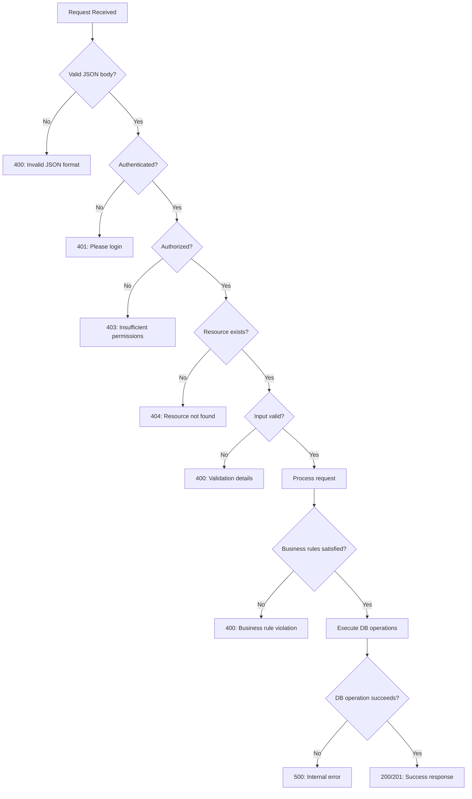
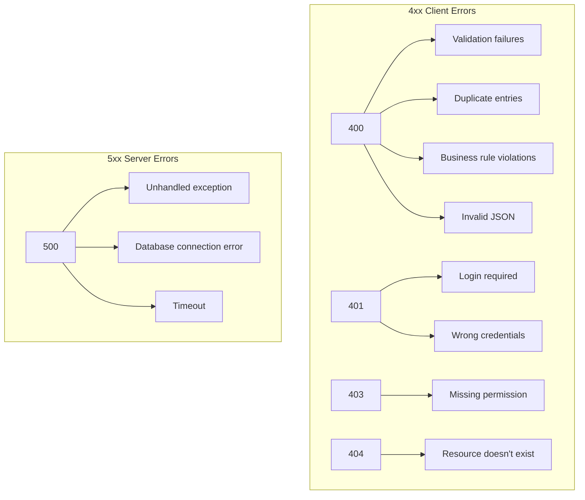
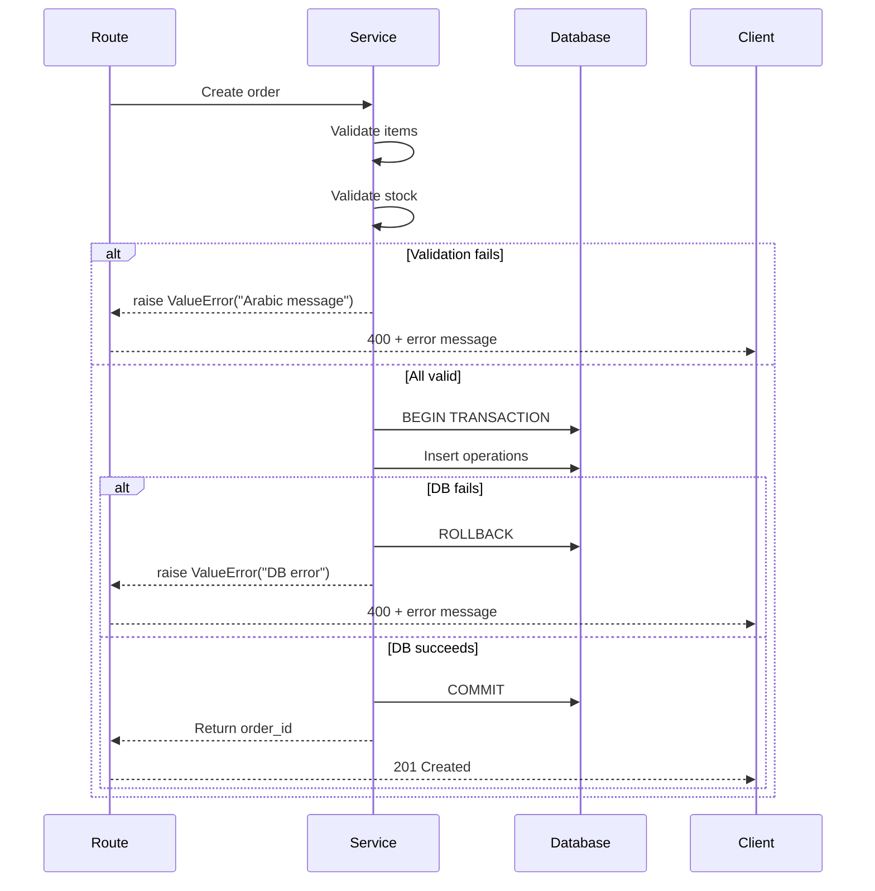

# Error Handling Strategy

> **Version:** 1.0  
> **Last Updated:** 2026-06-24  
> **Philosophy:** Fail Fast, Return Meaningful Messages, Log Everything

---

## Table of Contents

1. [Error Handling Philosophy](#1-error-handling-philosophy)
2. [Error Response Format](#2-error-response-format)
3. [HTTP Status Codes](#3-http-status-codes)
4. [Route-Level Error Handling Pattern](#4-route-level-error-handling-pattern)
5. [Service-Level Exceptions](#5-service-level-exceptions)
6. [Unexpected Exceptions](#6-unexpected-exceptions)
7. [Input Validation Errors](#7-input-validation-errors)
8. [Authentication Errors](#8-authentication-errors)
9. [Authorization Errors](#9-authorization-errors)
10. [Not Found Errors](#10-not-found-errors)
11. [Database Errors](#11-database-errors)
12. [Frontend Error Handling](#12-frontend-error-handling)
13. [Network Error Handling](#13-network-error-handling)
14. [Systematic Error Logging Pattern](#14-systematic-error-logging-pattern)
15. [Common Error Scenarios & Resolutions](#15-common-error-scenarios--resolutions)
16. [User-Facing Error Messages](#16-user-facing-error-messages)
17. [Developer-Facing Error Logging](#17-developer-facing-error-logging)
18. [Recovery Strategies by Error Type](#18-recovery-strategies-by-error-type)
19. [Best Practices & Checklist](#19-best-practices--checklist)

---

## 1. Error Handling Philosophy

### Core Principles

| Principle | Description |
|-----------|-------------|
| **Fail Fast** | Detect and report errors as early as possible — validate input before processing |
| **Meaningful Messages** | Every error response contains a clear, actionable Arabic message for the user |
| **Defensive Programming** | Never assume input is valid; check everything explicitly |
| **Graceful Degradation** | If a component fails, the system should still function partially |
| **No Information Leakage** | Never expose stack traces, SQL queries, or internal paths to the client |
| **Consistent Format** | All errors follow `{"error": "..."}` regardless of the source |

### Decision Flow



---

## 2. Error Response Format

### 2.1 Standard Error Envelope

All errors return a JSON object with a single `error` key:

```json
{
  "error": "رسالة الخطأ بالعربية"
}
```

### 2.2 No Nested Structures

- Errors are **always flat** `{"error": "text"}` — no nesting, no extra metadata.
- The HTTP status code conveys the category; the message conveys the detail.

### 2.3 Global Error Handler

```python
@app.errorhandler(404)
def not_found(e):
    return jsonify({"error": "الصفحة غير موجودة"}), 404

@app.errorhandler(405)
def method_not_allowed(e):
    return jsonify({"error": "طريقة الطلب غير مسموح بها"}), 405

@app.errorhandler(500)
def internal_error(e):
    app.logger.error(f"Internal server error: {traceback.format_exc()}")
    return jsonify({"error": "حدث خطأ داخلي في الخادم"}), 500
```

---

## 3. HTTP Status Codes

| Code | Name | When to Use | Client Action |
|------|------|-------------|---------------|
| `400` | Bad Request | Invalid input, missing fields, duplicate values, business rule violations | Fix the request body |
| `401` | Unauthorized | Missing session, invalid credentials | Redirect to login |
| `403` | Forbidden | Authenticated but insufficient role/permission | Show access denied |
| `404` | Not Found | Resource ID doesn't exist | Verify resource ID |
| `409` | Conflict | Duplicate SKU/Email (future use — currently 400) | Use unique values |
| `422` | Unprocessable | Semantic errors (future use — currently 400) | Fix data |
| `429` | Too Many Requests | Rate limit exceeded (future) | Retry after backoff |
| `500` | Internal Error | Unexpected server error | Contact support, retry later |
| `503` | Service Unavailable | Database down, maintenance (future) | Retry later |

### Current Usage Map



---

## 4. Route-Level Error Handling Pattern

### 4.1 Standard Pattern

```python
@products_bp.route('', methods=['POST'])
@require_permission('products:write')
def create_product():
    try:
        # 1. Parse and validate input
        data = request.get_json()
        if not data:
            return error_response('الرجاء إدخال بيانات المنتج')

        # 2. Delegate to service layer
        product_id = product_service.create_product(data)

        # 3. Return success
        return created_response('تم إنشاء المنتج بنجاح', {'id': product_id})

    except ValueError as e:
        # Expected business rule violations → 400
        return error_response(str(e))
    except Exception as e:
        # Unexpected errors → 500 + log
        app.logger.error(f"Unexpected error in create_product: {traceback.format_exc()}")
        return error_response('حدث خطأ أثناء إنشاء المنتج', 500)
```

### 4.2 Pattern Variations

#### Simple GET (read)

```python
@products_bp.route('/<int:id>', methods=['GET'])
@require_permission('products:read')
def get_product(id):
    try:
        product = product_service.get_product(id)
        if not product:
            return error_response('لم يتم العثور على المنتج', 404)
        return success_response('', product)
    except Exception as e:
        app.logger.error(f"Error fetching product {id}: {traceback.format_exc()}")
        return error_response('حدث خطأ أثناء جلب بيانات المنتج', 500)
```

#### POST with Transaction

```python
@sales_bp.route('/orders', methods=['POST'])
@require_permission('sales:write')
def create_sale():
    try:
        data = request.get_json()
        if not data:
            return error_response('الرجاء إدخال بيانات الفاتورة')

        order_id = sales_service.create_sales_order(data)
        return created_response('تم إنشاء فاتورة البيع بنجاح', {'id': order_id})

    except ValueError as e:
        return error_response(str(e))
    except Exception as e:
        app.logger.error(f"Sales creation failed: {traceback.format_exc()}")
        return error_response('حدث خطأ أثناء إنشاء الفاتورة', 500)
```

---

## 5. Service-Level Exceptions

### 5.1 Using ValueError for Business Rules

The service layer raises `ValueError` with an Arabic message for all expected business rule violations:

```python
def create_sales_order(data):
    db = get_db()

    # Validate items exist
    items = data.get('Items', [])
    if not items:
        raise ValueError('يجب إضافة صنف واحد على الأقل')

    # Validate each item
    for item in items:
        quantity = item.get('Quantity', 0)
        if quantity <= 0:
            raise ValueError('الكمية يجب أن تكون أكبر من صفر')

        unit_price = item.get('UnitPrice', 0)
        if unit_price <= 0:
            raise ValueError('سعر الوحدة يجب أن يكون أكبر من صفر')

        # Validate stock availability
        product = db.execute(
            "SELECT StockQuantity FROM products WHERE id = ?",
            (item['ProductId'],)
        ).fetchone()
        if not product:
            raise ValueError(f'المنتج برقم {item["ProductId"]} غير موجود')

        if product['StockQuantity'] < quantity:
            raise ValueError(f'الكمية غير متوفرة للمنتج: الكمية المطلوبة {quantity}، المتوفرة {product["StockQuantity"]}')

    # If all validations pass, proceed with transaction
    try:
        db.execute("BEGIN TRANSACTION")
        # ... insert order, items, update stock
        db.commit()
        return order_id
    except Exception as e:
        db.rollback()
        app.logger.error(f"Database error in create_sales_order: {str(e)}")
        raise ValueError('حدث خطأ في قاعدة البيانات')  # Wrap DB error as business error
```

### 5.2 Exception Hierarchy

```
Exception
├── ValueError          → Business rule violations (400)
│   ├── Missing field
│   ├── Duplicate entry
│   ├── Insufficient stock
│   └── Invalid status transition
├── PermissionError     → Authorization failures (403)
├── AuthenticationError → Session/login failures (401)  [not implemented as class]
└── Exception           → Unexpected errors (500)
    ├── sqlite3.Error
    ├── OSError
    └── Any other exception
```

### 5.3 Exception Flow



---

## 6. Unexpected Exceptions

### 6.1 Flask Debug Mode (Development)

```python
# When DEBUG=True (development)
app.run(debug=True)
# → Flask's built-in debugger shows detailed traceback in browser
# → Werkzeug debugger allows interactive inspection
```

### 6.2 Production Mode

```python
# When DEBUG=False (production)
# → Returns 500 with generic Arabic message
# → Logs full details server-side

@app.errorhandler(500)
def internal_error(e):
    app.logger.critical(f"Unhandled exception: {traceback.format_exc()}")
    return jsonify({"error": "حدث خطأ داخلي في الخادم"}), 500
```

### 6.3 Catching the Unexpected

```python
# Don't wrap entire route in bare except — let Flask handle 500
# But DO catch specific exceptions:

try:
    # operation
except ValueError:  # Expected business errors
    raise  # Re-raise for outer handler
except sqlite3.OperationalError as e:  # DB-specific
    app.logger.error(f"Database operation failed: {str(e)}")
    return error_response('خطأ في قاعدة البيانات', 500)
except Exception as e:  # Truly unexpected
    app.logger.critical(f"CRITICAL UNHANDLED: {traceback.format_exc()}")
    return error_response('حدث خطأ داخلي في الخادم', 500)
```

---

## 7. Input Validation Errors

### 7.1 Categories of Validation Errors

| Category | Example | HTTP Status |
|----------|---------|-------------|
| Missing required field | `ProductName` not provided | 400 |
| Wrong type | String instead of number | 400 |
| Out of range | Price <= 0 | 400 |
| Too long | Name > 200 characters | 400 |
| Invalid format | Bad email format | 400 |
| Duplicate value | SKU already exists | 400 |
| Empty array | No items in sales order | 400 |

### 7.2 Validation Error Messages

```python
def validate_product_data(data):
    """Validate product input data. Raises ValueError with Arabic message."""
    product_name = data.get('ProductName', '').strip()
    if not product_name:
        raise ValueError('حقل ProductName مطلوب')
    if len(product_name) > 200:
        raise ValueError('اسم المنتج يجب أن لا يتجاوز 200 حرف')

    sku = data.get('SKU', '').strip()
    if not sku:
        raise ValueError('حقل SKU مطلوب')
    if len(sku) > 50:
        raise ValueError('SKU يجب أن لا يتجاوز 50 حرف')

    selling_price = data.get('SellingPrice')
    if selling_price is None:
        raise ValueError('حقل SellingPrice مطلوب')
    if not isinstance(selling_price, (int, float)):
        raise ValueError('سعر البيع يجب أن يكون رقماً')
    if selling_price <= 0:
        raise ValueError('سعر البيع يجب أن يكون أكبر من صفر')

    cost_price = data.get('CostPrice', 0)
    if cost_price < 0:
        raise ValueError('سعر التكلفة لا يمكن أن يكون سالباً')
```

### 7.3 Multiple Validation Errors

For better UX, aggregate all validation errors when possible:

```python
def validate_sales_order(data):
    errors = []

    items = data.get('Items', [])
    if not items:
        errors.append('يجب إضافة صنف واحد على الأقل')

    for i, item in enumerate(items):
        qty = item.get('Quantity', 0)
        if qty <= 0:
            errors.append(f'الكمية في الصنف {i+1} يجب أن تكون أكبر من صفر')

        price = item.get('UnitPrice', 0)
        if price <= 0:
            errors.append(f'سعر الوحدة في الصنف {i+1} يجب أن يكون أكبر من صفر')

    if errors:
        raise ValueError('؛ '.join(errors))
```

### 7.4 Client-Side Validation (Complementary)

The frontend validates before sending to reduce server round-trips:

```javascript
// Frontend validation example
function validateProduct(data) {
    const errors = [];
    if (!data.ProductName?.trim()) errors.push('اسم المنتج مطلوب');
    if (!data.SKU?.trim()) errors.push('SKU مطلوب');
    if (!data.SellingPrice || data.SellingPrice <= 0) errors.push('سعر البيع يجب أن يكون أكبر من صفر');
    return errors;
}
```

---

## 8. Authentication Errors

### 8.1 Login Failures

**Scenario: Missing or invalid credentials**

```python
@auth_bp.route('/login', methods=['POST'])
def login():
    data = request.get_json()
    if not data:
        return error_response('الرجاء إدخال البريد الإلكتروني وكلمة المرور')

    email = data.get('Email', '').strip()
    password = data.get('Password', '')

    if not email or not password:
        return error_response('البريد الإلكتروني وكلمة المرور مطلوبان')

    user = get_user_by_email(email)

    # Don't reveal whether email or password is wrong
    if not user or not check_password_hash(user['PasswordHash'], password):
        app.logger.warning(f"Failed login attempt: {email}")
        return error_response('بيانات الدخول غير صحيحة', 401)

    if not user['IsActive']:
        app.logger.warning(f"Disabled account login attempt: {email}")
        return error_response('تم تعطيل الحساب', 401)

    # Login successful
    session['user_id'] = user['id']
    # ...
```

### 8.2 Session Expiration

```python
# Session check in decorator
def login_required(f):
    @wraps(f)
    def decorated_function(*args, **kwargs):
        if 'user_id' not in session:
            # Session expired or not logged in
            return error_response('يرجى تسجيل الدخول أولاً', 401)
        return f(*args, **kwargs)
    return decorated_function
```

### 8.3 Authentication Error Responses

| Scenario | Status | Message (Arabic) |
|----------|--------|------------------|
| No credentials provided | 400 | `البريد الإلكتروني وكلمة المرور مطلوبان` |
| Wrong email or password | 401 | `بيانات الدخول غير صحيحة` |
| Account disabled | 401 | `تم تعطيل الحساب` |
| Session expired | 401 | `يرجى تسجيل الدخول أولاً` |
| Invalid session | 401 | `يرجى تسجيل الدخول أولاً` |

---

## 9. Authorization Errors

### 9.1 Insufficient Permissions

```python
def require_permission(permission_name):
    def decorator(f):
        @wraps(f)
        def decorated_function(*args, **kwargs):
            if 'user_id' not in session:
                return error_response('يرجى تسجيل الدخول أولاً', 401)

            permissions = session.get('permissions', [])
            if permission_name not in permissions:
                app.logger.warning(
                    f"Authorization denied: user {session['user_id']} "
                    f"attempted '{permission_name}' but only has {permissions}"
                )
                return error_response('ليس لديك صلاحية للوصول إلى هذا المورد', 403)

            return f(*args, **kwargs)
        return decorated_function
    return decorator
```

### 9.2 Authorization Error Responses

| Scenario | Status | Message (Arabic) |
|----------|--------|------------------|
| No permission to view | 403 | `ليس لديك صلاحية للوصول إلى هذا المورد` |
| No permission to edit | 403 | `ليس لديك صلاحية لتعديل هذا المورد` |
| Action restricted by role | 403 | `صلاحياتك لا تسمح بهذه العملية` |

### 9.3 Authorization Audit Log

Every 403 error is logged with:
- User ID
- Attempted action
- Current permissions
- Request path

---

## 10. Not Found Errors

### 10.1 Resource-Specific Messages

```python
NOT_FOUND_MESSAGES = {
    'product': 'لم يتم العثور على المنتج',
    'customer': 'لم يتم العثور على العميل',
    'supplier': 'لم يتم العثور على المورد',
    'sales_order': 'لم يتم العثور على فاتورة البيع',
    'purchase_order': 'لم يتم العثور على أمر المشتريات',
    'employee': 'لم يتم العثور على الموظف',
    'repair_order': 'لم يتم العثور على أمر الإصلاح',
    'role': 'لم يتم العثور على الصلاحية',
    'category': 'لم يتم العثور على التصنيف',
    'brand': 'لم يتم العثور على العلامة التجارية',
    'tax': 'لم يتم العثور على الضريبة',
    'warehouse': 'لم يتم العثور على المستودع',
}
```

### 10.2 Not Found Handling Pattern

```python
def get_or_404(resource_type, resource_id, query, params):
    """Fetch a resource or return 404."""
    db = get_db()
    result = db.execute(query, params).fetchone()
    if not result:
        message = NOT_FOUND_MESSAGES.get(resource_type, 'لم يتم العثور على المورد')
        raise ValueError(message)  # Caught by route handler as 404
    return result
```

### 10.3 Not Found Error Responses

| Resource | Status | Message (Arabic) |
|----------|--------|------------------|
| Product | 404 | `لم يتم العثور على المنتج` |
| Customer | 404 | `لم يتم العثور على العميل` |
| Supplier | 404 | `لم يتم العثور على المورد` |
| Sales Order | 404 | `لم يتم العثور على فاتورة البيع` |
| Purchase Order | 404 | `لم يتم العثور على أمر المشتريات` |
| Employee | 404 | `لم يتم العثور على الموظف` |
| Repair Order | 404 | `لم يتم العثور على أمر الإصلاح` |
| Any resource | 404 | `لم يتم العثور على {resource}` |

---

## 11. Database Errors

### 11.1 Types of Database Errors

| Error Type | Cause | Handling |
|------------|-------|----------|
| `sqlite3.OperationalError` | DB locked, disk full, table missing | Log + return 500 |
| `sqlite3.IntegrityError` | Foreign key violation, unique constraint | Log + return 400 (user error) |
| `sqlite3.ProgrammingError` | Invalid SQL syntax | Log + return 500 (developer error) |
| `sqlite3.DatabaseError` | Corrupted database file | Log + return 500 |

### 11.2 Database Error Handler

```python
def safe_db_operation(operation, *args, **kwargs):
    """Wrapper for database operations with error handling."""
    try:
        return operation(*args, **kwargs)
    except sqlite3.IntegrityError as e:
        app.logger.error(f"Integrity error: {str(e)}")
        if 'UNIQUE constraint' in str(e):
            raise ValueError('البيانات موجودة مسبقاً')
        if 'FOREIGN KEY' in str(e):
            raise ValueError('بيانات مرتبطة غير موجودة')
        raise ValueError('حدث خطأ في قاعدة البيانات')
    except sqlite3.OperationalError as e:
        app.logger.error(f"Database operational error: {traceback.format_exc()}")
        raise ValueError('حدث خطأ في قاعدة البيانات')
```

### 11.3 Connection Error Recovery

```python
def get_db_with_retry(max_retries=3):
    """Get database connection with retry logic."""
    for attempt in range(max_retries):
        try:
            return get_db()
        except sqlite3.OperationalError as e:
            if 'database is locked' in str(e) and attempt < max_retries - 1:
                time.sleep(0.1 * (2 ** attempt))  # Exponential backoff
                continue
            raise
    raise RuntimeError("Could not connect to database after retries")
```

---

## 12. Frontend Error Handling

### 12.1 JavaScript Fetch Pattern

```javascript
async function apiRequest(url, options = {}) {
    try {
        const response = await fetch(url, {
            headers: {
                'Content-Type': 'application/json; charset=utf-8',
                ...options.headers,
            },
            ...options,
        });

        const data = await response.json();

        if (!response.ok) {
            // Server returned error (400, 401, 403, 404, 500)
            throw new ApiError(data.error || 'حدث خطأ غير معروف', response.status);
        }

        return data;
    } catch (error) {
        if (error instanceof ApiError) {
            throw error; // Re-throw server errors
        }
        // Network error (fetch failed entirely)
        throw new NetworkError('تعذر الاتصال بالخادم. تحقق من اتصالك بالإنترنت');
    }
}
```

### 12.2 Toast Notification System

```javascript
function showToast(message, type = 'error') {
    // type: 'error' (red), 'success' (green), 'warning' (yellow)
    const toast = document.createElement('div');
    toast.className = `toast toast-${type}`;
    toast.textContent = message;
    document.body.appendChild(toast);

    setTimeout(() => toast.remove(), 5000); // Auto-dismiss after 5s
}
```

### 12.3 Error Handling in UI

```javascript
async function loadProducts() {
    try {
        showLoadingSpinner();
        const response = await apiRequest('/api/products?page=1&page_size=20');
        renderProducts(response.value);
    } catch (error) {
        if (error.status === 401) {
            // Session expired — redirect to login
            window.location.href = '/login.html';
        } else if (error.status === 403) {
            showToast('ليس لديك صلاحية لعرض المنتجات', 'error');
        } else if (error.status === 500) {
            showToast('حدث خطأ في الخادم. حاول مرة أخرى', 'error');
        } else {
            showToast(error.message, 'error');
        }
    } finally {
        hideLoadingSpinner();
    }
}
```

### 12.4 Error-to-User Mapping (Frontend)

| HTTP Status | User Message (Arabic) | UI Action |
|-------------|----------------------|-----------|
| 400 | Show error message from server | Display toast/inline error |
| 401 | `يرجى تسجيل الدخول أولاً` | Redirect to login page |
| 403 | `ليس لديك صلاحية` | Show access denied page |
| 404 | Resource not found | Show not found state |
| 500 | `حدث خطأ في الخادم` | Show generic error + retry button |
| Network | `تعذر الاتصال بالخادم` | Show offline state + retry |

---

## 13. Network Error Handling

### 13.1 Client-Side Network Error

```javascript
class NetworkError extends Error {
    constructor(message) {
        super(message);
        this.name = 'NetworkError';
        this.status = 0; // No HTTP status
    }
}
```

### 13.2 Retry Logic for Critical Operations

```javascript
async function apiRequestWithRetry(url, options = {}, maxRetries = 3) {
    for (let attempt = 1; attempt <= maxRetries; attempt++) {
        try {
            return await apiRequest(url, options);
        } catch (error) {
            if (error instanceof NetworkError && attempt < maxRetries) {
                // Wait before retry (exponential backoff)
                await new Promise(r => setTimeout(r, 1000 * Math.pow(2, attempt)));
                continue;
            }
            throw error; // Non-network error or out of retries
        }
    }
}
```

### 13.3 Server-Side Network Error Protection

```python
# Timeout for long-running queries
import signal

def query_with_timeout(query, params, timeout_seconds=10):
    """Execute query with timeout."""
    # Note: SQLite doesn't natively support query timeouts
    # This is a placeholder for future PostgreSQL migration
    pass
```

---

## 14. Systematic Error Logging Pattern

### 14.1 Error Source Map

| Layer | Error Type | Log Level | Log Location | User Impact |
|-------|------------|-----------|--------------|-------------|
| **Route** | Invalid JSON | WARNING | app.logger | 400 Bad Request |
| **Route** | Missing data | WARNING | app.logger | 400 Bad Request |
| **Auth** | Invalid credentials | WARNING | app.logger | 401 Unauthorized |
| **Auth** | Disabled account | WARNING | app.logger | 401 Unauthorized |
| **Auth** | Session expired | INFO | app.logger | 401 Unauthorized |
| **Auth** | Permission denied | WARNING | app.logger | 403 Forbidden |
| **Service** | Resource not found | INFO | app.logger | 404 Not Found |
| **Service** | Validation error | INFO | app.logger | 400 Bad Request |
| **Service** | Duplicate entry | INFO | app.logger | 400 Bad Request |
| **Service** | Insufficient stock | INFO | app.logger | 400 Bad Request |
| **Service** | Invalid status | INFO | app.logger | 400 Bad Request |
| **Database** | Integrity error | ERROR | app.logger | 400 Bad Request |
| **Database** | Operational error | ERROR | app.logger | 500 Server Error |
| **Database** | Connection failed | CRITICAL | app.logger | 500 Server Error |
| **System** | Unhandled exception | CRITICAL | app.logger + file | 500 Server Error |

### 14.2 Log Format by Severity

```python
# INFO: Normal operations — one line
logger.info("Product created: ID=%d, SKU=%s", product_id, sku)

# WARNING: Expected failures — include context
logger.warning(
    "Permission denied: user_id=%d, required=%s, actual=%s",
    session.get('user_id'), permission_name, session.get('permissions')
)

# ERROR: Recoverable failures — include traceback if available
logger.error("Database error on sales creation: %s", traceback.format_exc())

# CRITICAL: System-level failures — full traceback
logger.critical("CRITICAL: Database connection lost: %s", traceback.format_exc())
```

### 14.3 Error Log Entries (Examples)

```
2026-06-24 09:15:23 - erp.routes.products - INFO - Product created: ID=42, SKU=LAP-001
2026-06-24 09:15:45 - erp.auth - WARNING - Failed login attempt for email: unknown@test.com
2026-06-24 09:16:10 - erp.auth - WARNING - Permission denied: user_id=3, required=products:write, actual=['products:read', 'sales:read']
2026-06-24 09:17:00 - erp.services.inventory - INFO - Insufficient stock: product_id=5, requested=10, available=3
2026-06-24 09:18:30 - erp.services.sales - ERROR - Integrity error on sales creation: UNIQUE constraint failed: reference_number
2026-06-24 09:19:00 - erp.app - CRITICAL - Unhandled exception: Traceback (most recent call last):
  File "app.py", line 42, in handler
    raise RuntimeError("Test error")
RuntimeError: Test error
```

---

## 15. Common Error Scenarios & Resolutions

| # | Scenario | Error Code | Error Message | Root Cause | Resolution |
|---|----------|------------|---------------|------------|------------|
| 1 | Login with wrong password | 401 | `بيانات الدخول غير صحيحة` | Password mismatch | Reset password or check credentials |
| 2 | Access product list without login | 401 | `يرجى تسجيل الدخول أولاً` | Session missing/expired | Redirect to login page |
| 3 | Create product without permission | 403 | `ليس لديك صلاحية للوصول إلى هذا المورد` | User role lacks `products:write` | Contact admin for role upgrade |
| 4 | GET product by non-existent ID | 404 | `لم يتم العثور على المنتج` | ID doesn't exist or soft-deleted | Verify the product ID |
| 5 | Create product with existing SKU | 400 | `رقم SKU موجود مسبقاً` | Duplicate SKU value | Use a unique SKU |
| 6 | Create sales order without items | 400 | `يجب إضافة صنف واحد على الأقل` | Empty Items array | Add at least one item |
| 7 | Sell more than available stock | 400 | `الكمية غير متوفرة للمنتج` | Insufficient inventory | Reduce quantity or restock |
| 8 | Invalid repair status transition | 400 | `لا يمكن تغيير الحالة من X إلى Y` | Illegal status change | Follow valid transition path |
| 9 | Empty product name | 400 | `حقل ProductName مطلوب` | Missing required field | Provide product name |
| 10 | Email with invalid format | 400 | `صيغة البريد الإلكتروني غير صحيحة` | Bad email pattern | Enter valid email format |
| 11 | Server crash on report query | 500 | `حدث خطأ داخلي في الخادم` | Database timeout or bug | Check logs, retry |
| 12 | Network timeout | N/A | `تعذر الاتصال بالخادم` | Frontend can't reach backend | Check server status, retry |
| 13 | Duplicate email for customer | 400 | `البريد الإلكتروني موجود مسبقاً` | Email already in use | Use different email |
| 14 | Delete product with active references | 400 | `لا يمكن حذف المنتج بسبب وجود فواتير مرتبطة` | Referential integrity | Deactivate instead |
| 15 | Negative price for product | 400 | `سعر البيع يجب أن يكون أكبر من صفر` | Negative or zero price | Set valid price |
| 16 | Receive already-received purchase | 400 | `تم استلام هذا الأمر بالفعل` | Duplicate receive operation | Verify order status |
| 17 | Empty password on employee creation | 400 | `كلمة المرور يجب أن تتكون من 6 أحرف على الأقل` | Too short password | Use minimum 6 characters |
| 18 | JSON parse error | 400 | `خطأ في صيغة JSON` | Malformed request body | Check JSON syntax |

---

## 16. User-Facing Error Messages

All user-facing error messages are in **Arabic** for the Egyptian market. Messages are stored inline or in the service layer.

### 16.1 Module: Authentication

| Key | Message (Arabic) |
|-----|-----------------|
| `auth.login.required` | `يرجى تسجيل الدخول أولاً` |
| `auth.login.invalid` | `بيانات الدخول غير صحيحة` |
| `auth.login.disabled` | `تم تعطيل الحساب` |
| `auth.logout.success` | `تم تسجيل الخروج بنجاح` |
| `auth.permission.denied` | `ليس لديك صلاحية للوصول إلى هذا المورد` |

### 16.2 Module: Products

| Key | Message (Arabic) |
|-----|-----------------|
| `product.not_found` | `لم يتم العثور على المنتج` |
| `product.created` | `تم إنشاء المنتج بنجاح` |
| `product.updated` | `تم تحديث المنتج بنجاح` |
| `product.deleted` | `تم حذف المنتج بنجاح` |
| `product.sku.duplicate` | `رقم SKU موجود مسبقاً` |
| `product.barcode.duplicate` | `رقم الباركود موجود مسبقاً` |
| `product.name.required` | `حقل ProductName مطلوب` |
| `product.price.positive` | `سعر البيع يجب أن يكون أكبر من صفر` |

### 16.3 Module: Customers

| Key | Message (Arabic) |
|-----|-----------------|
| `customer.not_found` | `لم يتم العثور على العميل` |
| `customer.created` | `تم إنشاء العميل بنجاح` |
| `customer.updated` | `تم تحديث بيانات العميل بنجاح` |
| `customer.deleted` | `تم حذف العميل بنجاح` |
| `customer.email.duplicate` | `البريد الإلكتروني موجود مسبقاً` |

### 16.4 Module: Sales

| Key | Message (Arabic) |
|-----|-----------------|
| `sales.not_found` | `لم يتم العثور على فاتورة البيع` |
| `sales.created` | `تم إنشاء فاتورة البيع بنجاح` |
| `sales.items.required` | `يجب إضافة صنف واحد على الأقل` |
| `sales.stock.insufficient` | `الكمية غير متوفرة للمنتج` |
| `sales.price.invalid` | `سعر الوحدة يجب أن يكون أكبر من صفر` |

### 16.5 Module: Inventory

| Key | Message (Arabic) |
|-----|-----------------|
| `inventory.stock.insufficient` | `الكمية غير متوفرة في المخزون` |
| `inventory.adjusted` | `تم تعديل المخزون بنجاح` |
| `inventory.deleted` | `تم حذف سجل المخزون بنجاح` |
| `inventory.cannot_delete` | `لا يمكن حذف سجل مخزون به كمية` |
| `inventory.count_created` | `تم إضافة جرد المخزون بنجاح` |

### 16.6 Module: Repairs

| Key | Message (Arabic) |
|-----|-----------------|
| `repair.not_found` | `لم يتم العثور على أمر الإصلاح` |
| `repair.created` | `تم إنشاء أمر الإصلاح بنجاح` |
| `repair.status_updated` | `تم تحديث حالة الإصلاح بنجاح` |
| `repair.invalid_transition` | `لا يمكن تغيير الحالة` |
| `repair.part_added` | `تم إضافة قطعة الغيار بنجاح` |

### 16.7 Module: General

| Key | Message (Arabic) |
|-----|-----------------|
| `general.server_error` | `حدث خطأ داخلي في الخادم` |
| `general.not_found` | `لم يتم العثور على المورد` |
| `general.invalid_json` | `خطأ في صيغة JSON` |
| `general.duplicate` | `البيانات موجودة مسبقاً` |
| `general.db_error` | `حدث خطأ في قاعدة البيانات` |
| `general.invalid_data` | `البيانات المدخلة غير صحيحة` |

---

## 17. Developer-Facing Error Logging

### 17.1 English-Only Logs

All developer-facing logs are in **English** for consistency:

```python
# GOOD (English):
app.logger.error(f"Product creation failed: {str(e)}")

# BAD (mixed):
app.logger.error(f"فشل إنشاء المنتج: {str(e)}")
```

### 17.2 Log Context

Include sufficient context for debugging:

```python
app.logger.info(
    "Sales order %d created by user %d: %d items, total=%.2f",
    order_id, session['user_id'], len(items), net_amount
)

app.logger.warning(
    "Stock adjustment blocked: product_id=%d, requested=%d, available=%d, user=%d",
    product_id, requested_qty, available_qty, session['user_id']
)

app.logger.error(
    "Database error in create_purchase: supplier_id=%d, items=%d, error=%s",
    supplier_id, len(items), str(e)
)
```

### 17.3 Full Stack Trace for 500 Errors

```python
import traceback

try:
    result = risky_operation()
except Exception:
    app.logger.critical(
        "CRITICAL: Unhandled exception in %s\n%s",
        request.path,
        traceback.format_exc()
    )
    return error_response('حدث خطأ داخلي في الخادم', 500)
```

### 17.4 Log Files Management

```python
import logging.handlers

# Rotating file handler — prevents infinite log growth
handler = logging.handlers.RotatingFileHandler(
    'erp.log',
    maxBytes=10 * 1024 * 1024,  # 10 MB per file
    backupCount=5               # Keep 5 backup files
)
```

---

## 18. Recovery Strategies by Error Type

### 18.1 Client-Side Recovery

| Error Type | Recovery Strategy | Implementation |
|------------|------------------|----------------|
| **Network** (fetch failed) | Auto-retry with exponential backoff | `apiRequestWithRetry()` |
| **401 Unauthorized** | Redirect to login, preserve return URL | `window.location.href = '/login?redirect=' + currentPath` |
| **403 Forbidden** | Show access denied, log out if session corrupted | Show message, offer logout |
| **404 Not Found** | Show empty state or error card | Replace content area with "Not Found" component |
| **400 Bad Request** | Show field-level validation errors | Highlight fields with error messages |
| **500 Server Error** | Show generic error with retry button | Toast + "Retry" button |
| **Timeout** (long operation) | Cancel operation, notify user | Show timeout message, abort controller |

### 18.2 Server-Side Recovery

| Error Type | Recovery Strategy | Implementation |
|------------|------------------|----------------|
| **Database locked** (SQLite) | Retry with backoff | `get_db_with_retry()` |
| **Transaction failure** | Rollback, log, return specific error | `db.rollback()` in exception handler |
| **Integrity constraint** | Return 400 with specific message | Catch `sqlite3.IntegrityError` |
| **Unexpected exception** | Log full traceback, return generic 500 | `app.logger.critical()` |
| **File upload failure** | Check disk space, return specific message | Catch `OSError` |

### 18.3 Transaction Rollback Flow

```python
def create_entity_with_rollback(create_func, data):
    """Generic wrapper for operations requiring rollback."""
    db = get_db()
    try:
        db.execute("BEGIN TRANSACTION")
        result = create_func(data)
        db.commit()
        return result
    except ValueError:
        db.rollback()
        raise  # Re-raise for route handler
    except Exception as e:
        db.rollback()
        app.logger.error(f"Transaction failed and rolled back: {traceback.format_exc()}")
        raise ValueError('حدث خطأ أثناء العملية')  # Wrap as business error
```

---

## 19. Best Practices & Checklist

### Error Handling Checklist

- [ ] Every route follows the try/except pattern
- [ ] `ValueError` used for all expected business rule violations
- [ ] All unexpected exceptions are logged with full traceback
- [ ] Error messages are in Arabic for users
- [ ] Logs are in English for developers
- [ ] `400` used for all input validation errors
- [ ] `401` used for authentication failures
- [ ] `403` used for authorization failures
- [ ] `404` used for resource not found
- [ ] `500` used for unexpected server errors
- [ ] No stack traces exposed to clients
- [ ] No database internals exposed in error messages
- [ ] All transactions have rollback handling
- [ ] Frontend handles all HTTP status codes correctly
- [ ] Network errors are caught and retried for critical ops
- [ ] File upload errors are caught and reported
- [ ] Validation is performed on both client and server
- [ ] Error messages are consistent across modules
- [ ] Logging includes context (user_id, entity_id, etc.)
- [ ] Log files are rotated to prevent disk full

### Anti-Patterns to Avoid

```python
# BAD: Silent failure
try:
    result = operation()
except:
    pass  # Never silently swallow exceptions!

# BAD: Exposing internals
return jsonify({"error": str(e), "sql": query}), 500

# BAD: Inconsistent error format
return jsonify({"message": "Error occurred"}), 400  # Should be {"error": "..."}

# BAD: Logging in Arabic
logger.error("فشلت العملية")  # Logs should be in English

# BAD: Not logging exceptions
except Exception:
    return error_response('حدث خطأ', 500)  # No log — can't debug!

# BAD: Catching generic exception in service layer
try:
    db.execute(query)
except:  # Too broad — catch specific exceptions
    pass
```

### Recovery Checklist

- [ ] Can the user retry the operation?
- [ ] Is the error message actionable?
- [ ] Is the system in a consistent state after the error?
- [ ] Was the transaction rolled back correctly?
- [ ] Was the error logged for debugging?
- [ ] Does the frontend handle this status code?
- [ ] Is there a way to recover automatically (retry)?
- [ ] Are monitoring/alerting systems notified?

### Future Improvements

| Improvement | Priority | Notes |
|-------------|----------|-------|
| Structured error logging (JSON) | Medium | Better log analysis |
| Centralized error reporting (Sentry) | High | Real-time error tracking |
| Error code catalog | Low | Machine-readable error codes |
| Automatic retry middleware | Medium | For transient DB failures |
| Circuit breaker pattern | Low | For external API calls |
| Rate limit error (429) | Medium | When rate limiting implemented |
| Validation error details (field-level) | Medium | Currently returns single message |
