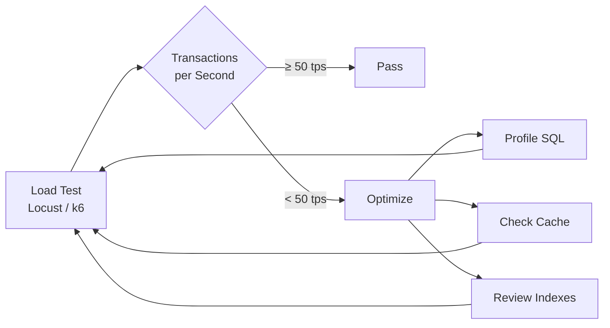
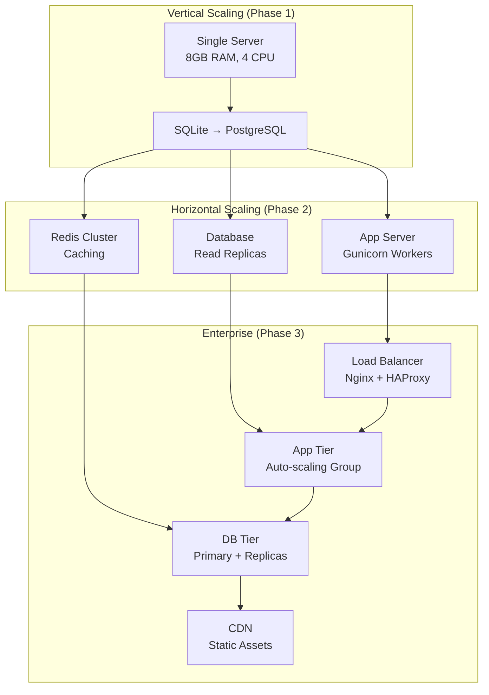
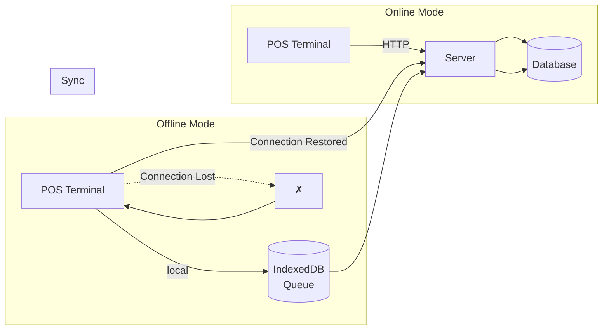
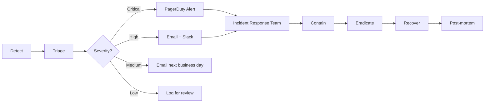
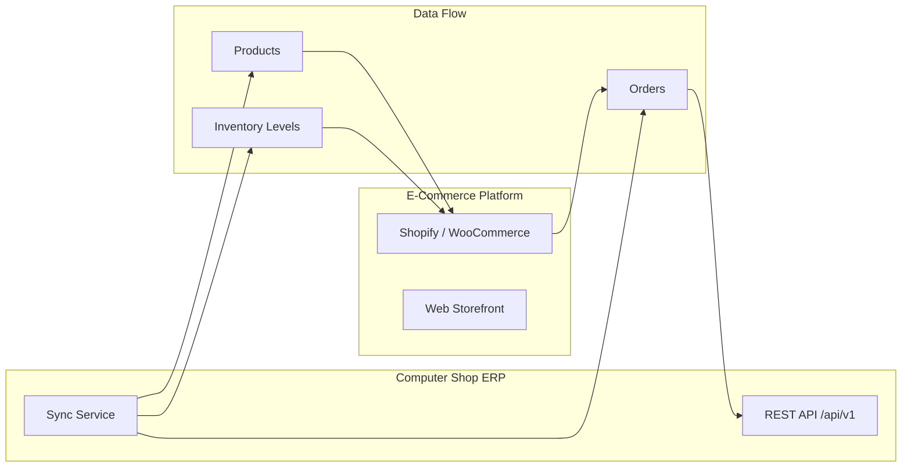
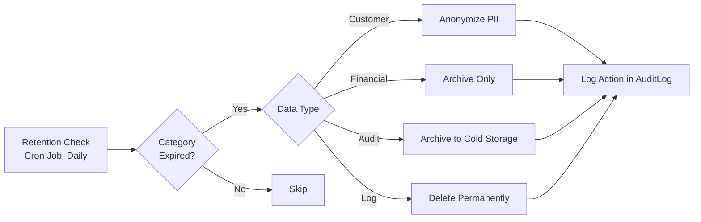
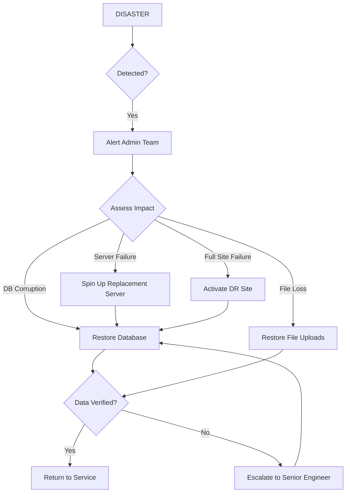

# Non-Functional Requirements — Computer Shop ERP & POS System

> **Version:** 1.0.0-beta  
> **Document Status:** Final  
> **Requirement Prefix:** NFR-001  
> **Last Updated:** June 2026

---

## Table of Contents

1. [NFR-001: Performance](#nfr-001-performance)
2. [NFR-002: Scalability](#nfr-002-scalability)
3. [NFR-003: Availability](#nfr-003-availability)
4. [NFR-004: Security](#nfr-004-security)
5. [NFR-005: Reliability](#nfr-005-reliability)
6. [NFR-006: Maintainability](#nfr-006-maintainability)
7. [NFR-007: Usability](#nfr-007-usability)
8. [NFR-008: Portability](#nfr-008-portability)
9. [NFR-009: Interoperability](#nfr-009-interoperability)
10. [NFR-010: Accessibility](#nfr-010-accessibility)
11. [NFR-011: Data Retention Policies](#nfr-011-data-retention-policies)
12. [NFR-012: Backup and Disaster Recovery](#nfr-012-backup-and-disaster-recovery)
13. [Traceability Matrix](#traceability-matrix)

---

## NFR-001: Performance

### Requirement

The system MUST meet or exceed the following performance benchmarks under normal operating conditions.

### Performance Targets

| Metric | Target | Measurement Method | Load Condition |
|--------|--------|--------------------|----------------|
| **POS Transaction** | ≤ 500 ms | Server-side timing from submit to response | 10 concurrent POS terminals |
| **Page Load (Dashboard)** | ≤ 2 seconds | Browser `DOMContentLoaded` event | 10 concurrent users |
| **Page Load (List Views)** | ≤ 1.5 seconds | Browser `DOMContentLoaded` event | 10 concurrent users |
| **Search Response** | ≤ 300 ms | AJAX request-response time | While typing (debounced) |
| **Barcode Lookup** | ≤ 200 ms | Server-side timing from request to response | 10 concurrent scanners |
| **Report Generation** | ≤ 5 seconds (filters) / ≤ 30 seconds (full export) | Server-side timing from request to response | Single user |
| **Database Query (Simple)** | ≤ 50 ms | Database query execution time | 50 concurrent connections |
| **Database Query (Complex)** | ≤ 500 ms | Database query execution time | 50 concurrent connections |
| **Concurrent API Calls** | ≤ 1000 ms for 95th percentile | API endpoint timing | 100 simultaneous requests |
| **File Upload (2 MB)** | ≤ 5 seconds | Total upload + processing time | Single user |
| **PDF Invoice Generation** | ≤ 3 seconds | Server-side timing | Single user |
| **Bulk Import (1000 products)** | ≤ 30 seconds | Total import + validation time | Single user |
| **Memory Usage** | ≤ 512 MB (application) | Process memory monitoring | 50 concurrent users |
| **CPU Usage** | ≤ 70% average | Process CPU monitoring | Peak load |

### Performance Degradation Thresholds

| Condition | Action |
|-----------|--------|
| POS transaction > 1 second | Log warning; monitor trend |
| POS transaction > 2 seconds | Trigger alert to admin |
| Page load > 5 seconds | Log error; show loading indicator |
| Database query > 2 seconds | Log slow query for optimization |
| Memory > 80% of allocated | Restart worker gracefully |
| CPU > 90% for 5 minutes | Scale out workers |

### Implementation Notes

- Database queries MUST use eager loading (`joinedload` / `subqueryload`) to avoid N+1 queries
- All list views MUST implement server-side pagination with maximum 50 rows per page
- AJAX endpoints MUST return only JSON (no HTML rendering)
- Redis caching for: product search results (5 min TTL), dashboard KPIs (60 seconds), report results (1 hour)
- Image thumbnails MUST be generated on upload and served from a separate URL
- Database indexes MUST exist on all foreign keys, `status` fields, `created_at`, and frequently filtered columns
- Connection pooling with PgBouncer (default pool size: 20, max: 50)
- Frontend assets (CSS, JS) MUST be minified and served with far-future `Cache-Control` headers

### Performance Testing



- **Tools:** Locust or k6 for load testing, py-spy for profiling, PostgreSQL `EXPLAIN ANALYZE` for query analysis
- **Baseline:** Establish performance baseline before each release
- **Regression:** Any change that degrades performance by >10% must be rejected
- **CI/CD:** Performance tests run on every pull request; failure blocks merge

---

## NFR-002: Scalability

### Requirement

The system MUST scale to support growing business needs without fundamental architecture changes.

### Scalability Targets

| Dimension | Phase 1 (v1.0) | Phase 2 (v1.5) | Phase 3 (v2.0) |
|-----------|----------------|-----------------|-----------------|
| **Stores** | 1-3 stores | 1-20 stores | 1-50+ stores |
| **Concurrent Users** | 10 users | 50 users | 100+ users |
| **Daily Transactions** | Up to 500 | Up to 5,000 | Up to 50,000 |
| **Product Catalog** | Up to 10,000 SKUs | Up to 50,000 SKUs | Up to 200,000 SKUs |
| **Customers** | Up to 5,000 | Up to 50,000 | Up to 200,000 |
| **Database Size** | Up to 1 GB | Up to 10 GB | Up to 100 GB |
| **Warehouses per Store** | 1 warehouse | 1-3 warehouses | 1-10 warehouses |

### Scaling Strategy



### Scaling Constraints

| Constraint | Mitigation |
|------------|------------|
| SQLite single-writer | Migrate to PostgreSQL for multi-user |
| Flask GIL limitation | Multiple Gunicorn workers (2× CPU + 1) |
| Session affinity | Use Redis for centralized session storage |
| File storage on local disk | Migrate to S3-compatible object storage (MinIO) |
| Monolithic application | Extract reporting to separate service with Celery workers |
| Database query scaling | Add read replicas for reporting queries |

### Implementation Notes

- Application MUST be stateless — all session state in Redis or signed cookies
- File uploads MUST use external storage (local disk as starting point, S3/MinIO for scale)
- Database connection pooling MUST be configured with proper min/max pool sizes
- API routes MUST be designed for horizontal scaling (no server-local state)
- Background tasks (report generation, email sending) MUST use a task queue (RQ/Celery)
- Multi-store data isolation via `store_id` column on all transactional tables

---

## NFR-003: Availability

### Requirement

The system MUST achieve the following availability targets measured over a calendar quarter.

### Availability Targets

| Metric | Target | Calculation |
|--------|--------|-------------|
| **System Uptime** | 99.9% (≈8.76 hours downtime/year) | (Total time − Downtime) / Total time × 100 |
| **Planned Maintenance** | ≤ 4 hours/month | Scheduled during off-hours (2:00-6:00 AM) |
| **POS Uptime** | 99.5% (offline mode compensates) | POS terminal availability including offline capability |
| **Recovery Time Objective (RTO)** | ≤ 1 hour | Time to restore service after failure |
| **Recovery Point Objective (RPO)** | ≤ 15 minutes | Maximum data loss acceptable |

### Offline POS Capability



**Offline mode behavior:**
1. POS detects connection loss (no response from `/health` for 5 seconds)
2. POS switches to offline mode: transactions queued in IndexedDB
3. Each queued transaction gets a temporary UUID and local timestamp
4. When connection restored, queued transactions sync one-by-one
5. If server rejects a transaction (e.g., insufficient stock), it's flagged for manual review
6. Server reconciles offline transactions on sync, maintaining sequential integrity
7. Offline mode supports: product search (from last-synced catalog), cart operations, cash payments only
8. Offline mode does NOT support: credit account sales, loyalty points redemption, card payments

### Availability Strategies

| Strategy | Implementation |
|----------|----------------|
| **Redundant Server** | Active-passive with failover; manual switch |
| **Database Connection Pooling** | PgBouncer with connection retry (3 attempts, exponential backoff) |
| **Graceful Degradation** | Non-critical features disabled under load (charts, recommendations) |
| **Health Checks** | `/health` endpoint checks DB connectivity, Redis connectivity, disk space |
| **Auto-Recovery** | Application restarts on crash (systemd `Restart=always`) |
| **Monitoring** | Prometheus metrics: uptime, request latency, error rate, DB connections |
| **Alerting** | PagerDuty / Opsgenie alerts for: downtime, high latency, 5xx errors spike, disk >80% |
| **Maintenance Mode** | Static HTML page during planned maintenance; DB migrations require 2× expected time |

---

## NFR-004: Security

### Requirement

The system MUST protect data confidentiality, integrity, and availability through defense-in-depth security controls.

### Security Controls

| Category | Control | Implementation |
|----------|---------|----------------|
| **Authentication** | Password hashing | bcrypt with 12 salt rounds |
| **Authentication** | Account lockout | 5 failed attempts → 15-minute lockout |
| **Authentication** | Password complexity | Min 8 chars, uppercase, lowercase, digit, special character |
| **Authentication** | Session management | HTTP-only, Secure, SameSite=Lax cookies; 30-min idle timeout |
| **Authentication** | Rate limiting | 5 login attempts/minute/IP via Flask-Limiter |
| **Authorization** | Role-Based Access Control (RBAC) | Flask-Principal or custom decorator |
| **Authorization** | Route protection | Permission check on every route; 403 for unauthorized |
| **Authorization** | API authentication | Token-based (JWT or API keys) for external integrations |
| **Encryption at Rest** | Database | Transparent Data Encryption (PostgreSQL TDE or LUKS) |
| **Encryption at Rest** | File uploads | Encrypted at filesystem level (dm-crypt/LUKS) |
| **Encryption in Transit** | Web traffic | TLS 1.3 with HSTS; A+ rating on SSL Labs |
| **Encryption in Transit** | Database connections | TLS for remote DB; client certificate optional |
| **Input Validation** | SQL Injection prevention | SQLAlchemy ORM — no raw SQL concatenation |
| **Input Validation** | XSS prevention | Jinja2 auto-escaping; bleach for rich text |
| **Input Validation** | CSRF protection | Flask-WTF CSRF token on all forms |
| **Input Validation** | File upload validation | File type (magic bytes), size limit, name sanitization |
| **Audit** | Data modification audit | AuditLog table with before/after values |
| **Audit** | Access logging | All login/logout events logged |
| **Privacy** | PII handling | Encryption at rest; access limited by role |
| **Privacy** | Data minimization | Only necessary PII collected; configurable retention |

### Security Checklist

| Check | Status | Notes |
|-------|--------|-------|
| TLS 1.3 enabled | ✓ Required | Config: `ssl_protocols TLSv1.2 TLSv1.3;` |
| HSTS enabled | ✓ Required | `add_header Strict-Transport-Security "max-age=31536000"` |
| CSP headers set | ✓ Required | Content-Security-Policy restricts script sources |
| X-Frame-Options: DENY | ✓ Required | Prevents clickjacking |
| X-Content-Type-Options: nosniff | ✓ Required | Prevents MIME sniffing |
| Referrer-Policy: strict-origin | ✓ Required | Limits referrer leakage |
| Session cookie: HttpOnly | ✓ Required | Cannot be accessed by JavaScript |
| Session cookie: Secure | ✓ Required | Sent only over HTTPS |
| Session cookie: SameSite | ✓ Required | Lax or Strict |
| Password hashing (bcrypt) | ✓ Required | 12 rounds minimum |
| Rate limiting on login | ✓ Required | 5 requests/minute/IP |
| Account lockout | ✓ Required | 5 failures → 15 min lockout |
| SQL injection prevention | ✓ Required | ORM only; no raw SQL |
| CSRF tokens on all forms | ✓ Required | Flask-WTF integration |
| File upload validation | ✓ Required | Magic bytes, size, name |
| Security headers audit | ✓ Monthly | Using Mozilla Observatory |
| Penetration test | ✓ Quarterly | External vendor |
| Dependency scan | ✓ Weekly | `pip-audit` or Snyk |
| Secret scanning | ✓ Pre-commit | `pre-commit` hook for secrets |

### GDPR Compliance

| Requirement | Implementation |
|-------------|----------------|
| Right to access | Customer profile export (JSON/CSV) |
| Right to rectification | Customer profile edit |
| Right to erasure | Soft delete with anonymization option |
| Right to data portability | Customer data export with all associated records |
| Consent management | Configurable marketing opt-in/out |
| Data processing record | AuditLog tracks all PII access |
| Breach notification | Automated alert to admin on suspicious activity |
| Data Processing Agreement (DPA) | Required for cloud hosting providers |

### Security Incident Response



---

## NFR-005: Reliability

### Requirement

The system MUST ensure data integrity, transaction atomicity, and consistent behavior under all conditions.

### Reliability Targets

| Metric | Target | Measurement |
|--------|--------|-------------|
| **Data Consistency** | 100% | No orphan records; referential integrity enforced |
| **Transaction Integrity** | 100% | All-or-nothing; rollback on failure |
| **Error Rate** | < 0.1% of transactions | Failed / Total × 100 |
| **Idempotency** | Duplicate requests do not create duplicate records | API key + idempotency key |
| **Data Loss** | 0% | Journaled writes; WAL mode for SQLite |
| **Race Condition** | 0 incidents | Optimistic locking with version columns |

### Reliability Mechanisms

| Mechanism | Description |
|-----------|-------------|
| **Database Transactions** | All multi-step operations wrapped in `db.session.begin()` with commit/rollback |
| **Optimistic Locking** | `version` column on high-contention tables; reject stale updates |
| **Pessimistic Locking** | `SELECT ... FOR UPDATE` on stock quantity reads during POS transaction |
| **Idempotency Keys** | API endpoints accept `Idempotency-Key` header; duplicate keys return cached response |
| **Input Validation** | Server-side validation on all inputs; never trust client |
| **Business Rule Validation** | Business rules enforced in service layer (not in controllers or templates) |
| **Graceful Error Handling** | Every route returns JSON error with appropriate HTTP status code |
| **Database Constraints** | Foreign keys, unique constraints, check constraints at database level |
| **Migration Reversibility** | Every Alembic migration has both `upgrade()` and `downgrade()` |

### Error Handling Standards

| HTTP Status | When to Use | Response Format |
|-------------|-------------|-----------------|
| 200 | Success | `{"status": "success", "data": {...}}` |
| 201 | Created | `{"status": "success", "data": {...}, "id": 123}` |
| 400 | Bad Request (validation error) | `{"status": "error", "message": "...", "errors": {...}}` |
| 401 | Unauthorized (not logged in) | `{"status": "error", "message": "Login required"}` |
| 403 | Forbidden (insufficient permissions) | `{"status": "error", "message": "Permission denied"}` |
| 404 | Not Found | `{"status": "error", "message": "Resource not found"}` |
| 409 | Conflict (duplicate, stale version) | `{"status": "error", "message": "...", "current_version": 5}` |
| 422 | Unprocessable Entity | `{"status": "error", "message": "Validation failed", "errors": {...}}` |
| 429 | Too Many Requests | `{"status": "error", "message": "Rate limit exceeded", "retry_after": 60}` |
| 500 | Internal Server Error | `{"status": "error", "message": "Internal server error"}` (no stack trace) |
| 503 | Service Unavailable | `{"status": "error", "message": "Service temporarily unavailable"}` |

### Testing Requirements

| Test Type | Coverage Target | Frequency |
|-----------|-----------------|-----------|
| Unit Tests | ≥ 85% line coverage | Every commit |
| Integration Tests | All API endpoints | Every pull request |
| Database Migration Tests | All migration pairs | Every release |
| Concurrency Tests | Stock decrement, finance recording | Every release |
| Error Handling Tests | All 4xx/5xx scenarios | Every release |
| Data Integrity Tests | Foreign key, unique constraint violations | Every release |

---

## NFR-006: Maintainability

### Requirement

The system MUST be designed for ease of maintenance, troubleshooting, and extension by developers with Python Flask experience.

### Maintainability Targets

| Metric | Target | Measurement |
|--------|--------|-------------|
| **Code Documentation** | ≥ 80% of public functions have docstrings | `pydocstyle` check |
| **Code Complexity** | Cyclomatic complexity ≤ 15 per function | `radon cc` analysis |
| **Code Duplication** | < 5% duplication | `radon hal` or `pylint` |
| **Test Coverage** | ≥ 85% line coverage | `pytest-cov` |
| **Setup Time** | New developer productive in ≤ 30 minutes | Time from `git clone` to `flask run` |
| **Migration Time** | Apply database migrations in < 1 second per migration | Alembic timing |
| **Log Readability** | Structured JSON logs with consistent fields | Visual inspection |

### Code Organization Standards

| Aspect | Standard |
|--------|----------|
| **Application Structure** | Flask application factory pattern (`create_app()`) |
| **Blueprints** | One blueprint per module (auth, pos, products, etc.) |
| **Models** | SQLAlchemy models in `app/models/`, one file per entity group |
| **Services** | Business logic in `app/services/`, not in routes or models |
| **Routes** | Thin controllers calling service methods; no logic |
| **Templates** | Jinja2 with template inheritance; macros for repeated UI patterns |
| **Static Assets** | CSS in `static/css/`, JS in `static/js/`; organized by module |
| **Configuration** | Environment-specific config classes in `app/config.py` |
| **Migrations** | One migration per schema change; squash after stable release |

### Documentation Requirements

| Document | Location | Update Frequency |
|----------|----------|-----------------|
| API Documentation | `/docs/api/` or OpenAPI spec | On every API change |
| Database Schema | Alembic migrations + ERD | On every migration |
| Deployment Guide | `/docs/DEPLOYMENT.md` | On every release |
| Environment Variables | `.env.example` | On every config change |
| README | `/README.md` | On every release |
| CHANGELOG | `/CHANGELOG.md` | On every PR |
| Architecture Decision Records | `/docs/adr/` | On every architecture decision |

### Logging Standards

| Aspect | Standard |
|--------|----------|
| **Format** | JSON structured logging |
| **Fields** | `timestamp`, `level`, `logger`, `module`, `function`, `line`, `message`, `request_id`, `user_id`, `ip`, `duration_ms` |
| **Levels** | DEBUG (development), INFO (normal operations), WARNING (potential issue), ERROR (failure), CRITICAL (system down) |
| **Request ID** | UUID generated per request; passed to all downstream calls |
| **Log Shipping** | stdout in Docker; file rotation for bare metal (7 days retention) |
| **Sensitive Data** | Never log passwords, tokens, or PII; mask with `[REDACTED]` |

### Dependency Management

| Practice | Implementation |
|----------|----------------|
| **Version Pinning** | All dependencies pinned with exact versions in `requirements.txt` |
| **Vulnerability Scanning** | Weekly `pip-audit` scan; critical CVEs patched within 48 hours |
| **Deprecation Monitoring** | Quarterly review of dependency updates |
| **Minimal Dependencies** | Avoid unnecessary packages; justify each dependency in `DEPENDENCIES.md` |

---

## NFR-007: Usability

### Requirement

The system MUST provide an intuitive, efficient, and localized user experience for Arabic and English speakers.

### Usability Targets

| Metric | Target | Measurement |
|--------|--------|-------------|
| **Language Support** | Arabic (RTL) and English (LTR) | Full UI translation; dynamic switch |
| **RTL Layout** | Complete mirror of UI components | Visual inspection; no layout breaks |
| **Checkout Time (Trained Cashier)** | < 45 seconds for 5-item sale | Timed user testing (n=10) |
| **Checkout Time (New Cashier)** | < 2 minutes after 1 hour training | Timed user testing (n=5) |
| **Product Search** | Find product in < 3 keystrokes | Search accuracy testing |
| **Button Clicks for Common Task** | ≤ 3 clicks | Common task analysis |
| **Keyboard Navigation** | Full keyboard operability | Tab order testing |
| **Error Messages** | Clear, actionable, localized | User review |
| **Mobile/Tablet Use** | Functional but not optimized | Basic responsive layout |

### UI/UX Principles

| Principle | Implementation |
|-----------|----------------|
| **Consistency** | Same UI patterns throughout; Bootstrap 5 components |
| **Feedback** | Every action has visual feedback (toast, spinner, success message) |
| **Error Prevention** | Confirm destructive actions; validate before submit |
| **Recovery** | Undo option where possible; clear error messages with next steps |
| **User Control** | Cancel buttons on all forms; escape key closes modals |
| **Recognition over Recall** | Dropdowns, search autocomplete, visual icons |
| **Aesthetic Design** | Clean, uncluttered layout; adequate whitespace |
| **Help & Documentation** | Contextual help icons linking to relevant docs |

### Localization Requirements

| Aspect | Arabic (RTL) | English (LTR) |
|--------|--------------|---------------|
| **Text Direction** | Right-to-Left | Left-to-Right |
| **Number Format** | ١٢٣٬٤٥٦٫٧٨ (Arabic-Indic digits) | 123,456.78 |
| **Date Format** | 2026/06/24 or 24/06/2026 | 06/24/2026 |
| **Currency** | EGP (on the right: ١٬٠٠٠ ج.م) | EGP (on the left: EGP 1,000) |
| **First Day of Week** | Saturday | Sunday |
| **Weekend** | Friday | Saturday-Sunday |
| **Time Format** | 24-hour | 12-hour (AM/PM) |
| **Decimal Separator** | Period (.) | Period (.) |
| **Thousands Separator** | Comma (,) or space | Comma (,) |
| **Translation Method** | Fluent with ICU message format | String IDs in Python/Templates |

### UI Responsiveness Targets

| Screen Width | Target | Notes |
|-------------|--------|-------|
| ≥ 1920px | Full desktop layout | POS optimized |
| 1366-1919px | Full desktop layout | Standard laptop |
| 1024-1365px | Full layout with condensed sidebar | Tablet landscape |
| 768-1023px | Condensed layout; POS grid 3 columns | Tablet portrait; limited POS |
| < 768px | Basic mobile layout; no POS | View-only; reports and notifications |

---

## NFR-008: Portability

### Requirement

The system MUST run on multiple platforms with minimal configuration changes.

### Supported Platforms

| Platform | Supported | Tested | Notes |
|----------|-----------|--------|-------|
| **Linux (Ubuntu 22.04/24.04)** | ✓ Primary | ✓ | Development and production |
| **Linux (Debian 12)** | ✓ | ✓ | Production tested |
| **Linux (CentOS/Rocky 9)** | ✓ | ✓ | Via Docker |
| **Windows (10/11)** | ✓ | ✓ | Development only |
| **macOS (13+)** | ✓ | ✓ | Development only |
| **Raspberry Pi OS (ARM)** | ✓ | ⚠ | Limited testing; low volume stores |
| **Docker (any platform)** | ✓ | ✓ | **Recommended deployment method** |

### Docker Deployment

```dockerfile
# Dockerfile (multi-stage build)
FROM python:3.12-slim AS builder
WORKDIR /app
COPY requirements.txt .
RUN pip install --user --no-cache-dir -r requirements.txt

FROM python:3.12-slim
WORKDIR /app
COPY --from=builder /root/.local /root/.local
COPY . .
ENV PATH=/root/.local/bin:$PATH
EXPOSE 8000
CMD ["gunicorn", "-w", "4", "-b", "0.0.0.0:8000", "app:create_app()"]
```

```yaml
# docker-compose.yml
version: '3.8'
services:
  web:
    build: .
    ports:
      - "8000:8000"
    env_file: .env
    volumes:
      - ./data:/app/data
    depends_on:
      - db
    restart: unless-stopped
  db:
    image: postgres:15-alpine
    environment:
      POSTGRES_DB: erp
      POSTGRES_USER: erp
      POSTGRES_PASSWORD: ${DB_PASSWORD}
    volumes:
      - pgdata:/var/lib/postgresql/data
    restart: unless-stopped
volumes:
  pgdata:
```

### Cross-Platform Considerations

| Concern | Mitigation |
|---------|------------|
| File path separators | Use `os.path.join()` or `pathlib.Path` |
| Line endings | `.gitattributes` with `text=auto` |
| Python version differences | Target Python 3.10+; avoid 3.11-only features |
| Database differences | SQLAlchemy abstraction layer |
| System dependencies | Document in `SYSTEM_REQUIREMENTS.md` |
| Printing | Platform-independent ESC/POS via python-escpos |
| Barcode scanning | HID keyboard wedge (OS-independent) |

---

## NFR-009: Interoperability

### Requirement

The system MUST expose data and functionality through standard interfaces for integration with third-party systems.

### Integration Interfaces

| Interface | Protocol | Format | Authentication | Rate Limit |
|-----------|----------|--------|----------------|------------|
| **REST API** | HTTP/HTTPS | JSON | API Key / JWT | 1000 req/min |
| **Data Export** | HTTP download | CSV, Excel (XLSX), PDF | Session + Role | 10 exports/min |
| **Data Import** | HTTP upload | CSV, Excel (XLSX) | Session + Role | 5 imports/min |
| **Webhook** | HTTP POST | JSON | HMAC signature | Configurable |
| **Printing** | Network (TCP) | ESC/POS | IP whitelist | N/A |
| **Payment Gateway** | HTTPS | JSON (REST) | API credentials | Per gateway |

### REST API Design

| Aspect | Standard |
|--------|----------|
| **Base URL** | `/api/v1/` |
| **Format** | JSON (Content-Type: application/json) |
| **Authentication** | `Authorization: Bearer <api_key>` or `X-API-Key: <key>` |
| **Pagination** | `?page=1&per_page=20` with `X-Total-Count`, `X-Total-Pages` headers |
| **Filtering** | `?status=active&category_id=5` (snake_case) |
| **Sorting** | `?sort=name&order=asc` |
| **Field Selection** | `?fields=id,name,price` |
| **Errors** | Consistent error format: `{"error": {"code": "...", "message": "..."}}` |
| **Idempotency** | `Idempotency-Key` header for POST/PUT/PATCH |
| **Versioning** | URL path versioning (`/api/v1/`, future `/api/v2/`) |

### API Endpoints (Summary)

| Endpoint | Methods | Description |
|----------|---------|-------------|
| `/api/v1/products` | GET, POST | List / Create products |
| `/api/v1/products/:id` | GET, PUT, PATCH, DELETE | Single product CRUD |
| `/api/v1/categories` | GET, POST | List / Create categories |
| `/api/v1/customers` | GET, POST | List / Create customers |
| `/api/v1/customers/:id` | GET, PUT, DELETE | Single customer CRUD |
| `/api/v1/sales` | GET, POST | List / Create sales |
| `/api/v1/sales/:id` | GET | Single sale detail |
| `/api/v1/inventory` | GET | Stock levels by warehouse |
| `/api/v1/reports/sales` | GET | Sales report data |
| `/api/v1/reports/inventory` | GET | Inventory report data |
| `/api/v1/auth/login` | POST | API authentication |

### E-Commerce Integration (Phase 4)



### Export/Import Formats

| Format | Support | Details |
|--------|---------|---------|
| **CSV** | Full | UTF-8 with BOM for Excel compatibility |
| **Excel (XLSX)** | Full | OpenPyXL; styled headers, auto-column-width |
| **PDF** | Reports only | WeasyPrint; A4 portrait, company letterhead |
| **JSON** | API only | REST API responses |
| **XML** | Not supported | v1.0 does not support XML; use JSON |

---

## NFR-010: Accessibility

### Requirement

The system MUST conform to Web Content Accessibility Guidelines (WCAG) 2.1 Level AA.

### Accessibility Standards

| Guideline | Conformance Level | Implementation |
|-----------|-------------------|----------------|
| **1.1.1 Non-text Content** | AA | All images have `alt` attributes; icons have `aria-label` |
| **1.2.1 Audio-only/Video-only** | AA | No audio/video content in v1.0 |
| **1.3.1 Info and Relationships** | AA | Semantic HTML5 elements (`<nav>`, `<main>`, `<section>`, `<table>`) |
| **1.3.2 Meaningful Sequence** | AA | Tab order follows visual order |
| **1.3.4 Orientation** | AA | Content not locked to portrait/landscape |
| **1.4.1 Use of Color** | AA | Color not sole means of conveying information |
| **1.4.3 Contrast (Minimum)** | AA | Text: 4.5:1, Large text: 3:1 (verified with contrast checker) |
| **1.4.4 Resize Text** | AA | Text resizable up to 200% without loss of content |
| **1.4.12 Text Spacing** | AA | No loss of content when text spacing overridden |
| **2.1.1 Keyboard** | AA | All functionality operable via keyboard |
| **2.1.2 No Keyboard Trap** | AA | Focus can be moved away from any component |
| **2.4.1 Bypass Blocks** | AA | Skip to main content link |
| **2.4.2 Page Titled** | AA | Descriptive page titles on all pages |
| **2.4.3 Focus Order** | AA | Logical tab order |
| **2.4.4 Link Purpose (In Context)** | AA | Link text describes destination |
| **2.4.6 Headings and Labels** | AA | Descriptive headings and labels |
| **2.4.7 Focus Visible** | AA | Visible focus indicator on all interactive elements |
| **3.1.1 Language of Page** | AA | `lang` attribute on `<html>` element |
| **3.2.1 On Focus** | AA | No context change on focus |
| **3.2.2 On Input** | AA | No context change without warning |
| **3.3.1 Error Identification** | AA | Error messages identify and describe errors |
| **3.3.2 Labels or Instructions** | AA | All form inputs have labels |
| **3.3.3 Error Suggestion** | AA | Suggestions provided for common errors |
| **3.3.4 Error Prevention** | AA | Reversible, checked, or confirmed for financial/legal data |
| **4.1.1 Parsing** | AA | Valid HTML5; no duplicate IDs |
| **4.1.2 Name, Role, Value** | AA | Custom controls have appropriate ARIA roles |

### Accessibility Checklist

- [x] Skip to main content link on every page
- [x] All images have descriptive `alt` text
- [x] Color contrast ratio ≥ 4.5:1 for normal text
- [x] Focus indicator visible on all interactive elements
- [x] Keyboard operable (Tab, Enter, Escape, Arrow keys)
- [x] Semantic HTML5 elements used throughout
- [x] Proper heading hierarchy (h1 → h6)
- [x] Form inputs have associated `<label>` elements
- [x] Error messages associated with form fields via `aria-describedby`
- [x] ARIA landmarks: `role="navigation"`, `role="main"`, `role="search"`
- [x] Dynamic content changes announced via `aria-live` regions
- [x] PDF reports have accessible structure (tags, headings, alt text)
- [ ] Screen reader testing (NVDA / VoiceOver)
- [ ] Keyboard-only workflow testing
- [ ] Zoom testing up to 200%

---

## NFR-011: Data Retention Policies

### Requirement

The system MUST define and enforce data retention periods for different data categories.

### Retention Schedule

| Data Category | Retention Period | Rationale | Action After Period |
|---------------|-----------------|-----------|---------------------|
| **Sales Transactions** | 10 years | Tax authority requirements (GDPR: right to erasure allows earlier anonymization) | Anonymize customer PII; retain financial data |
| **Purchase Transactions** | 10 years | Tax authority requirements | Archive to cold storage |
| **Customer Records** | 5 years after last transaction | Business requirement; GDPR: delete on request | Soft delete → anonymize |
| **Supplier Records** | 5 years after last transaction | Business requirement | Soft delete |
| **Repair Tickets** | 5 years after closure | Warranty and liability tracking | Anonymize customer data |
| **Financial Records** | Permanent | Legal requirement | Never delete; only void |
| **Audit Logs** | 5 years | Security and compliance | Archive to cold storage |
| **Employee Records** | 3 years after termination | Labor law compliance | Soft delete |
| **System Logs** | 90 days | Troubleshooting | Rotate / delete |
| **Session Data** | Duration of session + 1 day | Temporary | Delete at logout + 1 day |
| **Password History** | 2 years | Security | Delete after 2 years |
| **Loyalty Points** | 1 year after last point activity | Program policy | Expire points; retain transaction log |

### Data Anonymization

| Field | Anonymization Method | Example |
|-------|---------------------|---------|
| Customer Name | Replace with "Customer [ID]" | "Ahmed Hassan" → "Customer 1042" |
| Phone Number | Replace with "XXX-XXX-XXXX" | "01012345678" → "XXX-XXX-XXXX" |
| Email | Replace with hash + domain | "ahmed@example.com" → "a1b2c3d4@example.com" |
| Address | Replace with city only | "12 Main St, Cairo" → "Cairo" |
| Supplier Name | Replace with "Supplier [ID]" | "Tech Distributors Ltd" → "Supplier 87" |
| Employee Name | Replace with "Employee [ID]" | "Sara Ali" → "Employee 23" |

### Data Deletion Workflow



---

## NFR-012: Backup and Disaster Recovery

### Requirement

The system MUST have a documented, tested backup and disaster recovery plan to ensure business continuity.

### Backup Schedule

| Backup Type | Frequency | Retention | Storage Location | Content |
|-------------|-----------|-----------|------------------|---------|
| **Full Database** | Daily (2:00 AM) | 30 days | Local + Cloud (S3) | Complete database dump |
| **WAL Archiving** | Continuous | 7 days | Local + Cloud | PostgreSQL WAL segments |
| **File Uploads** | Daily | 30 days | Local + Cloud | `data/uploads/` directory |
| **Configuration** | On change | 10 versions | Git repository | `.env`, `nginx.conf`, `docker-compose.yml` |
| **Application Code** | On release | All releases | Git repository | Full source code |

### Backup Procedures

#### PostgreSQL Backup

```bash
# Full database backup
pg_dump -h localhost -U erp -d erp_db \
  --format=custom \
  --file=/backup/erp_$(date +%Y%m%d).dump \
  --verbose \
  --no-owner

# WAL archiving (postgresql.conf)
archive_mode = on
archive_command = 'cp %p /backup/wal/%f'
```

#### SQLite Backup

```bash
# SQLite backup (WAL mode required)
sqlite3 data/shop.db ".backup /backup/shop_$(date +%Y%m%d).db"

# Or using Python
python -c "
import sqlite3
con = sqlite3.connect('data/shop.db')
bck = sqlite3.connect('/backup/shop_$(date +%Y%m%d).db')
con.backup(bck)
bck.close()
con.close()
"
```

#### Automated Cleanup

```bash
# Delete backups older than retention period
find /backup -name "erp_*.dump" -mtime +30 -delete
find /backup/wal -name "????????" -mtime +7 -delete
```

### Disaster Recovery Plan



### Recovery Time Objectives

| Scenario | RTO | RPO | Procedure Reference |
|----------|-----|-----|---------------------|
| **Database corruption** | 2 hours | 15 minutes | Restore latest full backup + WAL replay |
| **File server failure** | 4 hours | 24 hours | Restore from file backup |
| **Application server failure** | 1 hour | 0 (stateless) | Spin up new container |
| **Full server failure** | 4 hours | 15 minutes | Provision new server, restore DB + files |
| **Data center outage** | 8 hours | 15 minutes | Activate disaster recovery site |
| **Ransomware attack** | 24 hours | 24 hours | Clean restore from offline backup |
| **Accidental data deletion** | 2 hours | 15 minutes | Point-in-time recovery to before deletion |

### Disaster Recovery Testing

| Test Type | Frequency | Scope |
|-----------|-----------|-------|
| **Backup Verification** | Weekly | Check backup file integrity; attempt restore to test DB |
| **Tabletop Exercise** | Quarterly | Walk through DR plan with team |
| **Full Restore Test** | Semi-annually | Restore full system to staging environment |
| **Failover Test** | Annually | Simulate server failure; measure actual RTO |

---

## Traceability Matrix

| NFR ID | Requirement | Module(s) Affected | Test Scenario |
|--------|-------------|--------------------|---------------|
| NFR-001 | Performance | POS, Dashboard, Search, Reports | TS-PERF-001 to TS-PERF-014 |
| NFR-002 | Scalability | All modules | TS-SCALE-001 to TS-SCALE-005 |
| NFR-003 | Availability | POS, System | TS-AVAIL-001 to TS-AVAIL-008 |
| NFR-004 | Security | Auth, All modules | TS-SEC-001 to TS-SEC-025 |
| NFR-005 | Reliability | Sales, Inventory, Finance | TS-REL-001 to TS-REL-015 |
| NFR-006 | Maintainability | All modules | Code review checklist |
| NFR-007 | Usability | UI/All modules | TS-UX-001 to TS-UX-020 |
| NFR-008 | Portability | Infrastructure | TS-PORT-001 to TS-PORT-005 |
| NFR-009 | Interoperability | API, Export/Import | TS-INT-001 to TS-INT-015 |
| NFR-010 | Accessibility | UI/All modules | TS-A11Y-001 to TS-A11Y-025 |
| NFR-011 | Data Retention | All modules | TS-RET-001 to TS-RET-010 |
| NFR-012 | Backup/DR | Infrastructure | TS-DR-001 to TS-DR-010 |

---

*This document is maintained by the Engineering team. For questions or corrections, contact engineering@computershop-erp.com.*
