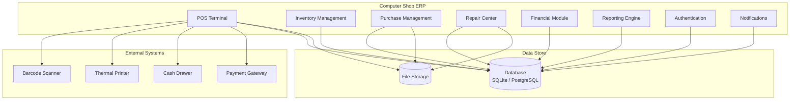
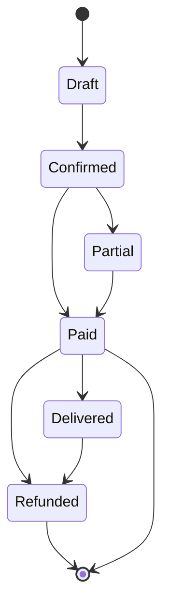
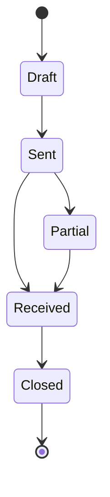
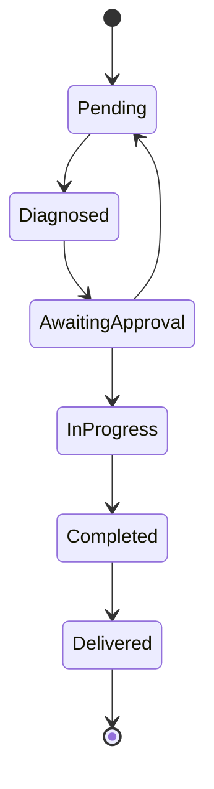
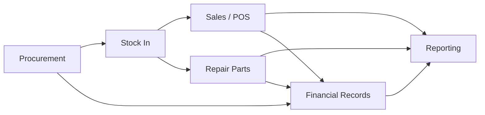

# Project Overview — Computer Shop ERP & POS System

> **Version:** 1.0.0-beta  
> **Document Status:** Final  
> **Last Updated:** June 2026

---

## Table of Contents

1. [Executive Summary](#executive-summary)
2. [Problem Statement](#problem-statement)
3. [Solution Overview](#solution-overview)
4. [Target Audience](#target-audience)
5. [Core Modules Deep Description](#core-modules-deep-description)
6. [User Roles](#user-roles)
7. [Workflow Overview](#workflow-overview)
8. [Integration Points](#integration-points)
9. [Success Metrics](#success-metrics)
10. [Future Roadmap](#future-roadmap)
11. [Glossary of Terms](#glossary-of-terms)

---

## Executive Summary

The **Computer Shop ERP & POS System** is a comprehensive, integrated software platform designed to digitize and streamline every operational facet of small-to-medium computer and electronics retail businesses. The system replaces fragmented manual processes — paper invoices, spreadsheet inventory, handwritten repair tickets — with a unified digital workflow covering procurement, inventory management, point-of-sale, repair center operations, financial accounting, and management reporting.

The system is built on a **Python Flask** backend with a lightweight **vanilla JavaScript** frontend, providing full **Arabic (RTL)** and **English** localization. It is architected to scale from a single-store SQLite deployment to a multi-store, multi-warehouse PostgreSQL setup serving 50+ locations and 100+ concurrent users.

The primary business objectives are to:
- Reduce inventory discrepancies from an estimated 15% to under 1%
- Decrease average checkout time from 4 minutes to under 45 seconds
- Eliminate revenue leakage from untracked repairs and missing stock
- Provide shop owners with real-time visibility into profitability, cash flow, and operational bottlenecks

---

## Problem Statement

Small and medium computer shops in emerging markets — particularly in the Middle East and North Africa — operate under severe operational inefficiencies caused by reliance on manual or semi-digital systems. The following pain points are consistently observed:

### Manual Inventory Tracking

Shop owners maintain inventory in physical ledgers or Excel spreadsheets. Stock is counted infrequently, leading to:
- Discrepancies between recorded and actual stock levels averaging 15-20%
- Over-ordering of slow-moving items and stockouts of fast-movers
- Inability to track serial numbers for high-value items (laptops, GPUs, smartphones)
- Lost revenue from misplaced or unrecorded inventory

### Paper-Based Sales

Cashiers manually calculate totals, discounts, and taxes, resulting in:
- Arithmetic errors in 5-8% of transactions
- No systematic tax compliance — VAT/GST calculations are error-prone
- No digital invoice records for customer returns or warranty claims
- Slow checkout during peak hours, causing customer frustration

### Disorganized Repair Center

Repair tickets are written on paper slips, leading to:
- Lost tickets and untracked customer devices
- No systematic diagnosis or parts-usage tracking
- Difficulty estimating repair turnaround times
- Revenue leakage from unbilled repairs or forgotten customer pickups

### Fragmented Financial Management

Income and expense tracking is disconnected from sales and purchasing:
- Shop owners cannot determine per-product or per-category profitability
- Cash flow visibility is limited to bank statements
- No systematic accounts receivable or payable tracking
- Manual month-end reconciliation is time-consuming and error-prone

### No Audit Trail

Without a centralized system, there is no accountability:
- Employee theft and unauthorized discounts go undetected
- Stock shrinkage cannot be traced to specific transactions or individuals
- No historical data for supplier performance evaluation
- Compliance with tax authorities requires laborious paper trail reconstruction

---

## Solution Overview

The Computer Shop ERP & POS System addresses these challenges through a **unified, real-time, role-aware platform** that covers the complete operational lifecycle.

### Architecture Principles

| Principle | Description |
|-----------|-------------|
| **Single Source of Truth** | All data — inventory, sales, purchases, repairs, finance — is stored in a single normalized database with referential integrity |
| **Real-Time Operations** | Stock levels update instantly on sale or receiving; dashboard KPIs refresh on each transaction |
| **Role-Based Access** | Every user has granular permissions; actions are logged with identity, timestamp, and IP |
| **Offline Resilience** | POS can operate in offline mode with local queue syncing when connectivity is restored |
| **Localization First** | Full RTL support for Arabic; decimal and date formatting follows locale settings |
| **Immutable Audit Trail** | All financial and stock transactions are append-only; corrections require reversal transactions |

### System Boundary Diagram

---

## Target Audience

### Primary Audiences

| Role | Pain Points | How the System Helps |
|------|------------|---------------------|
| **Store Owner** | No visibility into daily sales, profit margins, or cash flow | Real-time dashboard with KPIs, profit reports, cash flow statements |
| **Cashier** | Slow checkout, manual calculations, no barcode support | Barcode-scanning POS with auto-calculate taxes/discounts, instant receipt printing |
| **Inventory Clerk** | Spreadsheet tracking, stock discrepancies, no low-stock alerts | Real-time inventory, barcode-based stock in/out, automated alerts, cycle counting |
| **Technician** | Paper repair tickets, lost devices, no parts tracking | Digital repair tickets, status workflow, parts consumption tracking, customer notifications |
| **Accountant** | Manual reconciliation, no per-product profitability, tax calculation errors | Automated financial reports, P&L statements, tax summaries, audit trails |
| **Procurement Manager** | No purchase history visibility, manual reorder decisions | Purchase order management, supplier performance tracking, reorder suggestions |

### Secondary Audiences

| Role | Interest |
|------|----------|
| **IT Administrator** | System deployment, user management, backup configuration |
| **External Auditor** | Audit log review, financial statement verification |
| **Tax Authority** | VAT/GST report generation, invoice data export |

---

## Core Modules Deep Description

### 1. Authentication Module

The authentication module provides complete identity and access management for all system users.

**Capabilities:**
- Username/password authentication with bcrypt password hashing (12 rounds)
- Session management with configurable idle timeout (default: 30 minutes)
- Remember-me functionality with persistent cookies
- Password reset via email with time-limited tokens (15 minutes)
- Account lockout after configurable failed login attempts (default: 5)
- Concurrent session detection and termination
- IP-based login tracking with last login timestamp and location

**Security Measures:**
- CSRF protection on all forms
- Rate limiting on login endpoints (5 attempts per minute per IP)
- Session fingerprinting (User-Agent + IP binding)
- HTTP-only, secure cookies in production
- Password complexity enforcement (min 8 chars, uppercase, lowercase, digit, special char)

### 2. Dashboard Module

The dashboard serves as the home page for every user, presenting role-relevant information.

**Components:**
- **KPI Cards:** Today's sales, transaction count, average order value, active repairs, low stock items
- **Sales Chart:** 7-day and 30-day sales trend with daily/weekly aggregation
- **Top Products:** Best-selling products by quantity and revenue
- **Low Stock Alert Table:** Products below threshold with reorder action button
- **Pending Repairs:** Repair tickets awaiting diagnosis or completion
- **Quick Actions:** New sale, new purchase order, new repair ticket
- **Cash Flow Indicator:** Today's cash in vs. cash out with net position

**Refresh Policy:**
- KPI cards refresh every 60 seconds via AJAX polling
- Charts refresh on page load and on explicit refresh button
- Low stock and pending repairs refresh on each page interaction

### 3. Product Management Module

The product management module is the backbone of the entire system — every transaction references the product catalog.

**Data Model:**
- Products belong to a **Category** (e.g., Laptops, GPUs, RAM, Storage, Peripherals)
- Products optionally belong to a **Brand** (e.g., Dell, NVIDIA, Corsair)
- Products have **Taxes** assigned (standard VAT, reduced rate, zero-rated, exempt)
- Products can be **Simple** (single SKU) or **Variant-based** (e.g., iPhone 15 — 128GB/256GB/512GB)
- Products support **Composite/Bundle** definitions (e.g., Gaming PC bundle consisting of CPU + GPU + RAM + PSU)
- Products can have **Multiple Barcodes** (UPC, EAN-13, internal SKU)
- **Serial numbers** are tracked per product for high-value items

**Key Features:**
- Bulk product creation via CSV/Excel import with validation and error reporting
- Product image upload with automatic thumbnail generation
- Barcode and QR code generation for printing labels
- Price history tracking for audit and analysis
- Discontinued product archiving (soft delete with hide from POS)

### 4. Inventory Management Module

The inventory module tracks all stock movements with absolute accuracy and audit compliance.

**Core Concepts:**
- **PhysicalQuantity:** The actual count from the last physical stock count
- **AvailableQuantity:** PhysicalQuantity minus committed stock (in open sales carts)
- **CommittedQuantity:** Stock reserved in open (unpaid) sales orders
- **IncomingQuantity:** Stock expected from open purchase orders

**Stock Movement Types:**
| Movement | Effect | Audit Required |
|----------|--------|----------------|
| Stock In (Purchase Receiving) | +PhysicalQuantity, +AvailableQuantity | Yes |
| Stock Out (Sale) | -PhysicalQuantity, -AvailableQuantity | Yes |
| Stock Transfer (Warehouse A → B) | -A, +B (both quantities) | Yes |
| Stock Adjustment (Count Correction) | ±PhysicalQuantity with reason code | Yes |
| Stock Return (Sale Return) | +PhysicalQuantity, +AvailableQuantity | Yes |
| Stock Write-Off (Damage/Loss) | -PhysicalQuantity with reason code | Yes |

**Stock Count Workflow:**
1. **Initiate Count:** Freeze stock for a warehouse or category
2. **Count Entry:** Enter system counts via barcode scanner or manual entry
3. **Reconcile:** System shows variance between system count and entered count
4. **Approve:** Manager reviews and approves adjustments
5. **Adjust:** System posts adjustment entries to reconcile quantities

### 5. POS (Point of Sale) Module

The POS module is the most frequently used interface, designed for speed and accuracy.

**Interface Layout:**
- **Left Panel:** Category-filterable product grid with image thumbnails, prices, and quick-add buttons
- **Right Panel:** Shopping cart with line items, quantities, prices, discounts, and line totals
- **Bottom Bar:** Subtotal, discount summary, tax breakdown, grand total, payment buttons
- **Top Bar:** Search bar (barcode/SKU/name), customer selector, hold/recall buttons

**Checkout Flow:**
1. Cashier scans or searches products → items appear in cart
2. Adjust quantities via keyboard, barcode (scan same barcode increments), or +/- buttons
3. Apply discounts per-line or per-invoice (with permission check)
4. Select customer (optional) — applies loyalty points and credit balance
5. Select payment method: Cash, Card, Credit Account, Split Payment (up to 4 methods)
6. System validates payment ≥ total; change calculated for cash
7. Invoice generated with sequential number; receipt printed
8. Inventory updated in real-time; financial transaction recorded

**Edge Cases:**
- **Price Override:** Requires manager approval (PIN or card swipe)
- **Negative Margin:** Warning when selling below cost
- **Quantity Exceeds Available:** Blocked with user-friendly message
- **Offline Mode:** Sale queued locally; synced when connection restored

### 6. Sales Management Module

Manages the complete lifecycle of sales orders from creation to final settlement.

**Sales Status Workflow:**

- **Draft:** Order created but not yet confirmed (cart state)
- **Confirmed:** Order confirmed, inventory committed
- **Paid:** Full payment received
- **Partial:** Partial payment received, balance due tracked
- **Delivered:** Goods handed to customer (optional step)
- **Refunded:** Full or partial return processed

### 7. Purchase Management Module

Handles procurement from purchase order creation through goods receiving.

**Purchase Order Status Workflow:**

- **Draft:** PO being prepared internally
- **Sent:** PO sent to supplier
- **Partial:** Some items received
- **Received:** All items received
- **Closed:** PO fully processed and paid

**Partial Receiving:**
A single PO can be received over multiple shipments. Each receiving event creates:
1. A stock in movement for received quantities
2. A financial accrued liability for received value
3. A backorder flag for remaining items

### 8. Repair Center Module

Complete repair lifecycle management for computer and electronics service centers.

**Repair Ticket Status Workflow:**

**Ticket Components:**
- Customer information and contact details
- Device details: type, brand, model, serial number, IMEI (if phone)
- Reported issue: free-text description with photos
- Diagnosis: technician findings, estimated cost, estimated completion date
- Parts used: linked to inventory items; automatically decremented
- Labor charges: technician-defined with approval
- Warranty check: system checks original sale date against warranty policy
- Status history: timestamped entries with technician name
- Payment status: pending / paid / partially paid

### 9. Customer Management Module

Complete customer relationship management tailored for retail computer shops.

**Customer Profile Fields:**
- Name, phone (primary and secondary), email, address
- Tax registration number (for business customers)
- Credit limit and current balance
- Loyalty points balance and history
- Tags and segmentation (e.g., Wholesale, Retail, VIP)
- Notes (internal-use only)

**Customer Features:**
- Purchase history with full line-item drilldown
- Repair history across all devices
- Credit tracking with aging analysis
- Loyalty points: earn on purchase, redeem on subsequent purchase
- Automated SMS/email notifications (repair ready, warranty reminder)
- Duplicate detection by phone number and email

### 10. Supplier Management Module

Supplier relationship management with performance analytics.

**Supplier Profile Fields:**
- Company name, contact person, phone, email, address
- Tax registration number, payment terms (net 30, net 60, COD)
- Bank account details for payment

**Supplier Features:**
- Purchase order history with status tracking
- Product catalog mapping (products supplied by this supplier)
- Performance metrics: on-time delivery rate, defect rate, average lead time
- Contact person management (multiple contacts per supplier)

### 11. Financial Module

Comprehensive financial tracking integrated with all operational modules.

**Financial Records:**
| Record Type | Source Module | Description |
|-------------|--------------|-------------|
| Sales Income | POS / Sales | Revenue from customer sales |
| Purchase Expense | Purchases | Cost of goods purchased |
| Repair Income | Repairs | Labor and parts revenue |
| Expense | Manual Entry | Rent, utilities, salaries, etc. |
| Transfer | Manual Entry | Cash transfer between accounts |
| Opening Balance | Setup | Initial account balances |

**Daily Summary (X-Read / Z-Read):**
- X-Read: Mid-day or shift-end summary (non-resetting)
- Z-Read: End-of-day summary (resets daily counters)
- Contents: total sales, payment method breakdown, tax collected, discount given, expense totals, net cash position

### 12. Reporting Module

Comprehensive, exportable reports for management decision-making.

**Available Reports:**
| Report | Category | Description |
|--------|----------|-------------|
| Sales Summary | Sales | Daily/monthly/yearly sales by product, category, cashier |
| Profit & Loss | Financial | Revenue - COGS - Expenses = Net Profit |
| Cash Flow Statement | Financial | Cash inflows and outflows over period |
| Inventory Valuation | Inventory | Current stock value (cost × quantity on hand) |
| Stock Movement | Inventory | All stock in/out transactions with reasons |
| Low Stock Report | Inventory | Products below reorder threshold |
| Repair Summary | Repairs | Repair count, revenue, technician productivity |
| Tax Summary | Financial | VAT/GST collected and paid |
| Customer Purchase History | Customers | All purchases by selected customer |
| Supplier Performance | Purchases | Lead time, defect rate, order accuracy |
| Employee Activity | Admin | User actions within date range |

---

## User Roles

| Role | Description | Typical Permissions |
|------|-------------|-------------------|
| **Super Admin** | Full system access, configuration, user management | All permissions |
| **Admin** | Full operational access except sensitive system settings | All except system config |
| **Manager** | Access to reports, approvals, and all read operations | Read all, write most, approve discounts/refunds |
| **Cashier** | POS terminal operations only | POS access, customer lookup, basic reports |
| **Senior Cashier** | Cashier + limited discount approval (up to 15%) | POS + discount up to 15% |
| **Inventory Clerk** | Stock in/out, transfers, stock counts, product management | All inventory, product CRUD |
| **Technician** | Repair ticket management, diagnosis, parts usage | Repair center full access |
| **Accountant** | Financial entries, reports, reconciliation | Finance, reports read/write |
| **Procurement** | Purchase orders, supplier management | Purchases, suppliers |
| **Viewer** | Read-only access to reports and dashboards | Read all |

---

## Workflow Overview

### End-to-End Operational Workflow

### Detailed Procurement-to-Sale Workflow

1. **Procurement** identifies low stock (via reorder report or manual)
2. **Purchase Order** created and sent to supplier
3. **Goods Received** — stock enters inventory with barcode registration
4. **Products Priced** — retail/wholesale prices set
5. **Sale Occurs** at POS — stock decremented, revenue recorded
6. **Payment Collected** — cash/card/credit recorded in financial module
7. **Receipt Printed** — customer receives invoice
8. **Transaction Logged** — audit trail updated

### Repair Workflow

1. **Customer brings device** — counter staff creates repair ticket
2. **Technician diagnoses** — issue identified, cost estimated
3. **Customer approves** — status moves to In Progress
4. **Technician repairs** — parts consumed from inventory, labor tracked
5. **Quality check** — completed repair verified
6. **Customer notified** — SMS or call
7. **Customer collects** — payment collected, device delivered, ticket closed

---

## Integration Points

### Hardware Integrations

| Peripheral | Protocol | Integration Method |
|------------|----------|-------------------|
| **Barcode Scanner** | HID Keyboard Wedge / USB Serial | Emulates keyboard input; scans in search fields |
| **Thermal Receipt Printer** | USB / Ethernet / Bluetooth | python-escpos library, ESC/POS commands |
| **Cash Drawer** | RJ11 / USB (via printer pass-through) | Triggered by receipt printer | 
| **Barcode Label Printer** | USB / Ethernet | ZPL or python-barcode + standard printer driver |
| **Customer Display** | USB / Serial | Secondary display via Chrome/Edge or dedicated pole display |

### Software Integrations

| System | Integration Type | Purpose |
|--------|-----------------|---------|
| **Payment Gateway** | REST API | Card payment processing (e.g., Paymob, Fawry, PayPal) |
| **SMS Gateway** | REST API | Customer notifications for repair status and promotions |
| **Email (SMTP)** | SMTP protocol | Invoice email, password reset, reports |
| **Export** | CSV / Excel / PDF | Data export for accounting software and tax authorities |
| **Tax Authority** | CSV / XML | Tax report generation for VAT/GST filing |

---

## Success Metrics

### Quantitative Metrics

| Metric | Baseline (Manual) | Target (System) | Measurement Method |
|--------|------------------|-----------------|--------------------|
| Inventory Accuracy | 80-85% | >99% | Cycle count variance |
| Checkout Time | 3-5 minutes | <45 seconds | POS transaction timer |
| Transaction Errors | 5-8% | <0.1% | Audit log error count |
| Repair Ticket Loss | 10-15% | <0.5% | Ticket tracking audit |
| Invoice Generation | 3-5 minutes | Instant | System timer |
| Daily Reconciliation | 30-60 minutes | <5 minutes | Automatic report |
| Low Stock Detection | Reactive | Real-time | Alert trigger time |
| Tax Calculation Errors | 5-8% | 0% | Audit comparison |
| Customer Lookup Time | 2-5 minutes | <10 seconds | Search timer |
| Month-End Closing | 3-5 days | <1 hour | Report generation time |

### Qualitative Metrics

- **User Satisfaction:** Target NPS score of 50+ (measured via quarterly survey)
- **Learning Curve:** New cashier achieves full speed within 1 shift (<8 hours)
- **System Reliability:** Zero unscheduled downtime incidents per quarter
- **Data Integrity:** Zero orphan records or referential integrity violations

---

## Future Roadmap

### Phase 2 — Enhanced Analytics (Q3 2026)

- AI-powered sales forecasting using historical data (Prophet / ARIMA models)
- Automated stock reorder suggestions based on lead time and sales velocity
- Customer churn prediction and targeted retention campaigns
- Repair diagnostics assistant — common issue knowledge base with solution suggestions

### Phase 3 — Multi-Store Management (Q4 2026)

- Centralized management console for all stores
- Inter-store inventory transfers with approval workflows
- Consolidated reporting across all locations
- Multi-currency support (USD, SAR, AED)

### Phase 4 — E-Commerce Integration (Q1 2027)

- RESTful API for e-commerce platform integration (Shopify, WooCommerce, custom)
- Online storefront with real-time inventory sync
- Click & Collect (buy online, pick up in store)
- Last-mile delivery tracking integration

### Phase 5 — Enterprise Features (2027+)

- Barcode-based automated supplier communication (EDI)
- Integrated accounting package (IFRS-compliant general ledger)
- Mobile POS application for tablets and smartphones
- Self-service customer portal (order history, repair tracking, loyalty)
- IoT-enabled smart shelves for automated inventory monitoring

---

## Glossary of Terms

| Term | Definition |
|------|------------|
| **AvailableQuantity** | Current stock available for sale (PhysicalQuantity — CommittedQuantity) |
| **Backorder** | Items from a purchase order not yet received |
| **Bundle** | A product composed of multiple items sold together at a package price |
| **CommittedQuantity** | Stock reserved in open but unpaid sales orders |
| **COGS** | Cost of Goods Sold — the direct cost of products sold |
| **Cycle Count** | Physical count of a subset of inventory items, not a full count |
| **ESC/POS** | Epson Standard Code for Point of Sale — printer command language |
| **FIFO** | First In, First Out — inventory valuation method |
| **IMEI** | International Mobile Equipment Identity — unique identifier for phones |
| **NPS** | Net Promoter Score — customer satisfaction metric |
| **PhysicalQuantity** | Actual stock count confirmed by physical inventory | 
| **PO** | Purchase Order |
| **RBAC** | Role-Based Access Control |
| **RTL** | Right-to-Left — text direction for Arabic and Hebrew |
| **SKU** | Stock Keeping Unit — unique product identifier |
| **VAT** | Value Added Tax |
| **WAL** | Write-Ahead Logging — PostgreSQL reliability feature |
| **X-Read** | Interim sales summary report (non-resetting) |
| **Z-Read** | End-of-day sales summary report (resets counters) |
| **Variant** | A specific version of a product (e.g., size, color, storage capacity) |

---

*This document is maintained by the Computer Shop ERP product team. For questions or corrections, contact docs@computershop-erp.com.*
