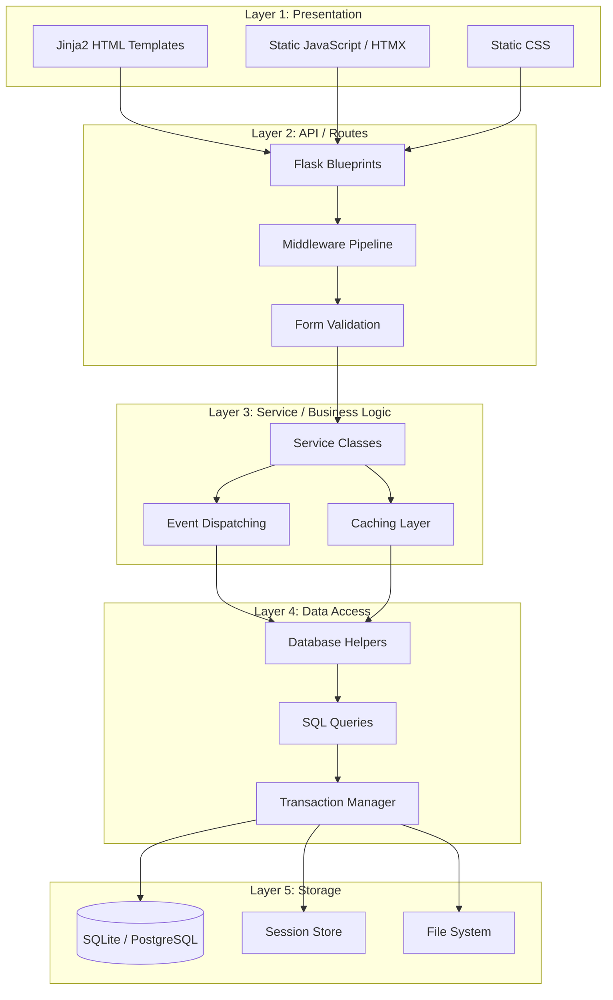
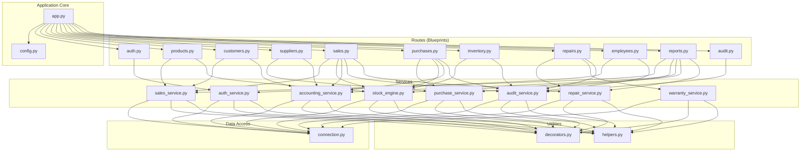
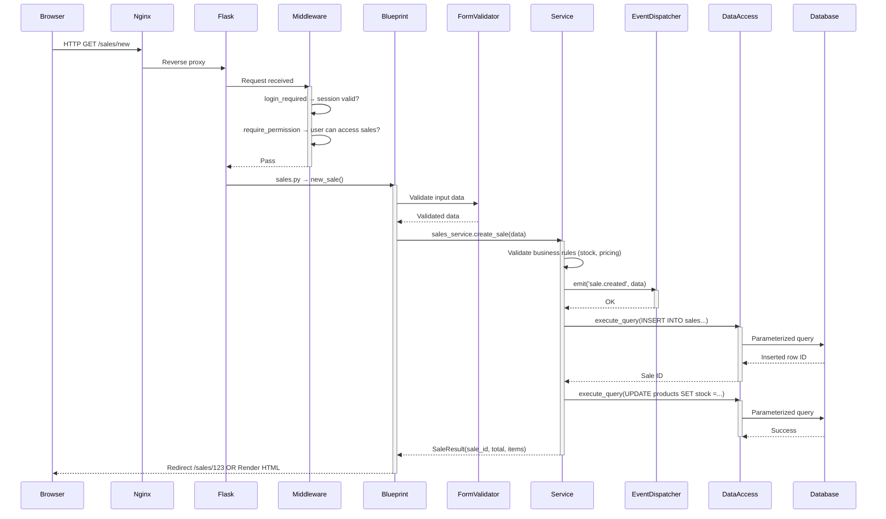
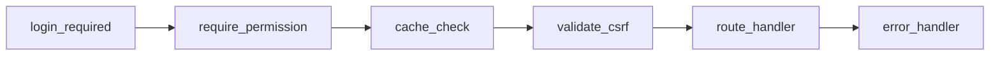
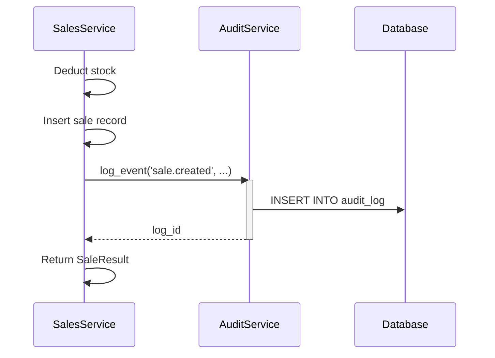
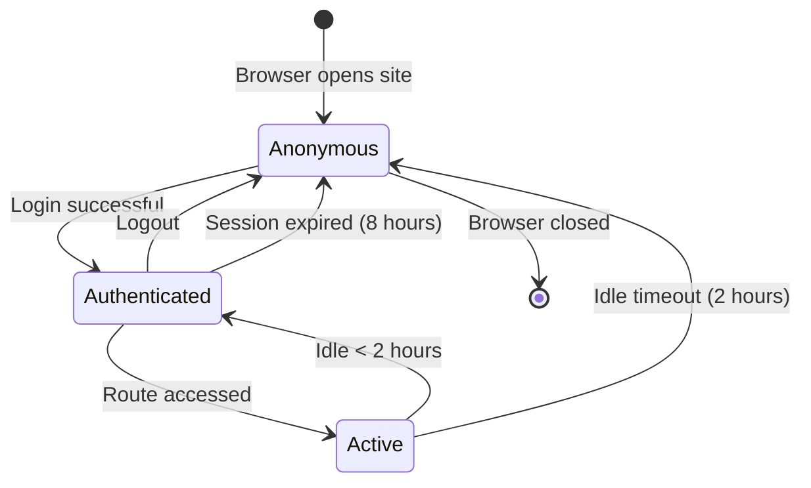
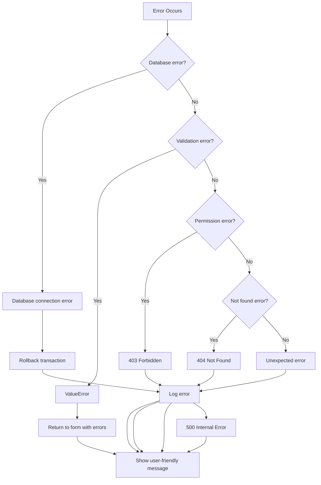

# Software Architecture — ERP POS System

> **Version:** 1.0  
> **Last Updated:** 2026-06-24  
> **Audience:** All Developers, Technical Leads

---

## Table of Contents

1. [Layered Architecture](#1-layered-architecture)
2. [Module Dependency Diagram](#2-module-dependency-diagram)
3. [Request Flow](#3-request-flow)
4. [Blueprint Organization](#4-blueprint-organization)
5. [Service Layer Patterns](#5-service-layer-patterns)
6. [Repository Pattern](#6-repository-pattern)
7. [Middleware Pipeline](#7-middleware-pipeline)
8. [Event-Driven Architecture for Audit Logging](#8-event-driven-architecture-for-audit-logging)
9. [Caching Strategy](#9-caching-strategy)
10. [Session Management](#10-session-management)
11. [State Management in Frontend](#11-state-management-in-frontend)
12. [Error Handling Strategy](#12-error-handling-strategy)
13. [Transaction Management](#13-transaction-management)
14. [Security Considerations](#14-security-considerations)
15. [Performance Considerations](#15-performance-considerations)
16. [Edge Cases](#16-edge-cases)
17. [Future Improvements](#17-future-improvements)

---

## 1. Layered Architecture

The system follows a strict layered architecture. Each layer communicates only with the layer directly below it. This enforces separation of concerns and makes the codebase testable and maintainable.



### Layer Interaction Rules

| Rule | Description | Violation Example |
|------|-------------|-------------------|
| **Strict downward dependency** | A layer may only depend on the layer directly below it | A blueprint calling a data access function directly, bypassing the service layer |
| **No upward dependencies** | A lower layer must never import from a higher layer | A service importing a route blueprint |
| **No sideways dependencies** | A module in one layer should not depend on another module in the same layer unless via a defined interface | `sales_service` importing `purchase_service` directly — should go through a shared module |
| **Data transfer objects** | Data crosses layers via plain Python dicts or dataclasses, never ORM objects | Passing a `sqlite3.Row` object to a Jinja2 template |

### Exceptions to Strict Layering

1. **Utility modules** in `utils/` may be imported by any layer
2. **Decorators** in `utils/decorators.py` may be used in any layer
3. **Configuration** in `config.py` may be imported by any layer
4. **Event dispatching** is an exception: services emit events, and the audit blueprint subscribes to them

---

## 2. Module Dependency Diagram



### Dependency Rules

1. **Routes depend on services only** — never on other routes or directly on data access
2. **Services depend on data access and utilities** — never on routes
3. **Data access depends on nothing** — it is the bottom layer (aside from Python stdlib)
4. **Utilities depend on nothing** — they are leaf modules
5. **No circular imports** — if module A imports B, B must not import A. If circular dependency is detected, extract the shared code into a third module in `utils/`

---

## 3. Request Flow

### Complete Request Lifecycle



### Detailed Flow Path

```
Browser → Nginx (TLS termination, static file serving)
       → Flask (WSGI via Gunicorn)
       → WSGI server (werkzeug)
       → Request object created
       → Before request handlers (session loading, CSRF checks)
       → URL routing (match path to blueprint + endpoint)
       → Middleware decorators (login_required → require_permission)
       → Route handler function
         → Form parsing and validation
         → Service call
         → Business logic execution
         → Data access (parameterized queries)
         → Response construction
       → After request handlers (session save, audit log flush)
       → Response sent to Nginx
       → Nginx → Browser
```

---

## 4. Blueprint Organization

### Blueprint Registration in `app.py`

```python
from flask import Flask

def create_app(config_name: str = "default") -> Flask:
    app = Flask(__name__)
    app.config.from_object(config[config_name])

    from routes.auth import auth_bp
    from routes.products import products_bp
    from routes.customers import customers_bp
    from routes.suppliers import suppliers_bp
    from routes.sales import sales_bp
    from routes.purchases import purchases_bp
    from routes.inventory import inventory_bp
    from routes.repairs import repairs_bp
    from routes.employees import employees_bp
    from routes.reports import reports_bp
    from routes.audit import audit_bp

    app.register_blueprint(auth_bp, url_prefix="/auth")
    app.register_blueprint(products_bp, url_prefix="/products")
    app.register_blueprint(customers_bp, url_prefix="/customers")
    app.register_blueprint(suppliers_bp, url_prefix="/suppliers")
    app.register_blueprint(sales_bp, url_prefix="/sales")
    app.register_blueprint(purchases_bp, url_prefix="/purchases")
    app.register_blueprint(inventory_bp, url_prefix="/inventory")
    app.register_blueprint(repairs_bp, url_prefix="/repairs")
    app.register_blueprint(employees_bp, url_prefix="/employees")
    app.register_blueprint(reports_bp, url_prefix="/reports")
    app.register_blueprint(audit_bp, url_prefix="/audit")

    return app
```

### Blueprint Responsibilities

| Blueprint | Prefix | Auth Required | Permissions Check | Key Routes |
|-----------|--------|---------------|-------------------|------------|
| **auth** | `/auth` | No | N/A | `login`, `logout`, `change_password`, `reset_password` |
| **products** | `/products` | Yes | `products.view`, `products.edit`, `products.delete` | `list`, `create`, `edit`, `delete`, `import`, `export`, `barcode` |
| **customers** | `/customers` | Yes | `customers.view`, `customers.edit` | `list`, `create`, `edit`, `search`, `sales_history` |
| **suppliers** | `/suppliers` | Yes | `suppliers.view`, `suppliers.edit` | `list`, `create`, `edit`, `purchase_history` |
| **sales** | `/sales` | Yes | `sales.create`, `sales.refund`, `sales.view` | `new`, `complete`, `refund`, `detail`, `history`, `hold`, `resume` |
| **purchases** | `/purchases` | Yes | `purchases.create`, `purchases.receive` | `new`, `receive`, `detail`, `list`, `pending` |
| **inventory** | `/inventory` | Yes | `inventory.view`, `inventory.adjust` | `stock_levels`, `adjust`, `transfer`, `count`, `history` |
| **repairs** | `/repairs` | Yes | `repairs.create`, `repairs.complete` | `new`, `status_update`, `complete`, `list`, `customer_history` |
| **employees** | `/employees` | Yes | `employees.view`, `employees.edit`, `employees.manage` | `list`, `create`, `edit`, `permissions`, `schedules`, `clock_in_out` |
| **reports** | `/reports` | Yes | `reports.view` | `daily_sales`, `inventory`, `profit_loss`, `tax`, `custom` |
| **audit** | `/audit` | Yes | `audit.view` | `log`, `search`, `export`, `user_activity` |

### Blueprint File Structure Pattern

Every blueprint file follows this exact structure:

```python
# routes/products.py

from flask import Blueprint, render_template, request, redirect, url_for, flash
from utils.decorators import login_required, require_permission
from services import product_service

products_bp = Blueprint("products", __name__, template_folder="../templates")


@products_bp.route("/")
@login_required
@require_permission("products.view")
def list_products():
    page = request.args.get("page", 1, type=int)
    per_page = request.args.get("per_page", 50, type=int)
    search = request.args.get("search", "").strip()
    category = request.args.get("category", "")

    products, total = product_service.search_products(
        search=search, category=category,
        page=page, per_page=per_page
    )

    return render_template(
        "products/list.html",
        products=products,
        total=total,
        page=page,
        per_page=per_page,
        search=search,
        category=category
    )


@products_bp.route("/create", methods=["GET", "POST"])
@login_required
@require_permission("products.edit")
def create_product():
    if request.method == "POST":
        data = {
            "name": request.form["name"].strip(),
            "sku": request.form["sku"].strip(),
            "barcode": request.form.get("barcode", "").strip(),
            "category": request.form["category"],
            "unit_price": request.form["unit_price", type=float],
            "cost_price": request.form["cost_price", type=float],
            "stock": request.form["stock", type=int],
            "reorder_point": request.form["reorder_point", type=int],
            "supplier_id": request.form.get("supplier_id", type=int),
            "description": request.form.get("description", "").strip(),
        }

        errors = validate_product(data)
        if errors:
            return render_template("products/create.html", errors=errors, data=data)

        try:
            product_id = product_service.create_product(data)
            flash("Product created successfully", "success")
            return redirect(url_for("products.list_products"))
        except ValueError as e:
            flash(str(e), "error")
        except Exception:
            flash("An unexpected error occurred. Please try again.", "error")
            app.logger.exception("Failed to create product")

    return render_template("products/create.html", errors={}, data={})
```

---

## 5. Service Layer Patterns

### Service Class Pattern

Every service is a class with a single responsibility. Services are stateless singletons — they hold no instance state, only configuration.

```python
# services/sales_service.py

import logging
from typing import Optional
from datetime import datetime, date
from dataclasses import dataclass
from decimal import Decimal

from database.connection import get_db
from services.stock_engine import StockEngine
from services.audit_service import AuditService
from utils.helpers import validate_currency, format_date

logger = logging.getLogger(__name__)


@dataclass
class SaleItem:
    product_id: int
    quantity: int
    unit_price: Decimal
    discount_percent: Decimal = Decimal("0")
    discount_amount: Decimal = Decimal("0")


@dataclass
class SaleResult:
    sale_id: int
    total: Decimal
    items_count: int
    timestamp: datetime


class SalesService:
    """
    Handles all sales-related business logic.
    Responsibilities:
      - Create, refund, and void sales
      - Validate stock availability
      - Calculate totals, taxes, and discounts
      - Manage hold/resume functionality
    """

    def __init__(self, stock_engine: Optional[StockEngine] = None):
        self.stock_engine = stock_engine or StockEngine()
        self.audit_service = AuditService()

    def create_sale(
        self,
        cashier_id: int,
        customer_id: Optional[int],
        items: list[SaleItem],
        payments: list[dict],
        store_id: int = 1,
    ) -> SaleResult:
        """
        Creates a new sale with proper stock deduction and audit logging.

        Args:
            cashier_id: User ID of the cashier processing the sale.
            customer_id: Optional customer ID for the sale.
            items: List of SaleItem dataclasses.
            payments: List of payment dicts with keys: method, amount, reference.
            store_id: Store identifier (default 1 for single-store).

        Returns:
            SaleResult with sale_id, total, items_count, and timestamp.

        Raises:
            ValueError: If stock is insufficient for any item.
            RuntimeError: If database operation fails.
        """
        self._validate_sale_input(cashier_id, items, payments)

        db = get_db()
        cursor = db.cursor()

        try:
            cursor.execute("BEGIN TRANSACTION")

            # Verify stock for all items before processing
            for item in items:
                available = self.stock_engine.check_availability(
                    product_id=item.product_id,
                    quantity=item.quantity,
                    store_id=store_id,
                    cursor=cursor
                )
                if not available:
                    raise ValueError(
                        f"Insufficient stock for product {item.product_id}. "
                        f"Requested {item.quantity}, available {available}"
                    )

            # Calculate totals
            subtotal = sum(
                (item.unit_price * item.quantity) - item.discount_amount
                for item in items
            )
            tax_total = self._calculate_tax(subtotal)
            grand_total = subtotal + tax_total

            # Insert sale header
            cursor.execute("""
                INSERT INTO sales (cashier_id, customer_id, subtotal, tax_total,
                                   grand_total, store_id, status, created_at)
                VALUES (?, ?, ?, ?, ?, ?, 'completed', datetime('now'))
            """, (cashier_id, customer_id, float(subtotal),
                  float(tax_total), float(grand_total), store_id))

            sale_id = cursor.lastrowid

            # Insert sale items and deduct stock
            for item in items:
                cursor.execute("""
                    INSERT INTO sale_items (sale_id, product_id, quantity,
                                            unit_price, discount_percent,
                                            discount_amount, total)
                    VALUES (?, ?, ?, ?, ?, ?, ?)
                """, (sale_id, item.product_id, item.quantity,
                      float(item.unit_price), float(item.discount_percent),
                      float(item.discount_amount),
                      float((item.unit_price * item.quantity) - item.discount_amount)))

                self.stock_engine.deduct(
                    product_id=item.product_id,
                    quantity=item.quantity,
                    store_id=store_id,
                    cursor=cursor,
                    reference_type="sale",
                    reference_id=sale_id
                )

            # Record payments
            for payment in payments:
                cursor.execute("""
                    INSERT INTO payments (sale_id, method, amount, reference, created_at)
                    VALUES (?, ?, ?, ?, datetime('now'))
                """, (sale_id, payment["method"], float(payment["amount"]),
                      payment.get("reference", "")))

            db.commit()

            self.audit_service.log_event(
                event_type="sale.created",
                user_id=cashier_id,
                resource_type="sale",
                resource_id=sale_id,
                details={"total": str(grand_total), "items": len(items)}
            )

            return SaleResult(
                sale_id=sale_id,
                total=Decimal(str(grand_total)),
                items_count=len(items),
                timestamp=datetime.now()
            )

        except Exception as e:
            db.rollback()
            logger.error(f"Failed to create sale: {e}", exc_info=True)
            raise

    def refund_sale(self, sale_id: int, cashier_id: int, reason: str) -> SaleResult:
        """
        Process a full or partial refund for a sale.
        Restocks inventory and logs the refund.
        """
        db = get_db()
        cursor = db.cursor()

        try:
            cursor.execute("BEGIN TRANSACTION")

            # Verify sale exists and is not already refunded
            cursor.execute(
                "SELECT status, grand_total FROM sales WHERE id = ?",
                (sale_id,)
            )
            sale = cursor.fetchone()
            if not sale:
                raise ValueError(f"Sale {sale_id} not found")
            if sale["status"] == "refunded":
                raise ValueError(f"Sale {sale_id} has already been refunded")

            # Restore stock for each item
            cursor.execute(
                "SELECT product_id, quantity FROM sale_items WHERE sale_id = ?",
                (sale_id,)
            )
            for item in cursor.fetchall():
                self.stock_engine.add(
                    product_id=item["product_id"],
                    quantity=item["quantity"],
                    store_id=1,
                    cursor=cursor,
                    reference_type="refund",
                    reference_id=sale_id
                )

            # Update sale status
            cursor.execute(
                "UPDATE sales SET status = 'refunded', refunded_at = datetime('now'), "
                "refund_reason = ?, refunded_by = ? WHERE id = ?",
                (reason, cashier_id, sale_id)
            )

            db.commit()

            self.audit_service.log_event(
                event_type="sale.refunded",
                user_id=cashier_id,
                resource_type="sale",
                resource_id=sale_id,
                details={"reason": reason}
            )

            return SaleResult(
                sale_id=sale_id,
                total=Decimal(str(sale["grand_total"])),
                items_count=0,
                timestamp=datetime.now()
            )

        except Exception as e:
            db.rollback()
            logger.error(f"Failed to refund sale {sale_id}: {e}", exc_info=True)
            raise

    def _validate_sale_input(self, cashier_id: int, items: list, payments: list) -> None:
        if not items:
            raise ValueError("Sale must contain at least one item")
        if not payments:
            raise ValueError("Sale must include at least one payment")
        payment_total = sum(p["amount"] for p in payments)
        item_total = sum(
            float(item.unit_price * item.quantity) - float(item.discount_amount)
            for item in items
        )
        if abs(payment_total - item_total) > 0.01:
            raise ValueError(
                f"Payment total ({payment_total:.2f}) does not match "
                f"sale total ({item_total:.2f})"
            )

    def _calculate_tax(self, subtotal: Decimal) -> Decimal:
        """Calculate tax. Override this for different tax regimes."""
        tax_rate = Decimal("0.14")  # 14% VAT
        return (subtotal * tax_rate).quantize(Decimal("0.01"))
```

### Service Layer Conventions

| Convention | Rule | Rationale |
|------------|------|-----------|
| **Stateless** | No instance variables that hold state | Multiple requests may share the same service instance; state would cause race conditions |
| **Single responsibility** | One service per business domain | `SalesService` handles sales; `StockEngine` handles inventory. Clear boundaries |
| **Explicit dependencies** | Dependencies passed via constructor | Makes testing easy: inject mock `StockEngine` in tests |
| **Raise, don't return errors** | Raise `ValueError` for business rule violations, `RuntimeError` for system errors | Routes catch and display errors. Avoid error return codes |
| **Log at service boundary** | Log entry and exit of all public methods | Enables debugging without polluting routes |
| **Return dataclasses** | Return typed dataclasses, not raw dicts | Self-documenting, IDE-friendly, type-checked |

### Service Registry

Services are not instantiated per-request. They are module-level singletons:

```python
# services/__init__.py

from services.auth_service import AuthService
from services.sales_service import SalesService
from services.purchase_service import PurchaseService
from services.stock_engine import StockEngine
from services.audit_service import AuditService
from services.repair_service import RepairService
from services.warranty_service import WarrantyService
from services.accounting_service import AccountingService

stock_engine = StockEngine()
auth_service = AuthService()
sales_service = SalesService(stock_engine=stock_engine)
purchase_service = PurchaseService(stock_engine=stock_engine)
audit_service = AuditService()
repair_service = RepairService()
warranty_service = WarrantyService()
accounting_service = AccountingService()

__all__ = [
    "auth_service",
    "sales_service",
    "purchase_service",
    "stock_engine",
    "audit_service",
    "repair_service",
    "warranty_service",
    "accounting_service",
]
```

---

## 6. Repository Pattern

In this system, the repository pattern is simplified. Instead of creating separate repository classes (which adds indirection for a CRUD-heavy system), data access logic lives in the service layer with raw SQL. The database connection module handles connection lifecycle.

### Connection Management

```python
# database/connection.py

import sqlite3
import os
from typing import Optional
from flask import g, current_app
import logging

logger = logging.getLogger(__name__)


def get_db() -> sqlite3.Connection:
    """
    Get the database connection for the current request.
    Connection is stored in Flask's application context (g).
    """
    if "db" not in g:
        db_path = current_app.config["DATABASE_PATH"]
        g.db = sqlite3.connect(
            db_path,
            detect_types=sqlite3.PARSE_DECLTYPES | sqlite3.PARSE_COLNAMES,
        )
        g.db.row_factory = sqlite3.Row
        g.db.execute("PRAGMA journal_mode = WAL")
        g.db.execute("PRAGMA foreign_keys = ON")
        g.db.execute("PRAGMA busy_timeout = 5000")
        g.db.execute(f"PRAGMA cache_size = {-current_app.config.get('DB_CACHE_SIZE_MB', 64) * 1024}")
    return g.db


def close_db(error: Optional[Exception] = None) -> None:
    """Close the database connection at the end of a request."""
    db = g.pop("db", None)
    if db is not None:
        db.close()


def init_app(app):
    """Register database teardown with the Flask app."""
    app.teardown_appcontext(close_db)
```

### Query Patterns

```python
# Example: Parameterized query patterns used throughout services

# SELECT with parameters
cursor.execute(
    "SELECT id, name, unit_price, stock FROM products WHERE category = ? AND active = 1",
    (category,)
)

# INSERT with RETURNING
cursor.execute(
    "INSERT INTO products (name, sku, unit_price) VALUES (?, ?, ?) RETURNING id",
    (name, sku, unit_price)
)
product_id = cursor.fetchone()["id"]

# UPDATE with WHERE
cursor.execute(
    "UPDATE products SET stock = stock - ? WHERE id = ? AND stock >= ?",
    (quantity, product_id, quantity)
)
if cursor.rowcount == 0:
    raise ValueError("Insufficient stock")

# DELETE with safety check
cursor.execute(
    "DELETE FROM customers WHERE id = ? AND (SELECT COUNT(*) FROM sales WHERE customer_id = ?) = 0",
    (customer_id, customer_id)
)
if cursor.rowcount == 0:
    raise ValueError("Cannot delete customer with existing sales. Use deactivation instead.")

# UPSERT
cursor.execute("""
    INSERT INTO product_prices (product_id, price, effective_from)
    VALUES (?, ?, datetime('now'))
    ON CONFLICT(product_id, effective_from)
    DO UPDATE SET price = excluded.price
""", (product_id, new_price))
```

---

## 7. Middleware Pipeline

Middleware is implemented as decorators applied to route handlers.



### Decorator Implementations

```python
# utils/decorators.py

import functools
import logging
from flask import session, redirect, url_for, request, flash, abort, jsonify, g
from typing import Callable, Any

logger = logging.getLogger(__name__)


def login_required(route_function: Callable) -> Callable:
    """
    Ensures the user is authenticated before accessing the route.
    Redirects to login page if not authenticated.
    """
    @functools.wraps(route_function)
    def wrapper(*args: Any, **kwargs: Any) -> Any:
        if "user_id" not in session:
            flash("Please log in to access this page.", "warning")
            return redirect(url_for("auth.login", next=request.path))
        g.user_id = session["user_id"]
        g.username = session.get("username", "Unknown")
        g.user_role = session.get("role", "cashier")
        return route_function(*args, **kwargs)
    return wrapper


def require_permission(permission: str) -> Callable:
    """
    Ensures the current user has the specified permission.
    Usage: @require_permission("products.edit")
    """
    def decorator(route_function: Callable) -> Callable:
        @functools.wraps(route_function)
        def wrapper(*args: Any, **kwargs: Any) -> Any:
            user_permissions = session.get("permissions", [])
            if permission not in user_permissions:
                logger.warning(
                    f"Access denied: user {g.get('username', 'unknown')} "
                    f"lacks permission '{permission}' for {request.path}"
                )
                if request.headers.get("X-Requested-With") == "XMLHttpRequest":
                    return jsonify({"error": "Permission denied"}), 403
                abort(403)
            return route_function(*args, **kwargs)
        return wrapper
    return decorator


def cache_response(timeout: int = 300) -> Callable:
    """
    Caches the response of a route for the given timeout (in seconds).
    Only caches GET requests. Cache key is based on request path and query params.
    """
    def decorator(route_function: Callable) -> Callable:
        @functools.wraps(route_function)
        def wrapper(*args: Any, **kwargs: Any) -> Any:
            if request.method != "GET":
                return route_function(*args, **kwargs)

            from flask import current_app
            cache = current_app.config.get("CACHE", {})

            cache_key = f"{request.path}:{frozenset(request.args.items())}"
            cached = cache.get(cache_key)
            if cached is not None:
                return cached

            response = route_function(*args, **kwargs)
            cache[cache_key] = response
            return response
        return wrapper
    return decorator


def ajax_required(route_function: Callable) -> Callable:
    """Ensures the request is an AJAX request."""
    @functools.wraps(route_function)
    def wrapper(*args: Any, **kwargs: Any) -> Any:
        if request.headers.get("X-Requested-With") != "XMLHttpRequest":
            abort(400, description="AJAX request required")
        return route_function(*args, **kwargs)
    return wrapper


def api_endpoint(route_function: Callable) -> Callable:
    """
    Wraps a route to return JSON responses.
    Catches exceptions and returns structured error JSON.
    """
    @functools.wraps(route_function)
    def wrapper(*args: Any, **kwargs: Any) -> Any:
        try:
            result = route_function(*args, **kwargs)
            if isinstance(result, tuple):
                data, status = result
                if isinstance(data, dict) and "error" not in data:
                    data["success"] = True
                return jsonify(data), status
            return jsonify({"success": True, "data": result})
        except ValueError as e:
            return jsonify({"success": False, "error": str(e)}), 400
        except RuntimeError as e:
            logger.exception("API error")
            return jsonify({"success": False, "error": "Internal server error"}), 500
    return wrapper
```

### Middleware Execution Order

```
1. Flask before_request hooks
   - Load session from store
   - Set g.db (database connection)
   - Set g.start_time (for request timing)

2. Decorator chain (outermost → innermost)
   - login_required (redirect if no session)
   - require_permission (403 if missing permission)
   - cache_response (return cached if available)
   - csrf.validate (for POST/PUT/DELETE)
   - ajax_required / api_endpoint (content negotiation)

3. Route handler
   - Parse and validate input
   - Call service layer
   - Render template or return JSON

4. Flask after_request hooks
   - Log request duration
   - Save session to store
   - Close database connection
   - Add security headers (CSP, HSTS, X-Frame-Options)
```

---

## 8. Event-Driven Architecture for Audit Logging

### Event System

Services emit events that the audit service consumes. This decouples business logic from audit logging.

```python
# services/audit_service.py

import logging
from datetime import datetime
from typing import Optional, Any
from flask import g, has_request_context
from database.connection import get_db

logger = logging.getLogger(__name__)


class AuditService:
    """
    Handles audit logging for all data modifications.
    Consumes events emitted by services.
    This is a simplified pub/sub — services call audit_service.log_event directly.
    """

    EVENT_TYPES = {
        "sale.created",
        "sale.refunded",
        "sale.voided",
        "purchase.created",
        "purchase.received",
        "stock.adjusted",
        "stock.transferred",
        "product.created",
        "product.updated",
        "product.deleted",
        "customer.created",
        "customer.updated",
        "supplier.created",
        "supplier.updated",
        "repair.created",
        "repair.completed",
        "employee.created",
        "employee.updated",
        "employee.deactivated",
        "user.login",
        "user.logout",
        "user.password_changed",
        "config.updated",
        "report.generated",
    }

    def log_event(
        self,
        event_type: str,
        user_id: int,
        resource_type: str,
        resource_id: Optional[int] = None,
        details: Optional[dict] = None,
        ip_address: Optional[str] = None,
    ) -> int:
        """
        Log an auditable event to the database.

        Args:
            event_type: One of EVENT_TYPES.
            user_id: ID of the user who performed the action.
            resource_type: Type of resource affected (sale, product, etc.).
            resource_id: ID of the affected resource (optional).
            details: JSON-serializable dict with event details.
            ip_address: Client IP address. Auto-detected from request context.

        Returns:
            ID of the inserted audit log entry.
        """
        if event_type not in self.EVENT_TYPES:
            logger.warning(f"Unknown event type: {event_type}")

        if ip_address is None and has_request_context():
            ip_address = request.remote_addr

        db = get_db()
        cursor = db.cursor()
        cursor.execute(
            """INSERT INTO audit_log
               (event_type, user_id, resource_type, resource_id,
                details, ip_address, created_at)
               VALUES (?, ?, ?, ?, ?, ?, datetime('now'))
               RETURNING id""",
            (
                event_type,
                user_id,
                resource_type,
                resource_id,
                json.dumps(details) if details else None,
                ip_address,
            ),
        )
        log_id = cursor.fetchone()["id"]
        db.commit()

        logger.info(f"Audit event: {event_type} (resource={resource_type}:{resource_id})")
        return log_id

    def get_events(
        self,
        event_type: Optional[str] = None,
        user_id: Optional[int] = None,
        resource_type: Optional[str] = None,
        resource_id: Optional[int] = None,
        start_date: Optional[str] = None,
        end_date: Optional[str] = None,
        page: int = 1,
        per_page: int = 50,
    ) -> tuple[list[dict], int]:
        """
        Search audit logs with filters and pagination.
        Returns (events, total_count).
        """
        conditions = []
        params = []

        if event_type:
            conditions.append("event_type = ?")
            params.append(event_type)
        if user_id:
            conditions.append("user_id = ?")
            params.append(user_id)
        if resource_type:
            conditions.append("resource_type = ?")
            params.append(resource_type)
        if resource_id:
            conditions.append("resource_id = ?")
            params.append(resource_id)
        if start_date:
            conditions.append("created_at >= ?")
            params.append(start_date)
        if end_date:
            conditions.append("created_at <= ?")
            params.append(end_date)

        where = " AND ".join(conditions) if conditions else "1=1"

        db = get_db()
        cursor = db.cursor()

        # Count
        cursor.execute(f"SELECT COUNT(*) FROM audit_log WHERE {where}", params)
        total = cursor.fetchone()[0]

        # Fetch page
        offset = (page - 1) * per_page
        cursor.execute(
            f"SELECT * FROM audit_log WHERE {where} "
            f"ORDER BY created_at DESC LIMIT ? OFFSET ?",
            params + [per_page, offset],
        )
        events = [dict(row) for row in cursor.fetchall()]

        return events, total
```

### Event Flow



### Future: Full Event Bus

For v2.0, consider a proper event bus to support multiple subscribers:

```python
# Future: event_bus.py (not yet implemented)

class EventBus:
    def __init__(self):
        self._subscribers = defaultdict(list)

    def subscribe(self, event_type: str, callback: Callable):
        self._subscribers[event_type].append(callback)

    def emit(self, event_type: str, **data):
        for callback in self._subscribers.get(event_type, []):
            try:
                callback(event_type, data)
            except Exception as e:
                logger.error(f"Event handler failed: {e}")
```

---

## 9. Caching Strategy

### In-Memory Cache

```python
# utils/helpers.py — Simple TTL cache

import time
from typing import Any, Optional
from collections import OrderedDict


class TTLCache:
    """
    Simple TTL-based in-memory cache.
    Not suitable for multi-process deployments — use Redis for that.
    """

    def __init__(self, maxsize: int = 128, default_ttl: int = 300):
        self._cache: OrderedDict[str, tuple[float, Any]] = OrderedDict()
        self._maxsize = maxsize
        self._default_ttl = default_ttl

    def get(self, key: str) -> Optional[Any]:
        if key not in self._cache:
            return None
        expires, value = self._cache[key]
        if time.time() > expires:
            del self._cache[key]
            return None
        # Move to end (most recently used)
        self._cache.move_to_end(key)
        return value

    def set(self, key: str, value: Any, ttl: Optional[int] = None) -> None:
        ttl = ttl if ttl is not None else self._default_ttl
        self._cache[key] = (time.time() + ttl, value)
        self._cache.move_to_end(key)
        if len(self._cache) > self._maxsize:
            self._cache.popitem(last=False)  # Remove oldest

    def invalidate(self, key: str) -> None:
        self._cache.pop(key, None)

    def clear(self) -> None:
        self._cache.clear()
```

### What to Cache

| Data | Cache Key | TTL | Why |
|------|-----------|-----|-----|
| Product list | `products:list:{page}` | 30s | Changes frequently with sales; short TTL ensures freshness |
| Product categories | `categories` | 3600s | Changes rarely; long TTL |
| User permissions | `permissions:{user_id}` | 600s | Changes on role update; moderate TTL |
| Daily sales report | `report:daily_sales:{date}` | 300s | Expensive aggregation query |
| Low stock list | `report:low_stock` | 120s | Changes with every sale/purchase |
| Exchange rate | `exchange_rate:{from}:{to}` | 3600s | External API call; cached aggressively |
| Store config | `config:{store_id}` | 600s | Rarely changed by admin |

### What NOT to Cache

- Individual product stock levels (change on every sale)
- User sessions (handled by Flask-Session)
- Current sale transaction (unique per cashier)
- Search results (high cardinality of queries)
- Audit logs (always need fresh data)

---

## 10. Session Management

### Server-Side Sessions

```python
# config.py — Session configuration

class Config:
    SECRET_KEY = os.environ.get("SECRET_KEY", "change-me-in-production")
    SESSION_TYPE = "filesystem"  # or "redis" in production
    SESSION_FILE_DIR = os.path.join(BASE_DIR, "flask_session")
    SESSION_PERMANENT = True
    PERMANENT_SESSION_LIFETIME = timedelta(hours=8)
    SESSION_USE_SIGNER = True
    SESSION_KEY_PREFIX = "erp_"
```

### Session Contents

```python
session["user_id"] = 42              # Integer, never None
session["username"] = "ahmed"        # String
session["role"] = "cashier"          # "admin" | "manager" | "cashier"
session["permissions"] = [           # List of permission strings
    "sales.create",
    "sales.view",
    "customers.view",
    "products.view",
]
session["store_id"] = 1              # Integer for multi-store
session["last_activity"] = time.time()  # Float for idle timeout check
```

### Session Lifecycle



### Session Security

- Session ID stored in `HttpOnly`, `Secure`, `SameSite=Lax` cookie
- Session signed with `SECRET_KEY` to prevent tampering
- Session data never exposed to client
- Password change invalidates all sessions for that user
- Redis sessions enable shared state across app instances
- Idle timeout check in `login_required` decorator:

```python
@login_required
def check_idle_timeout():
    last_activity = session.get("last_activity", 0)
    idle_limit = current_app.config.get("IDLE_TIMEOUT_MINUTES", 120)
    if time.time() - last_activity > idle_limit * 60:
        session.clear()
        flash("Session expired due to inactivity.", "warning")
        return redirect(url_for("auth.login"))
    session["last_activity"] = time.time()
```

---

## 11. State Management in Frontend

### Global State (JavaScript)

```javascript
// static/js/app.js

const ERP = {
    // Global application state (singleton)
    state: {
        store: null,        // { id, name, currency }
        user: null,         // { id, username, role, permissions[] }
        config: {},         // { tax_rate, currency_symbol, ... }
        currentSale: null,  // { items[], customer, payments[] }
        notifications: [],  // { type, message, timestamp }[]
    },

    // Initialize application
    async init() {
        try {
            const response = await fetch('/api/app-state');
            const data = await response.json();
            this.state.store = data.store;
            this.state.user = data.user;
            this.state.config = data.config;
            this.setupEventListeners();
            this.renderNavigation();
        } catch (error) {
            console.error('Failed to initialize app state:', error);
        }
    },

    // Update specific state property and trigger re-render
    setState(key, value) {
        this.state[key] = value;
        document.dispatchEvent(new CustomEvent('erp:stateChange', {
            detail: { key, value }
        }));
    },

    // Show notification
    notify(type, message, duration = 5000) {
        const notification = { type, message, timestamp: Date.now() };
        this.state.notifications.push(notification);
        document.dispatchEvent(new CustomEvent('erp:notification', {
            detail: notification
        }));
        if (duration > 0) {
            setTimeout(() => {
                this.state.notifications = this.state.notifications
                    .filter(n => n.timestamp !== notification.timestamp);
            }, duration);
        }
    },

    // Restore sale from localStorage (survives browser refresh)
    savePendingSale(saleData) {
        localStorage.setItem('erp_pending_sale', JSON.stringify(saleData));
    },

    loadPendingSale() {
        const data = localStorage.getItem('erp_pending_sale');
        return data ? JSON.parse(data) : null;
    },

    clearPendingSale() {
        localStorage.removeItem('erp_pending_sale');
    },
};

// Initialize on DOM ready
document.addEventListener('DOMContentLoaded', () => ERP.init());
```

### Page-Specific State

Each page manages its own state via a dedicated JavaScript module pattern:

```javascript
// Page-specific state example (in a <script> block or separate .js file)
const SalesPage = {
    currentSale: { items: [], total: 0, tax: 0 },
    scannerBuffer: '',
    scannerTimer: null,

    addItem(product) {
        this.currentSale.items.push({
            productId: product.id,
            name: product.name,
            price: product.price,
            quantity: 1,
            total: product.price,
        });
        this.updateDisplay();
        ERP.savePendingSale(this.currentSale);
    },

    updateDisplay() {
        // Update DOM elements with current sale data
        document.getElementById('sale-items').innerHTML = this.renderItems();
        document.getElementById('sale-total').textContent =
            this.formatCurrency(this.currentSale.total);
    },

    formatCurrency(amount) {
        return `${ERP.state.config.currency_symbol || '$'}${amount.toFixed(2)}`;
    },
};
```

### State Persistence Strategy

| Data | Storage | Persistence | Scope |
|------|---------|-------------|-------|
| Current user session | Server session | Request-bound | Server-side |
| UI preferences | localStorage | Permanent (until cleared) | Local browser |
| Pending sale | localStorage | Survives refresh | Local browser |
| Product cache | sessionStorage | Tab lifetime | Local browser |
| Form drafts | sessionStorage | Tab lifetime | Local browser |
| Shopping cart (customer) | Server-side | Until completed/abandoned | Server-side |

---

## 12. Error Handling Strategy

### Error Handling Hierarchy



### Error Response Helper

```python
# utils/helpers.py

from flask import jsonify, render_template, request
import logging

logger = logging.getLogger(__name__)


def error_response(
    message: str,
    status_code: int = 400,
    details: dict = None,
    template: str = None,
):
    """
    Return a consistent error response.
    Returns JSON if AJAX request, HTML template otherwise.
    """
    is_ajax = request.headers.get("X-Requested-With") == "XMLHttpRequest"

    if is_ajax:
        response = {"error": message}
        if details:
            response["details"] = details
        return jsonify(response), status_code

    if template:
        return render_template(template, error=message, details=details), status_code

    flash(message, "error")
    # Redirect back to previous page
    return redirect(request.referrer or url_for("index"))


def handle_database_error(error: Exception) -> tuple:
    """Handle database errors gracefully."""
    logger.exception("Database error occurred")
    return error_response(
        "A database error occurred. Please try again.",
        status_code=500,
        template="errors/500.html"
    )
```

### Error Handlers Registration

```python
# app.py

def register_error_handlers(app):
    @app.errorhandler(404)
    def not_found(error):
        return render_template("errors/404.html"), 404

    @app.errorhandler(403)
    def forbidden(error):
        return render_template("errors/403.html"), 403

    @app.errorhandler(400)
    def bad_request(error):
        return render_template("errors/400.html"), 400

    @app.errorhandler(500)
    def internal_error(error):
        logger.exception("Internal server error")
        db = g.pop("db", None)
        if db is not None:
            db.close()
        return render_template("errors/500.html"), 500
```

### Error Handling Rules

| Rule | Description |
|------|-------------|
| **Be specific in except** | Catch specific exceptions (`ValueError`, `RuntimeError`), never bare `except:` |
| **Log before raise** | Log the error with context, then re-raise for the route to handle |
| **Never expose internals** | Don't show `str(err)` to the user. Log the real error, show a generic message |
| **Rollback on any error** | If a transaction is open and an error occurs, always rollback |
| **Flash for user feedback** | Use `flash()` for user-facing messages, not for internal errors |
| **JSON for AJAX** | If request is AJAX, return `{"error": "message"}` with appropriate status code |
| **Graceful degradation** | If a feature fails, the rest of the app should continue to work |

---

## 13. Transaction Management

### Explicit Transaction Pattern

```python
def transfer_stock(product_id, from_store, to_store, quantity, user_id):
    """
    Transfer stock between stores in a single transaction.
    """
    db = get_db()
    cursor = db.cursor()

    try:
        cursor.execute("BEGIN TRANSACTION")

        # Deduct from source store
        cursor.execute(
            "UPDATE store_stock SET quantity = quantity - ? "
            "WHERE product_id = ? AND store_id = ? AND quantity >= ?",
            (quantity, product_id, from_store, quantity)
        )
        if cursor.rowcount == 0:
            raise ValueError("Insufficient stock in source store")

        # Add to destination store
        cursor.execute("""
            INSERT INTO store_stock (product_id, store_id, quantity)
            VALUES (?, ?, ?)
            ON CONFLICT(product_id, store_id)
            DO UPDATE SET quantity = quantity + excluded.quantity
        """, (product_id, to_store, quantity))

        # Log the transfer
        cursor.execute("""
            INSERT INTO stock_transfers
                (product_id, from_store, to_store, quantity, user_id, created_at)
            VALUES (?, ?, ?, ?, ?, datetime('now'))
        """, (product_id, from_store, to_store, quantity, user_id))

        db.commit()
        logger.info(
            f"Transferred {quantity} of product {product_id} "
            f"from store {from_store} to store {to_store}"
        )

    except Exception as e:
        db.rollback()
        logger.error(f"Transfer failed: {e}", exc_info=True)
        raise
```

### Transaction Rules

| Rule | Rationale |
|------|-----------|
| **Begin transaction explicitly** | `cursor.execute("BEGIN TRANSACTION")` — don't rely on autocommit |
| **Commit once, at the end** | One commit per request. All-or-nothing |
| **Rollback on any exception** | Always rollback in `except` block before re-raising |
| **Short-lived transactions** | Keep transactions open for the minimum time. Do not wait for user input inside a transaction |
| **Nested transactions not supported** | SQLite does not support nested transactions. Use savepoints if needed |
| **Read-only operations don't need transactions** | SELECT queries run fine without explicit transactions |
| **Implicit commit on DDL** | `CREATE TABLE`, `ALTER TABLE`, etc. implicitly commit. Be aware of this in migration scripts |

---

## 14. Security Considerations

### Input Validation

```python
def validate_product(data: dict) -> dict[str, str]:
    """
    Validate product input data. Returns dict of field→error messages.
    Empty dict means validation passed.
    """
    errors = {}

    if not data.get("name") or len(data["name"]) > 200:
        errors["name"] = "Product name is required and must be under 200 characters"
    if not data.get("sku") or len(data["sku"]) > 50:
        errors["sku"] = "SKU is required and must be under 50 characters"
    if data.get("unit_price") is None or data["unit_price"] <= 0:
        errors["unit_price"] = "Unit price must be a positive number"
    if data.get("cost_price") is not None and data["cost_price"] < 0:
        errors["cost_price"] = "Cost price cannot be negative"
    if data.get("barcode") and not re.match(r"^\d{8,13}$", data["barcode"]):
        errors["barcode"] = "Barcode must be 8-13 digits"

    return errors
```

### SQL Injection Prevention

- **Never** use string formatting or f-strings in SQL queries
- **Always** use parameterized queries (`?` placeholders with parameter tuple)
- **Never** concatenate user input into SQL
- **Validate** input before constructing queries (type checking, length limits)

### XSS Prevention

- Jinja2 auto-escapes all variables by default (`{{ variable }}`)
- Use `|safe` filter ONLY on trusted content (static HTML, generated content)
- Set Content Security Policy headers
- Never use `innerHTML` in JavaScript — use `textContent` or `createElement`

---

## 15. Performance Considerations

### Query Optimization

| Technique | Implementation | Expected Gain |
|-----------|---------------|---------------|
| Index foreign keys | `CREATE INDEX idx_sales_customer ON sales(customer_id)` | 10-100x for JOIN queries |
| Limit result sets | `LIMIT ? OFFSET ?` on all list views | Memory reduction, faster page loads |
| Aggregate in SQL | `SUM(...)` in query, not in Python | Network reduction, faster reports |
| Batch inserts | Insert 500 rows at once vs 1 at a time | 10x faster bulk operations |
| Prepared statements | Reuse compiled query plan | 2-3x faster repeated queries |
| WAL mode (SQLite) | `PRAGMA journal_mode = WAL` | Concurrent reads while writing |

### N+1 Query Prevention

```python
# BAD: N+1 queries
for sale in sales:
    cursor.execute("SELECT * FROM sale_items WHERE sale_id = ?", (sale["id"],))
    items = cursor.fetchall()

# GOOD: Single query with JOIN
cursor.execute("""
    SELECT s.*, si.product_id, si.quantity, si.unit_price
    FROM sales s
    LEFT JOIN sale_items si ON si.sale_id = s.id
    WHERE s.id IN ({})
""".format(",".join("?" * len(sale_ids))), sale_ids)
```

---

## 16. Edge Cases

### Application Edge Cases

| Edge Case | Detection | Handling |
|-----------|-----------|----------|
| **Concurrent stock deduction** | Two sales of same item simultaneously | `UPDATE ... WHERE stock >= ?` returns affected rows. If 0, reject second sale |
| **Midnight rollover** | Sale started at 23:59, completed at 00:01 | Use consistent `created_at` timestamp from the database for reporting |
| **Daylight saving time** | Clock jumps forward/backward 1 hour | Store all timestamps in UTC. Convert to local time only for display |
| **Decimal precision** | Currency calculations with 0.01 rounding | Use `Decimal` type, not `float`. Round only at the final step |
| **Large numbers** | Total sale exceeds 32-bit integer | Use `DECIMAL(12,2)` in database. Python handles arbitrary precision |
| **Empty search results** | Search term matches nothing | Return empty list. Show "No results found" message. Never throw an error |
| **Overlapping discounts** | Multiple discounts applied to same item | Apply percentage discounts first, then fixed amount discounts |
| **Partial refund** | Customer returns only 2 of 5 items | Allow partial refund. Restock specific items. Keep remaining sale as completed |

### Data Integrity Edge Cases

| Edge Case | Detection | Handling |
|-----------|-----------|----------|
| **Duplicate SKU** | Two products with same SKU | `UNIQUE` constraint on SKU. Return clear error "SKU already exists" |
| **Orphaned supplier** | Supplier deleted but referenced in products | Set `supplier_id = NULL` on delete. Never cascade delete products |
| **Self-referencing category** | Category with parent = own ID | Validate parent != id before insert |
| **Negative stock after return** | Return processed after stock adjustment | Allow configurable negative stock cap. Require manager override below -10 |
| **Invalid foreign key** | Referenced ID does not exist | Foreign key constraint prevents. Return meaningful error message |

---

## 17. Future Improvements

### Short-Term (0-6 Months)

| Improvement | Effort | Description |
|-------------|--------|-------------|
| **HTMX integration** | 2 weeks | Replace manual JS fetch with HTMX for partial page updates. No build step needed |
| **REST API v1** | 3 weeks | Add `/api/v1/` blueprints alongside HTML routes. Enable mobile POS |
| **Soft delete everywhere** | 1 week | Add `active` column to all entities. Replace DELETE with SET active = 0 |
| **Bulk import wizard** | 1 week | CSV/XLSX import with validation preview. 10,000 products in 30 seconds |
| **Keyboard shortcuts** | 3 days | Cashier mode with keyboard-only operation. No mouse needed for common tasks |

### Medium-Term (6-12 Months)

| Improvement | Effort | Description |
|-------------|--------|-------------|
| **PWA support** | 4 weeks | Service Worker for offline cache. Manifest for "Add to Home Screen" |
| **WebSocket real-time** | 3 weeks | Socket.IO for real-time sales dashboard, stock alerts, notification push |
| **Plugin system** | 6 weeks | Python plugin discovery for custom reports, payment gateways, tax calculators |
| **GraphQL endpoint** | 4 weeks | Alternative to REST for flexible data fetching. Useful for reporting |
| **Automated testing** | 4 weeks | 90%+ code coverage. pytest with fixtures. Playwright for E2E |

### Long-Term (12+ Months)

| Improvement | Effort | Description |
|-------------|--------|-------------|
| **Event sourcing rewrite** | 3 months | All state as immutable events. Full rebuild from event stream. Built-in audit |
| **CQRS** | 2 months | Separate read/write models. Optimized query tables for reporting |
| **Micro-frontend** | 3 months | Each module (sales, inventory, reports) as an independent Flask sub-app |
| **Mobile native apps** | 6 months | React Native for iOS/Android. Offline-first, sync when connected |

---

> **Document Maintainer**: Principal Software Architect  
> **Review Cycle**: Quarterly  
> **Next Review**: 2026-09-24
