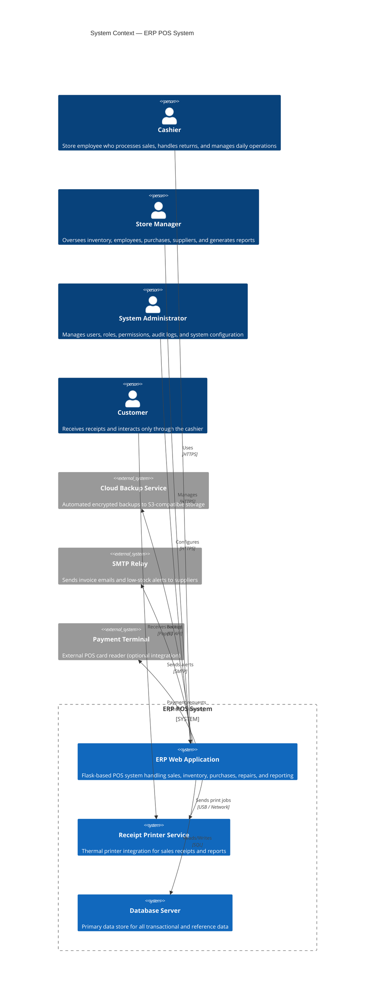
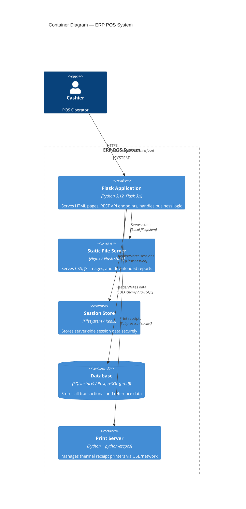
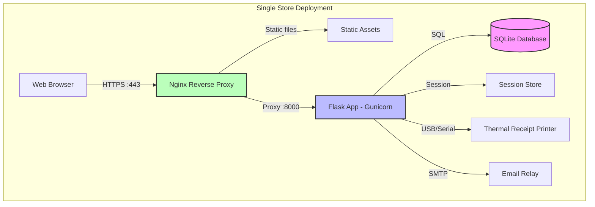
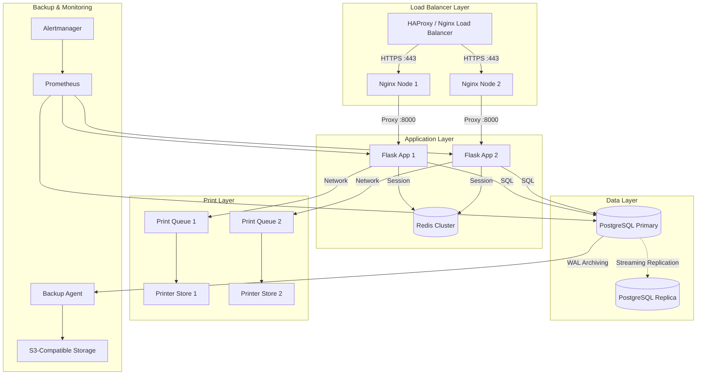
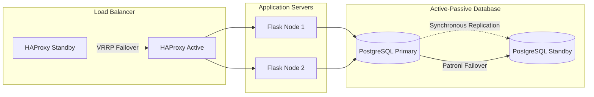
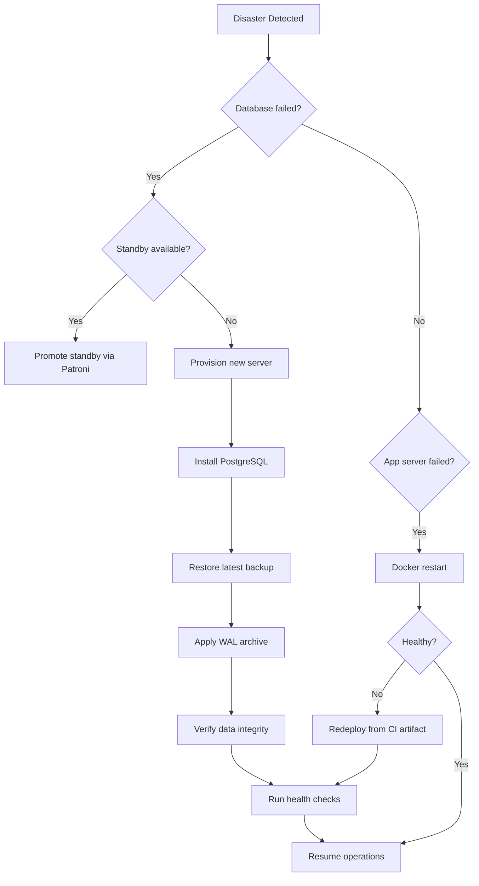
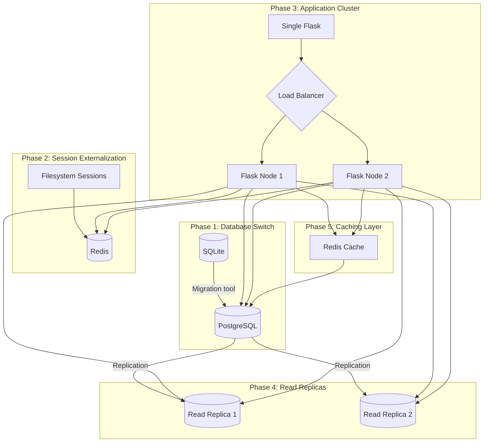

# System Architecture — ERP POS System

> **Version:** 1.0  
> **Last Updated:** 2026-06-24  
> **Audience:** Architects, DevOps, Senior Developers

---

## Table of Contents

1. [System Context Diagram](#1-system-context-diagram)
2. [Container Diagram](#2-container-diagram)
3. [Deployment Architecture](#3-deployment-architecture)
4. [Network Topology for Multi-POS Setup](#4-network-topology-for-multi-pos-setup)
5. [Technology Stack Justification](#5-technology-stack-justification)
6. [Hardware Architecture Recommendations](#6-hardware-architecture-recommendations)
7. [Security Architecture](#7-security-architecture)
8. [High Availability Design](#8-high-availability-design)
9. [Disaster Recovery Design](#9-disaster-recovery-design)
10. [Scalability Strategy](#10-scalability-strategy)
11. [Performance Considerations](#11-performance-considerations)
12. [Edge Cases & Failure Modes](#12-edge-cases--failure-modes)
13. [Future Improvements](#13-future-improvements)
14. [Appendix: Decision Log](#14-appendix-decision-log)

---

## 1. System Context Diagram

The following C4 context diagram shows the ERP POS system in relation to external actors and systems.



### Actor Descriptions

| Actor | Role | Key Responsibilities |
|-------|------|---------------------|
| **Cashier** | Point-of-sale operator | Process sales, issue refunds, accept payments, print receipts |
| **Store Manager** | Operational supervisor | Manage inventory levels, approve purchase orders, review reports, manage employees |
| **System Administrator** | IT/administrative role | Create users, assign roles/permissions, review audit logs, configure system settings |
| **Customer** | End consumer | Receives receipts; no direct system access |

---

## 2. Container Diagram

The container diagram decomposes the system into its major runtime containers.



### Container Responsibilities

| Container | Technology | Purpose |
|-----------|-----------|---------|
| **Flask Application** | Python 3.12, Flask 3.x, Jinja2, Werkzeug | Serves all HTML pages and REST API endpoints; enforces authentication, authorization, CSRF protection; coordinates all business operations |
| **Static File Server** | Nginx (prod) / Flask (dev) | Serves compiled CSS, minified JavaScript, images, and downloadable CSV/PDF reports. In production, Nginx handles this directly for performance |
| **Session Store** | Filesystem (dev) / Redis (prod) | Server-side session storage prevents tampering and supports session invalidation. Redis enables shared sessions across multiple app instances |
| **Database** | SQLite (single-store) / PostgreSQL (multi-store) | Relational store for all persistent data: products, customers, sales, purchases, inventory, employees, audit logs |
| **Print Server** | python-escpos, pyusb | Bridge between the web app and thermal receipt printers. Handles print job queuing, printer status monitoring, and error recovery |

---

## 3. Deployment Architecture

### Single-Store Deployment (Development / Small Business)



### Multi-Store Deployment (Production / Enterprise)



### Infrastructure as Code

```yaml
# docker-compose.yml (production profile)
version: "3.9"
services:
  nginx:
    image: nginx:1.27-alpine
    volumes:
      - ./nginx.conf:/etc/nginx/nginx.conf
      - ./static:/static:ro
    ports:
      - "443:443"
    depends_on:
      - flask

  flask:
    build: .
    image: erp-pos:latest
    env_file: .env.prod
    environment:
      FLASK_ENV: production
      DATABASE_URL: postgresql://user:pass@pg:5432/erp
      SESSION_TYPE: redis
      REDIS_URL: redis://redis:6379
    volumes:
      - ./flask_session:/app/flask_session
      - ./logs:/app/logs
    depends_on:
      - pg
      - redis
    restart: unless-stopped

  pg:
    image: postgres:16-alpine
    volumes:
      - pgdata:/var/lib/postgresql/data
      - ./database/schema.sql:/docker-entrypoint-initdb.d/01-schema.sql
      - ./database/seed.py:/docker-entrypoint-initdb.d/02-seed.py
    environment:
      POSTGRES_DB: erp
      POSTGRES_USER: erp_user
      POSTGRES_PASSWORD: ${DB_PASSWORD}
    restart: unless-stopped

  redis:
    image: redis:7-alpine
    volumes:
      - redisdata:/data
    restart: unless-stopped

volumes:
  pgdata:
  redisdata:
```

---

## 4. Network Topology for Multi-POS Setup

### Typical Store Network Layout

```
[Internet] → [Firewall] → [Router] → [Managed Switch]
                                          │
                    ┌─────────────────────┼─────────────────────┐
                    │                     │                     │
             [POS Terminal 1]      [POS Terminal 2]     [Back Office PC]
                    │                     │                     │
              [Printer 1]           [Printer 2]          [Label Printer]
                    │                     │
              [Cash Drawer 1]      [Cash Drawer 2]
```

### Network Segmentation

| Segment | VLAN ID | Subnet | Devices |
|---------|---------|--------|---------|
| POS Devices | 10 | 192.168.10.0/24 | POS terminals, receipt printers, cash drawers |
| Back Office | 20 | 192.168.20.0/24 | Management PCs, label printers, barcode scanners |
| Server | 30 | 192.168.30.0/24 | Database server, print server, application server |
| Management | 99 | 192.168.99.0/24 | Switch management, console access |

### Firewall Rules

| Source | Destination | Protocol | Port | Purpose |
|--------|-------------|----------|------|---------|
| VLAN 10, 20 | VLAN 30 | TCP | 443 | Application access |
| VLAN 10, 20 | VLAN 30 | TCP | 5432 | Database access (*restricted to server only*) |
| VLAN 30 | Internet | TCP | 587 | SMTP for email alerts |
| VLAN 30 | Internet | TCP | 443 | S3 API for backups |
| All VLANs | VLAN 99 | SSH | 22 | Management access (admin only) |
| Internet | VLAN 30 | TCP | 443 | External access via VPN/reverse proxy |

### Network Requirements

- **Latency**: Application server to database < 1ms (same LAN)
- **Bandwidth**: 100 Mbps minimum; 1 Gbps recommended for multi-POS
- **Wi-Fi**: Not recommended for POS terminals; use wired Ethernet. Wi-Fi acceptable for back-office inventory scanning
- **UPS**: Every POS terminal, server, and network switch must be on UPS

---

## 5. Technology Stack Justification

| Component | Choice | Alternatives Considered | Rationale |
|-----------|--------|------------------------|-----------|
| **Backend Framework** | Flask 3.x | Django, FastAPI, Express.js | Lightweight, explicit, excellent for custom ERP. Django is too opinionated for a POS; FastAPI lacks mature templating for server-rendered pages |
| **Database (dev)** | SQLite | None (default) | Zero configuration, file-based, perfect for single-store deployment. The database is a single file that can be backed up atomically |
| **Database (prod)** | PostgreSQL 16 | MySQL, MariaDB, SQL Server | Superior JSON support, window functions, CTEs for complex reporting, mature replication, excellent community support |
| **ORM / SQL** | Raw SQL + sqlite3/psycopg2 | SQLAlchemy, Peewee | Full control over queries. SQLAlchemy adds complexity for what is primarily CRUD + reporting. Parameterized queries prevent injection equally well |
| **Templating** | Jinja2 | Vue.js, React, Svelte | Server-rendered HTML is simpler for a POS where SEO is irrelevant and page load speed on store hardware matters. JS frameworks add build steps and client complexity |
| **Session Store** | Flask-Session + Redis / Filesystem | JWT, cookies | Server-side sessions can be revoked instantly. JWT tokens cannot be invalidated without a blocklist, adding complexity |
| **Reverse Proxy** | Nginx | Apache, Caddy, Traefik | Highest performance for static files, mature SSL termination, low memory footprint |
| **Container Runtime** | Docker + Compose | Kubernetes, Nomad | Docker Compose is sufficient for single-store and small deployments. K8s is overkill until 10+ stores |
| **Receipt Printing** | python-escpos | WebUSB, Socket printing | Direct USB control via ESC/POS protocol is the most reliable. WebUSB requires browser permissions and is not universally supported |

### Why Not a JavaScript Frontend Framework?

- POS terminals are often low-spec machines (Celeron, 4 GB RAM). A heavy SPA adds memory pressure
- Server-rendered HTML with Jinja2 provides instant page loads with no client-side rendering delay
- All business logic remains server-side where it cannot be tampered with
- Development velocity is higher — no build step, no API versioning, no state management library
- For a future v2.0, a REST API can be added alongside existing routes without rewriting the frontend

---

## 6. Hardware Architecture Recommendations

### POS Terminal Specifications

| Component | Minimum | Recommended |
|-----------|---------|-------------|
| CPU | Intel Celeron / AMD A-series | Intel Core i3 / AMD Ryzen 3 |
| RAM | 4 GB | 8 GB |
| Storage | 120 GB SSD | 256 GB NVMe SSD |
| Display | 15.6" 1366×768 | 19" 1600×900 touchscreen |
| OS | Windows 10/11 / Ubuntu 22.04 | Ubuntu 22.04 LTS |
| Network | 100 Mbps Ethernet | 1 Gbps Ethernet |
| UPS | 500 VA | 800 VA |

### Server Specifications

| Scenario | CPU | RAM | Storage | Network |
|----------|-----|-----|---------|---------|
| Single-store (SQLite) | 2 cores | 4 GB | 100 GB SSD | 1 Gbps |
| 3-5 stores (PostgreSQL) | 4 cores | 8 GB | 250 GB SSD | 1 Gbps |
| 10+ stores (PostgreSQL) | 8 cores | 16 GB | 500 GB NVMe | 10 Gbps |

### Printer Specifications

| Type | Interface | Recommended Model | Notes |
|------|-----------|-------------------|-------|
| Thermal Receipt | USB / Ethernet | Epson TM-T88VII | Industry standard, reliable, 300mm/s |
| Label Printer | USB | Zebra GK420d | For barcode labels, 6" per second |
| Impact/Dot Matrix | Ethernet | Epson LQ-590IIN | For multipart invoices/forms |

### Barcode Scanner

- **Type**: 2D imager (not laser). Reads both 1D (UPC) and 2D (QR) codes
- **Interface**: USB HID (emulates keyboard) or USB serial
- **Recommended**: Zebra DS2208 or Honeywell 1902

---

## 7. Security Architecture

### Defense in Depth

```mermaid
graph TD
    subgraph "Layer 1: Network"
        FW[Firewall] --> IPS[IPS/IDS]
        IPS --> VLAN[VLAN Segmentation]
    end

    subgraph "Layer 2: Transport"
        VLAN --> TLS[TLS 1.3 Termination]
        TLS --> HSTS[HSTS Headers]
    end

    subgraph "Layer 3: Application"
        HSTS --> Auth[Authentication]
        Auth --> MFA[MFA (admin only)]
        MFA --> RBAC[Role-Based Access Control]
        RBAC --> CSRF[CSRF Protection]
        CSRF --> Input[Input Validation]
    end

    subgraph "Layer 4: Data"
        Input --> Param[Parameterized Queries]
        Param --> Encrypt[Encryption at Rest]
        Encrypt --> Audit[Audit Logging]
    end
```

### Security Controls by Layer

| Layer | Control | Implementation |
|-------|---------|----------------|
| **Network** | Firewall | Deny all inbound except ports 443 (HTTPS) and 22 (management VPN). Rate-limit connection attempts |
| **Network** | VLAN segmentation | POS devices, servers, and management on separate VLANs with strict ACLs |
| **Transport** | TLS 1.3 | Terminated at Nginx. Certificate management via Let's Encrypt with automated renewal |
| **Transport** | HSTS | `Strict-Transport-Security: max-age=63072000; includeSubDomains; preload` |
| **Application** | Authentication | bcrypt password hashing (cost factor 12), account lockout after 5 failed attempts |
| **Application** | MFA | TOTP-based (PyOTP) for admin accounts. Recovery codes provided at setup |
| **Application** | RBAC | Three-tier: admin, manager, cashier. Permissions checked via decorators on every route |
| **Application** | CSRF | Flask-WTF CSRF protection on all POST/PUT/DELETE forms |
| **Application** | Input validation | Server-side validation on all inputs. whitelist allowed characters. Length limits enforced |
| **Data** | SQL injection | Parameterized queries exclusively. No string concatenation in SQL anywhere |
| **Data** | XSS prevention | Jinja2 auto-escaping enabled. `|safe` filter used only on trusted content |
| **Data** | Encryption at rest | Database encrypted at filesystem level (LUKS on Linux). Backups encrypted with GPG |
| **Data** | Audit logging | All data modifications logged with timestamp, user ID, IP, action, old/new values |

### Session Security

- Server-side sessions stored in Redis (production) or encrypted filesystem (development)
- Session ID transmitted via `HttpOnly`, `Secure`, `SameSite=Lax` cookies
- Session TTL: 8 hours for cashiers, 2 hours idle timeout
- On logout: session deleted from server store immediately
- On password change: all active sessions for that user are invalidated

### Data Encryption

```python
# Key management via environment variables (never in code)
BACKUP_ENCRYPTION_KEY = os.environ["BACKUP_ENCRYPTION_KEY"]

# GPG encryption for backups
gpg --symmetric --cipher-algo AES256 --batch --passphrase "$KEY" backup.sql
```

---

## 8. High Availability Design

### SLAs

| Component | Target Uptime | Allowed Downtime/Month |
|-----------|---------------|----------------------|
| POS Application | 99.5% | ~3.6 hours |
| Database | 99.9% | ~43 minutes |
| Receipt Printing | 99.0% | ~7.3 hours |

### Single-Store HA (Degraded Mode)

For single-store deployments, full HA is cost-prohibitive. Instead, the system supports **degraded mode**:

1. **Database failure**: The POS app detects database connection loss and enters offline mode
2. **Offline mode**: A local SQLite cache stores sales transactions. When the database recovers, queued transactions are synced automatically
3. **Printer failure**: Receipts are queued and can be reprinted later from the sales journal
4. **Server failure**: If the Flask app goes down, the store reverts to manual paper-based operations. Target: restore from backup within 2 hours

### Multi-Store HA (Clustered)



### Failure Scenarios

| Scenario | Impact | Mitigation | RTO | RPO |
|----------|--------|------------|-----|-----|
| App server crash | Minutes of downtime | Health check → kill → restart via Docker | < 30s | Zero |
| Database crash | All operations halt | Patroni auto-failover to standby | < 60s | < 5 MB |
| Entire server failure | Full outage | Restore from backup on new hardware | < 2 hours | < 1 hour |
| Disk corruption | Data loss possible | WAL archiving + frequent backups | < 2 hours | < 5 minutes |
| Network outage | No external access | Offline mode + queue transactions | N/A | Until reconnect |

---

## 9. Disaster Recovery Design

### Backup Strategy

| Backup Type | Frequency | Retention | Contents | Storage |
|-------------|-----------|-----------|----------|---------|
| Full database | Daily (02:00) | 30 days | Complete SQL dump + WAL archive | Local + S3 |
| Incremental WAL | Continuous (every 5 min) | 7 days | WAL segments | Local + S3 |
| Configuration | On change | 90 days | .env, nginx.conf, docker-compose.yml | Git + S3 |
| Static assets | On change | 90 days | CSS, JS, images | Git + S3 + local |

### Backup Automation

```bash
#!/bin/bash
# backup.sh — Full database backup with encryption

DB_NAME="${DB_NAME:-erp}"
DB_USER="${DB_USER:-erp_user}"
TIMESTAMP=$(date +%Y%m%d_%H%M%S)
BACKUP_DIR="/backups/daily"
S3_BUCKET="s3://erp-backups/${DB_NAME}/"

mkdir -p "$BACKUP_DIR"

# Dump database with compression (level 9 = maximum)
pg_dump -U "$DB_USER" -d "$DB_NAME" --no-owner --compress=9 \
  --file="${BACKUP_DIR}/${DB_NAME}_${TIMESTAMP}.sql.gz"

# Encrypt with GPG
gpg --symmetric --cipher-algo AES256 --batch --passphrase "$BACKUP_KEY" \
  --output "${BACKUP_DIR}/${DB_NAME}_${TIMESTAMP}.sql.gz.gpg" \
  "${BACKUP_DIR}/${DB_NAME}_${TIMESTAMP}.sql.gz"

# Remove unencrypted file
rm "${BACKUP_DIR}/${DB_NAME}_${TIMESTAMP}.sql.gz"

# Upload to S3
aws s3 cp "${BACKUP_DIR}/${DB_NAME}_${TIMESTAMP}.sql.gz.gpg" "$S3_BUCKET"

# Clean up old backups (older than 30 days)
find "$BACKUP_DIR" -name "*.gpg" -mtime +30 -delete
```

### Recovery Procedure



### Recovery Time Objectives

| Tier | RTO | RPO | Cost |
|------|-----|-----|------|
| Bronze (single-store) | 4 hours | 24 hours | $0 (manual restore) |
| Silver (multi-store) | 1 hour | 1 hour | $50/month (S3 + standby) |
| Gold (enterprise) | 5 minutes | 5 seconds | $500/month (Patroni + synchronous replication + cross-region) |

---

## 10. Scalability Strategy

### Vertical Scaling (First Priority)

For the single-store use case, vertical scaling is simpler and more cost-effective:

1. **CPU**: Upgrade from 2 cores → 4 cores. Flask benefits from more cores under Gunicorn
2. **RAM**: 4 GB → 8 GB. Allows larger in-memory caches and bigger SQLite page cache
3. **Storage**: SATA SSD → NVMe. Database query speed improves 3-5x
4. **Network**: 100 Mbps → 1 Gbps. Eliminates network bottleneck

### Horizontal Scaling (When Vertical is Exhausted)



### Scaling Triggers

| Metric | Warning Threshold | Scale Action |
|--------|-------------------|-------------|
| CPU > 80% sustained | 5 minutes | Add app node |
| DB connections > 80 | Peak connections | Increase pool size |
| Response time > 500ms (p95) | 10 minutes | Add index / increase cache |
| Disk I/O wait > 10% | 15 minutes | Upgrade storage or add read replica |
| Session store memory > 70% | 10 minutes | Increase Redis maxmemory |

### Stateful vs Stateless Architecture

| Component | Stateful? | Scaling Strategy |
|-----------|-----------|------------------|
| Flask Application | Stateless | Add nodes behind load balancer |
| Session Store | Stateful | Redis cluster with replication |
| Database | Stateful | Primary-replica with failover |
| Print Queue | Stateless | Print server per store |
| Static Assets | Stateless | CDN or Nginx cache |

---

## 11. Performance Considerations

### Database Performance

- **Indexing strategy**: All foreign keys, frequently searched columns (product name, customer phone, order date), and columns used in ORDER BY / GROUP BY must be indexed
- **Query optimization**: Avoid `SELECT *`; always specify columns. Use `EXPLAIN ANALYZE` to verify query plans
- **Connection pooling**: Use `psycopg2.pool.ThreadedConnectionPool` (PostgreSQL) or reuse the single `sqlite3` connection with WAL mode
- **SQLite WAL mode**: Enables concurrent reads while writing, critical for POS operations

```sql
-- Enable WAL mode for SQLite
PRAGMA journal_mode = WAL;
PRAGMA synchronous = NORMAL;
PRAGMA cache_size = -64000;  -- 64 MB page cache
```

### Application Performance

- **Gunicorn workers**: `(2 × CPU cores) + 1` workers for synchronous operations. Use gevent workers for I/O-bound workloads
- **Template caching**: Jinja2 bytecode cache enabled in production. Pre-compile templates where possible
- **Static file compression**: Nginx gzip for CSS/JS. Enable brotli compression for additional 20% reduction
- **Browser caching**: `Cache-Control: public, max-age=31536000` for versioned assets (e.g., `style.v1.css`)

### Caching Strategy

| Cache Type | Location | TTL | Invalidation Trigger | Size |
|------------|----------|-----|---------------------|------|
| Product list | In-memory (Flask app) | 30 seconds | Product CRUD operation | ~500 KB |
| Report data | In-memory | 5 minutes | Manual refresh or TTL expiry | ~10 MB |
| Config values | In-memory | 10 minutes | Admin config change | ~10 KB |
| User permissions | Redis | 1 hour | Role/permission change | ~50 KB per user |
| Audit log counts | In-memory | 1 minute | New audit entry | ~1 KB |

```python
# Simple TTL cache implementation
import time
from functools import lru_cache

@lru_cache(maxsize=128)
def get_cached_report(report_type: str, store_id: int, ttl: int = 300):
    """
    Cache report results with TTL.
    Cache key includes report type + store ID + current time bucket.
    """
    time_bucket = int(time.time() / ttl)
    return _generate_report(report_type, store_id)
```

---

## 12. Edge Cases & Failure Modes

### Database Edge Cases

| Edge Case | Scenario | Handling |
|-----------|----------|----------|
| **Concurrent sale** | Two cashiers sell the same last item simultaneously | Transaction isolation (SERIALIZABLE). Second transaction fails with retry prompt |
| **Negative inventory** | Return processed after stock is already zero | Allow negative stock (configurable). Flag in report. Require manager override for negative quantities |
| **Orphaned records** | Customer deleted with existing sales | Foreign key prevents deletion. Soft-delete customers: set `active = 0`. Retention policy for hard delete after X years |
| **Large transaction** | Importing 50,000 products at once | Batch insert (500 per batch). Progress indicator. Transaction per batch to avoid lock escalation |
| **Clock skew** | Server time changes during transaction | Use database `CURRENT_TIMESTAMP` for all audit/sale timestamps. Never trust application time |

### Network Edge Cases

| Edge Case | Scenario | Handling |
|-----------|----------|----------|
| **Printer offline** | USB disconnected, paper jam | Queue print jobs. Retry every 10 seconds. Alert cashier after 3 failures |
| **Payment terminal timeout** | Card reader no response | Timeout after 30 seconds. Allow cash payment fallback. Log failed payment attempt |
| **Session lost** | Cookie cleared, server restart | Redirect to login. Active sale is lost (only current transaction). Graceful handling — ask cashier to re-ring items |
| **Slow database** | Heavy report generation blocks sales | Reports run on read replica (PostgreSQL) or with `PRAGMA temp_store = MEMORY` (SQLite). Separate connection for reports |
| **Upload interrupted** | Image upload fails mid-transfer | Resumable upload via chunking. Or accept and retry. Show clear error, do not save partial record |

### Application Edge Cases

| Edge Case | Scenario | Handling |
|-----------|----------|----------|
| **Double submission** | Cashier clicks "Complete Sale" twice | Idempotency key on sale endpoint. Check for existing transaction ID before processing |
| **Negative pricing** | Discount exceeds item price | Validate: discount <= price. Require manager approval for discounts > 50% |
| **Unicode names** | Customer name with Arabic characters | UTF-8 everywhere. Database in UTF-8. Jinja2 handles Unicode natively |
| **Browser back button** | Cashier navigates away mid-sale | Warn before unload (`beforeunload` event). Unsaved sale is discarded |
| **Autofill interference** | Browser autofills form fields | Set `autocomplete="off"` on sensitive fields. Never autofill password fields on POS terminals |
| **Tab crash** | Browser tab crashes | Session persisted server-side. Cashier logs back in and can view last incomplete sale |

### Concurrency Edge Cases

```python
# Example: Race condition in stock decrement
# BAD — not thread-safe:
stock = get_stock(product_id)  # Read
new_stock = stock - quantity    # Modify
update_stock(product_id, new_stock)  # Write
# Between read and write, another request may have changed stock

# GOOD — atomic update:
UPDATE products SET stock = stock - ? WHERE product_id = ? AND stock >= ?
# Returns affected rows. If 0, stock was insufficient — rollback entire sale.
```

---

## 13. Future Improvements

### Short-Term (0-6 Months)

| Improvement | Effort | Impact | Description |
|-------------|--------|--------|-------------|
| **REST API v1** | 2 weeks | High | Expose CRUD endpoints for mobile app integration |
| **Barcode generator** | 3 days | Medium | Generate EAN-13 barcodes for products without manufacturer codes |
| **Email invoice** | 1 week | Medium | Send PDF invoice via email on sale completion |
| **Low-stock alerts** | 2 days | High | Automated email/SMS when stock falls below reorder point |
| **Dark mode** | 1 day | Low | CSS variable-based theme switching |

### Medium-Term (6-12 Months)

| Improvement | Effort | Impact | Description |
|-------------|--------|--------|-------------|
| **Offline-first mode** | 4 weeks | High | PWA with Service Worker, IndexedDB cache, background sync |
| **Multi-currency** | 3 weeks | High | Support for USD, EUR, EGP with configurable exchange rates |
| **Loyalty program** | 4 weeks | Medium | Points-based system, automatic discount tiers |
| **Supplier portal** | 6 weeks | Medium | Suppliers can view purchase orders and submit invoices |
| **Mobile inventory** | 3 weeks | Medium | React Native app for inventory counting via camera |

### Long-Term (12+ Months)

| Improvement | Effort | Impact | Description |
|-------------|--------|--------|-------------|
| **Microservices migration** | 6 months | Very High | Split into: POS service, inventory service, accounting service, reporting service |
| **Event sourcing** | 4 months | High | All state changes as immutable events. Full audit trail without separate audit table |
| **Real-time dashboard** | 6 weeks | Medium | WebSocket-based real-time sales dashboard for management |
| **AI demand forecasting** | 3 months | High | ML-based inventory demand prediction using historical sales |
| **Multi-tenant SaaS** | 6 months | Very High | Separate schemas per tenant, centralized management console |

---

## 14. Appendix: Decision Log

| Decision ID | Decision | Date | Rationale |
|-------------|----------|------|-----------|
| ARCH-001 | SQLite for single-store / PostgreSQL for multi-store | 2026-06-24 | SQLite requires no server, zero config. PostgreSQL scales to 10+ stores |
| ARCH-002 | Server-rendered HTML over SPA | 2026-06-24 | Lower hardware requirements, simpler development, no API versioning needed |
| ARCH-003 | Raw SQL over ORM | 2026-06-24 | Full query control, no ORM overhead, easier to optimize. Parameterized queries provide same SQL injection protection |
| ARCH-004 | Server-side sessions over JWT | 2026-06-24 | Instant revocation, no token storage on client, simpler logout semantics |
| ARCH-005 | Docker Compose over Kubernetes | 2026-06-24 | K8s is premature for < 10 stores. Compose provides containerization benefits without operational complexity |
| ARCH-006 | bcrypt over argon2 for passwords | 2026-06-24 | BCrypt is battle-tested, available in stdlib via `bcrypt` package, sufficient for POS use case |
| ARCH-007 | Single database over read replicas (initial) | 2026-06-24 | Until traffic exceeds 100 concurrent users, a single PostgreSQL instance is sufficient. Vertical scaling is cheaper initially |

---

> **Document Maintainer**: Principal Software Architect  
> **Review Cycle**: Quarterly  
> **Next Review**: 2026-09-24
