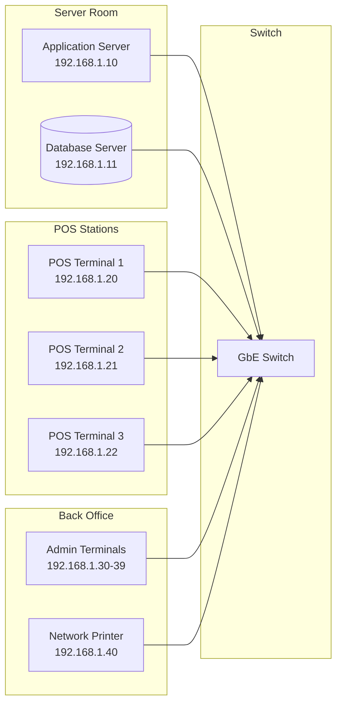

# System Requirements — Computer Shop ERP & POS System

> **Version:** 1.0.0-beta  
> **Document Status:** Final  
> **Last Updated:** June 2026

---

## Table of Contents

1. [Hardware Requirements](#hardware-requirements)
2. [Software Requirements](#software-requirements)
3. [Network Requirements](#network-requirements)
4. [Minimum POS Terminal Specifications](#minimum-pos-terminal-specifications)
5. [Recommended Server Specifications](#recommended-server-specifications)
6. [Supported Browsers](#supported-browsers)
7. [Database Requirements](#database-requirements)
8. [Third-Party Dependencies](#third-party-dependencies)
9. [Development Environment Requirements](#development-environment-requirements)
10. [Production Environment Requirements](#production-environment-requirements)
11. [Peripherals Compatibility](#peripherals-compatibility)

---

## Hardware Requirements

### Server Hardware

The system can be deployed on-premises (local server) or in the cloud (IaaS). The following specifications apply to on-premises deployments.

| Component | Minimum (5-10 Concurrent Users) | Recommended (10-50 Concurrent Users) | Enterprise (50+ Concurrent Users) |
|-----------|--------------------------------|--------------------------------------|-----------------------------------|
| **CPU** | 2 cores @ 2.0 GHz | 4 cores @ 2.5 GHz | 8+ cores @ 3.0 GHz |
| **RAM** | 4 GB | 8 GB | 16-32 GB |
| **Storage** | 100 GB SSD | 250 GB SSD | 500 GB NVMe SSD |
| **Network** | 100 Mbps | 1 Gbps | 1 Gbps redundant |
| **Backup Drive** | 100 GB HDD | 250 GB HDD/SSD | 500 GB+ external or cloud |

### POS Client Machine Hardware

| Component | Minimum | Recommended |
|-----------|---------|-------------|
| **CPU** | Intel Celeron / AMD A4 | Intel Core i3 / AMD Ryzen 3 |
| **RAM** | 2 GB | 4 GB |
| **Storage** | 32 GB (SSD preferred) | 128 GB SSD |
| **Display** | 1366x768 | 1920x1080 touchscreen |
| **Connectivity** | Wi-Fi or Ethernet | Ethernet (stable) + Wi-Fi (backup) |
| **Ports** | 2× USB | 4× USB + RJ11 (for cash drawer) |

### Peripheral Hardware

| Peripheral | Purpose | Connection | Power |
|------------|---------|------------|-------|
| **Barcode Scanner** | Product lookup at POS and inventory | USB (HID keyboard wedge) | Bus-powered |
| **Thermal Receipt Printer** | Customer invoice printing | USB or Ethernet | External adapter |
| **Cash Drawer** | Cash storage at POS | RJ11 (via printer) or USB | Powered by printer or adapter |
| **Barcode Label Printer** | Price tag and shelf label printing | USB or Ethernet | External adapter |
| **Customer-facing Display** | Show transaction total to customer | USB video or serial | USB or external |
| **UPS** | Protect server from power loss | Power input | Battery |
| **Router/Switch** | LAN connectivity for multi-POS setup | Ethernet | External adapter |

---

## Software Requirements

### Operating Systems

| Role | Supported OS | Verified |
|------|-------------|----------|
| **Server** | Ubuntu 22.04 LTS / 24.04 LTS | ✓ |
| **Server** | Debian 12 (Bookworm) | ✓ |
| **Server** | Windows Server 2022 | ✓ |
| **Server** | Rocky Linux 9 / AlmaLinux 9 | ✓ |
| **POS Terminal** | Windows 10/11 Pro | ✓ |
| **POS Terminal** | Ubuntu 22.04+ | ✓ |
| **POS Terminal** | Raspberry Pi OS (ARM) | ⚠ Limited testing |
| **Development** | Windows 10/11, macOS 13+, Ubuntu 22.04+ | ✓ |

### Core Software Stack

| Software | Required Version | Purpose |
|----------|-----------------|---------|
| **Python** | 3.10, 3.11, or 3.12 | Application runtime |
| **Flask** | 3.0+ | Web framework |
| **SQLAlchemy** | 2.0+ | ORM and database abstraction |
| **Gunicorn** | 22+ | WSGI production server |
| **Nginx** | 1.24+ | Reverse proxy and static file serving |
| **PostgreSQL** | 15+ (production) | Relational database |
| **SQLite** | 3.x (dev/single-store) | Embedded database |
| **Redis** | 7+ (optional) | Caching, session store, task queue |

### Browser Requirements

Only modern, evergreen browsers are supported. See the [Supported Browsers](#supported-browsers) section for details.

---

## Network Requirements

### LAN Setup for Multi-POS



### Network Specifications

| Parameter | Minimum | Recommended |
|-----------|---------|-------------|
| **LAN Speed** | 100 Mbps | 1 Gbps |
| **Wi-Fi Standard** | 802.11n (if using Wi-Fi) | 802.11ac/ax (Wi-Fi 5/6) |
| **Internet Bandwidth** | 5 Mbps down / 2 Mbps up | 20 Mbps down / 10 Mbps up |
| **Latency (Client ↔ Server)** | <10 ms (LAN) | <2 ms (LAN) |
| **Latency (Server ↔ Cloud)** | <100 ms | <30 ms |
| **DHCP** | Static IPs for server and printers | Static IPs + DNS reservation |
| **Ports Required (Inbound)** | 80, 443 (Nginx), 8000 (Gunicorn) | Same + 5432 (DB, internal only) |
| **Ports Required (Outbound)** | 443 (payment gateway, email) | 443 + 25/587 (SMTP) |

### Network Security Requirements

- **VLAN Segmentation:** Separate POS traffic from office/admin traffic
- **Firewall Rules:** Restrict database port (5432) to application server only
- **Wi-Fi Encryption:** WPA2-PSK minimum, WPA3-Enterprise recommended
- **VPN:** Required for remote management and cloud database access
- **No Public Exposure:** Never expose the database or Gunicorn directly to the internet

---

## Minimum POS Terminal Specifications

| Component | Specification |
|-----------|--------------|
| **Processor** | Intel Celeron N4020 or equivalent |
| **RAM** | 2 GB DDR3/DDR4 |
| **Storage** | 32 GB eMMC or SSD |
| **Display** | 10" touchscreen (1366x768 minimum) |
| **Operating System** | Windows 10 LTSC / Ubuntu 22.04 |
| **USB Ports** | 2× USB 2.0 (for scanner, printer) |
| **Network** | 100 Mbps Ethernet; 802.11n Wi-Fi as backup |
| **Power** | 12V DC adapter; UPS recommended |
| **Mounting** | VESA-compatible for desk or wall mount |

### Cost Estimate

| Component | Estimated Cost (USD) |
|-----------|---------------------|
| POS Terminal (entry-level) | $200 - $400 |
| Thermal Printer | $80 - $150 |
| Barcode Scanner | $30 - $80 |
| Cash Drawer | $40 - $70 |
| Customer Display (optional) | $80 - $200 |
| UPS (per terminal) | $50 - $100 |
| **Total per POS Station** | **$480 - $1,000** |

---

## Recommended Server Specifications

### Single Store (Up to 10 Concurrent Users)

| Component | Specification |
|-----------|--------------|
| **Form Factor** | Mini PC or entry-level tower server (e.g., HP ProDesk, Dell OptiPlex) |
| **Processor** | Intel Core i5 (10th gen+) or AMD Ryzen 5 |
| **RAM** | 8 GB DDR4 |
| **Storage** | 256 GB NVMe SSD |
| **Backup** | External 500 GB HDD or cloud backup |
| **OS** | Ubuntu Server 22.04 LTS |
| **Power** | UPS 600VA |
| **Network** | Gigabit Ethernet |
| **Estimated Cost** | **$600 - $1,000** |

### Multi-Store / Enterprise (10-50 Concurrent Users)

| Component | Specification |
|-----------|--------------|
| **Form Factor** | Rack-mount server (1U/2U) or high-end tower |
| **Processor** | Intel Xeon E-2314+ / AMD EPYC 4244P |
| **RAM** | 32 GB ECC DDR4/DDR5 |
| **Storage** | 2× 480 GB NVMe SSD (RAID 1) |
| **Backup** | NAS with 4 TB HDD or cloud backup |
| **OS** | Ubuntu Server 24.04 LTS |
| **Power** | Redundant PSU + UPS 1500VA |
| **Network** | Dual Gigabit Ethernet (bonded) |
| **Estimated Cost** | **$3,000 - $6,000** |

---

## Supported Browsers

| Browser | Minimum Version | RTL (Arabic) Support | POS Optimized | Notes |
|---------|----------------|----------------------|---------------|-------|
| **Google Chrome** | 100+ | ✓ Full | ✓ Best | Recommended for POS terminals |
| **Mozilla Firefox** | 110+ | ✓ Full | ✓ Good | Full support |
| **Microsoft Edge** | 110+ | ✓ Full | ✓ Good | Chromium-based |
| **Safari** | 16+ | ✓ Full | ⚠ Limited | Some POS features may not work |
| **Opera** | 90+ | ✓ Full | ⚠ Limited | Not tested for POS |
| **Samsung Internet** | 20+ | ✓ Partial | ✗ Not supported | Mobile browser only |
| **Internet Explorer 11** | — | ✗ Not supported | ✗ Not supported | **Fails** — will not load |

### Browser Features Required

The following browser APIs must be available for full functionality:

| Feature | Purpose | Fallback |
|---------|---------|----------|
| `localStorage` | Session persistence, offline cart | Session-only mode |
| `navigator.mediaDevices.getUserMedia` | Barcode camera scanning (mobile) | Not available — redirect to manual entry |
| `window.print()` | Receipt printing | Print button fallback |
| `Service Workers` | Offline POS support | Not available — online-only mode |
| `IndexedDB` | Offline data storage | Not available — limited offline |
| CSS `direction: rtl` | Arabic interface | Layout may break |

---

## Database Requirements

### SQLite (Single-Store / Development)

| Parameter | Specification |
|-----------|--------------|
| **Version** | 3.x (bundled with Python 3.10+) |
| **File Location** | `data/shop.db` (configurable via `.env`) |
| **Limitations** | Single-writer concurrency; not suitable for >5 concurrent write users |
| **Backup Method** | File copy (with WAL checkpoint) or `.backup` command |
| **WAL Mode** | **Required** — enables concurrent reads during writes |
| **Journal Mode** | WAL (Write-Ahead Logging) |
| **Cache Size** | -20000 (20 MB) — configurable |
| **Page Size** | 4096 (default) |

**When to use SQLite:**
- Single-store deployment with 1-3 POS terminals
- Development and testing environments
- Demonstration / evaluation instances
- Budget-constrained deployments

**When to migrate to PostgreSQL:**
- Multiple POS terminals (>5) with high write throughput
- Multi-store setup requiring centralized reporting
- Need for point-in-time recovery and advanced backup
- High availability requirements (>99.9% uptime)

### PostgreSQL (Production / Multi-Store)

| Parameter | Minimum | Recommended |
|-----------|---------|-------------|
| **Version** | 15.x | 16.x |
| **Configuration** | `shared_buffers = 2GB` | `shared_buffers = 4GB` |
| | `work_mem = 64MB` | `work_mem = 128MB` |
| | `maintenance_work_mem = 512MB` | `maintenance_work_mem = 1GB` |
| | `effective_cache_size = 4GB` | `effective_cache_size = 8GB` |
| | `wal_level = replica` | `wal_level = replica` |
| | `max_connections = 50` | `max_connections = 100` |
| | `max_wal_size = 2GB` | `max_wal_size = 4GB` |
| **SSL** | Required for remote connections | Required for all non-localhost connections |
| **Backup** | pg_dump daily | pgBackRest with WAL archiving (PITR) |
| **Replication** | N/A | Streaming replication for HA |
| **Connection Pooling** | N/A | PgBouncer (recommended) |

### Database Schema Design Principles

| Principle | Implementation |
|-----------|---------------|
| **Normalization** | Third Normal Form (3NF) for transactional tables |
| **Indexing** | B-tree on all FK columns, created_at, status fields; GIN for JSON fields |
| **Soft Delete** | All major entities have `is_deleted` boolean + `deleted_at` timestamp |
| **Timestamps** | Every table has `created_at` and `updated_at` with `DEFAULT CURRENT_TIMESTAMP` |
| **Audit Columns** | `created_by` and `updated_by` referencing `employees` table |
| **Monetary Values** | Stored as integer representing smallest currency unit (piasters) |
| **Encoding** | UTF-8 with `utf8mb4_unicode_ci` collation for Arabic/Latin compatibility |
| **Migration Strategy** | Alembic with version-controlled, reversible migration scripts |

---

## Third-Party Dependencies

### Production Dependencies

| Package | Version | Purpose | License |
|---------|---------|---------|---------|
| `Flask` | ≥3.0.0 | Web framework | BSD-3-Clause |
| `Flask-Login` | ≥0.6.3 | User session management | MIT |
| `Flask-WTF` | ≥1.2.1 | CSRF protection and form handling | MIT |
| `SQLAlchemy` | ≥2.0.25 | Database ORM | MIT |
| `Alembic` | ≥1.13.0 | Database migrations | MIT |
| `Werkzeug` | ≥3.0.1 | WSGI utilities, password hashing | BSD-3-Clause |
| `python-barcode` | ≥0.15.0 | Barcode generation | MIT |
| `qrcode` | ≥7.4.2 | QR code generation | BSD-3-Clause |
| `Pillow` | ≥10.2.0 | Image processing | Historical Permission Notice |
| `WeasyPrint` | ≥61.0 | PDF generation (HTML → PDF) | BSD-3-Clause |
| `python-escpos` | ≥3.0 | Thermal printer ESC/POS commands | MIT |
| `OpenPyXL` | ≥3.1.2 | Excel file export | MIT |
| `python-dotenv` | ≥1.0.0 | Environment variable management | BSD-3-Clause |
| `psycopg2-binary` | ≥2.9.9 | PostgreSQL adapter | LGPL |
| `redis` | ≥5.0.0 | Redis client (if using caching) | MIT |
| `rq` | ≥1.16 | Background task queue | BSD-2-Clause |
| `Flask-Mail` | ≥0.9.1 | Email sending | BSD-3-Clause |
| `bleach` | ≥6.1.0 | HTML sanitization | Apache 2.0 |
| `gunicorn` | ≥22.0 | WSGI HTTP server (production) | MIT |

### Development Dependencies

| Package | Version | Purpose | License |
|---------|---------|---------|---------|
| `pytest` | ≥8.0.0 | Test framework | MIT |
| `pytest-cov` | ≥4.1.0 | Test coverage reporting | MIT |
| `factory-boy` | ≥3.3.0 | Test data factories | MIT |
| `Faker` | ≥22.0.0 | Fake data generation | MIT |
| `flake8` | ≥7.0.0 | Code style enforcement | MIT |
| `black` | ≥24.0.0 | Code formatting | MIT |
| `isort` | ≥5.13.0 | Import sorting | MIT |
| `mypy` | ≥1.8.0 | Static type checking | MIT |
| `pre-commit` | ≥3.6.0 | Pre-commit hooks | MIT |

---

## Development Environment Requirements

### Windows Development

| Requirement | Specification |
|-------------|--------------|
| **OS Version** | Windows 10 (22H2+) or Windows 11 |
| **Python** | 3.10+ (install via python.org or Windows Store) |
| **Terminal** | Windows Terminal (recommended) or PowerShell 7+ |
| **Git** | Git for Windows 2.40+ |
| **Editor** | VS Code (recommended) with Python, Pylance, Jinja2 extensions |
| **Database** | SQLite (built-in with Python) or PostgreSQL 15+ via Docker Desktop |
| **Docker** | Docker Desktop (optional, for PostgreSQL) |
| **Node.js** | Not required (no build step for frontend), optional for lint tools |

### Ubuntu Development

```bash
# Prerequisites
sudo apt update
sudo apt install -y python3.10 python3.10-venv python3.10-dev git

# Clone and setup
git clone https://github.com/your-org/computer-shop-erp.git
cd computer-shop-erp
python3.10 -m venv venv
source venv/bin/activate
pip install -r requirements.txt -r requirements-dev.txt
```

### macOS Development

| Requirement | Specification |
|-------------|--------------|
| **OS Version** | macOS Ventura (13+) or Sonoma (14+) |
| **Python** | 3.10+ via Homebrew (`brew install python@3.10`) |
| **Git** | Xcode Command Line Tools or standalone Git |
| **Editor** | VS Code or PyCharm |

---

## Production Environment Requirements

### Deployment Architecture

```mermaid
flowchart TB
    subgraph "Internet"
        USR[Users / Clients]
    end
    
    subgraph "DMZ"
        NGX[Nginx<br/>Reverse Proxy<br/>SSL Termination]
    end
    
    subgraph "Application Layer"
        GUN1[Gunicorn<br/>Worker 1]
        GUN2[Gunicorn<br/>Worker 2]
        GUN3[Gunicorn<br/>Worker N]
    end
    
    subgraph "Data Layer"
        DB[(PostgreSQL<br/>Primary)]
        DBR[(PostgreSQL<br/>Replica - DR)]
        REDIS[(Redis<br/>Cache + Queue)]
    end
    
    subgraph "Storage"
        FS[(File System<br/>Uploads)]
    end

    USR -->|HTTPS :443| NGX
    NGX --> GUN1
    NGX --> GUN2
    NGX --> GUN3
    GUN1 --> DB
    GUN2 --> DB
    GUN3 --> DB
    DB --> DBR
    GUN1 --> REDIS
    GUN2 --> REDIS
    GUN3 --> REDIS
    GUN1 --> FS
    GUN2 --> FS
    GUN3 --> FS
```



### Production Checklist

| Requirement | Check | Implementation |
|-------------|-------|----------------|
| **SSL Certificate** | ✓ Required | Let's Encrypt (Certbot) or commercial CA |
| **Firewall** | ✓ Required | UFW (allow 80, 443, 22 only); restrict 5432, 6379 to internal |
| **Database Encryption** | ✓ Required | TLS for remote connections; TDE for data at rest |
| **Automated Backups** | ✓ Required | Daily pg_dump + WAL archiving; tested monthly |
| **Monitoring** | ✓ Recommended | Prometheus + Grafana or Sentry |
| **Logging** | ✓ Required | Structured JSON logs to stdout; aggregated via systemd/journald or Loki |
| **Update Strategy** | ✓ Required | Blue-green deployment or rolling update |
| **Health Checks** | ✓ Required | `/health` endpoint returning 200 + DB status |
| **Rate Limiting** | ✓ Required | Nginx limit_req on login, API endpoints |
| **Fail2Ban** | ✓ Recommended | Brute force protection for SSH and login |

---

## Peripherals Compatibility

### Barcode Scanners

| Brand / Model | Connection | Protocol | Verified | Notes |
|---------------|------------|----------|----------|-------|
| **Honeywell 1900/1910** | USB | HID Keyboard Wedge | ✓ | Works out of box |
| **Zebra DS2208** | USB | HID Keyboard Wedge | ✓ | Supports 1D/2D codes |
| **Zebra DS9308** | USB | HID Keyboard Wedge | ✓ | In-counter presentation scanner |
| **Socket Mobile S700** | Bluetooth | SPP / HID | ✓ | For iOS/Android companion app |
| **Newland NLS-HR15** | USB | HID Keyboard Wedge | ✓ | Economy option |
| **Generic USB Scanner** | USB | HID Keyboard Wedge | ⚠ | May require configuration to add suffix (ENTER) |

**Scanner Configuration Required:**
- Enable **USB-HID Keyboard Wedge** mode (default on most)
- Append **ENTER** suffix (Carriage Return `\r` or Line Feed `\n`)
- Disable **country code** (use US keyboard layout)
- Barcode types supported: EAN-13, UPC-A, Code 128, Code 39, QR Code, DataMatrix

### Thermal Receipt Printers

| Brand / Model | Connection | Interface Library | Verified | Notes |
|---------------|------------|-------------------|----------|-------|
| **Epson TM-T20II** | USB | python-escpos | ✓ | Industry standard; cash drawer port |
| **Epson TM-T88VII** | USB + Ethernet | python-escpos | ✓ | Higher speed; networkable |
| **Epson TM-T82** | USB | python-escpos | ✓ | Economy model |
| **Star SP700** | USB + Serial | python-escpos | ✓ | Durable; popular in retail |
| **Xprinter XP-80C** | USB | python-escpos | ✓ | Budget option |
| **Generic ESC/POS** | USB | python-escpos | ⚠ | Check command set compatibility |

**Printer Configuration:**
- **Paper Width:** 80 mm (58 mm supported with template adjustment)
- **Character Encoding:** CP437 or UTF-8
- **Baud Rate (Serial):** 9600 or 115200
- **Cash Drawer:** Pin 2 (default, RJ11 port on printer)
- **Auto-cut:** Enabled (partial cut recommended)
- **Print Density:** Medium (can be adjusted for clarity)

### Label Printers

| Brand / Model | Connection | Method | Verified |
|---------------|------------|--------|----------|
| **Zebra ZD420** | USB + Ethernet | ZPL via network socket | ✓ |
| **Zebra GK420d** | USB | ZPL via direct USB | ✓ |
| **Brother QL-820NWBc** | USB + Wi-Fi | Raster via brother_ql | ✓ |
| **Dymo LabelWriter 450** | USB | Dymo SDK (not recommended) | ⚠ |
| **Generic 58mm Label** | USB | python-escpos image printing | ✓ |

### Cash Drawers

| Brand / Model | Connection | Trigger | Verified |
|---------------|------------|---------|----------|
| **APG Vasario 1616** | RJ11 | Printer pulse | ✓ |
| **MMF POS-3000** | RJ11 | Printer pulse | ✓ |
| **Star CD-300** | RJ11 | Printer pulse | ✓ |
| **Generic Cash Drawer** | RJ11 or USB | Printer pulse or GPIO | ✓ |

### Touchscreens / Monitors

| Type | Size | Resolution | Touch Technology | Verified |
|------|------|------------|------------------|----------|
| **POS Monitor** | 15.6" | 1920x1080 | Projected Capacitive | ✓ |
| **POS Monitor** | 10.1" | 1280x800 | Projected Capacitive | ✓ |
| **Tablet** | 10-12" | Various | Capacitive | ⚠ Limited |
| **Second Display** | 7-10" | 1024x600 | N/A (customer-facing) | ✓ |

### Customer-Facing Displays (Pole Displays)

| Brand / Model | Connection | Protocol | Verified |
|---------------|------------|----------|----------|
| **Epson DM-D110** | USB | ESC/POS (VFD) | ✓ |
| **Bixolon BCD-1000** | USB | ESC/POS | ⚠ |

---

*This document is maintained by the DevOps and QA teams. For compatibility questions, contact infra@computershop-erp.com.*
